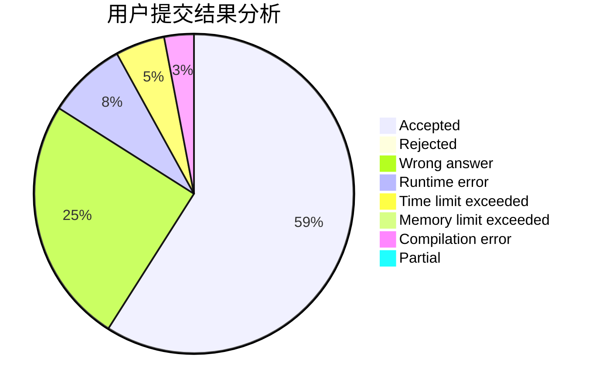
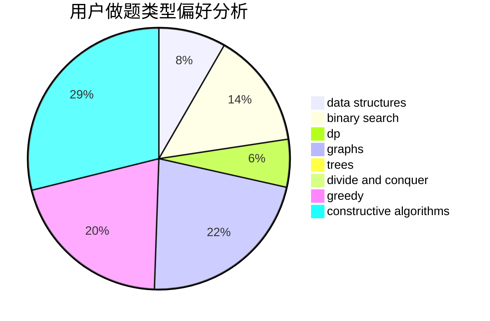
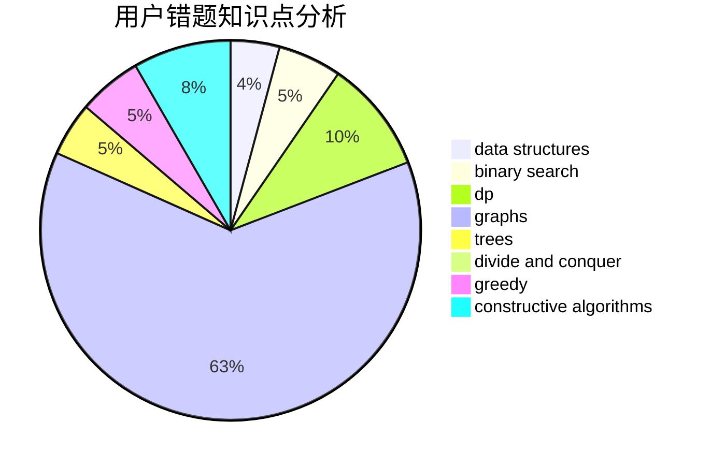

# Contna

<!-- tabs:start -->

#### **用户提交结果分析**

#### **用户做题类型偏好分析**

#### **用户错题知识点分析**

<!-- tabs:end -->
# 推荐题目
[1331E](https://codeforces.com/contest/1331/problem/E)		dfs and similar,
                        geometry,
                        implementation		  
[160B](https://codeforces.com/contest/160/problem/B)		greedy,
                        sortings		  
[331C1](https://codeforces.com/contest/331C/problem/1)		dp		  
[702B](https://codeforces.com/contest/702/problem/B)		brute force,
                        data structures,
                        implementation,
                        math		  
[1149B](https://codeforces.com/contest/1149/problem/B)		dp,
                        implementation,
                        strings		  
[18A](https://codeforces.com/contest/18/problem/A)		brute force,
                        geometry		  
[1131A](https://codeforces.com/contest/1131/problem/A)		math		  
[680C](https://codeforces.com/contest/680/problem/C)		dsu,graphs,sortings,trees		  
[1020E](https://codeforces.com/contest/1020/problem/E)		dsu,graphs,sortings,trees		  
[1099F](https://codeforces.com/contest/1099/problem/F)		binary search,
                        data structures,
                        dfs and similar,
                        dp,
                        games,
                        trees		  
