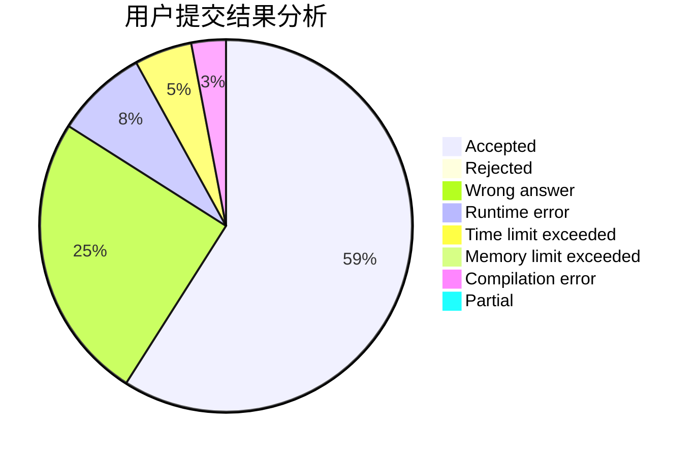
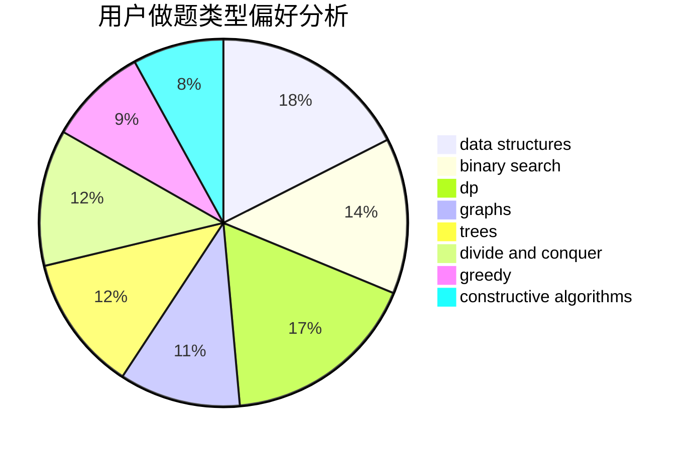
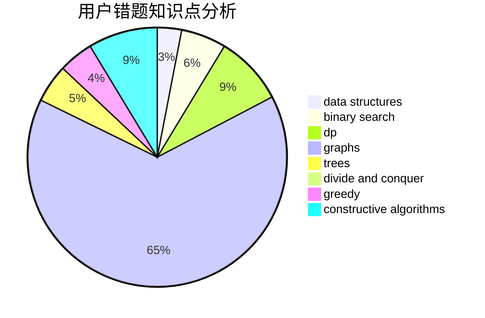

# Contna

<!-- tabs:start -->

#### **用户提交结果分析**

#### **用户做题类型偏好分析**

#### **用户错题知识点分析**

<!-- tabs:end -->
# 推荐题目
[1337D](https://codeforces.com/contest/1337/problem/D)		dsu,graphs,sortings,trees		  
[185A](https://codeforces.com/contest/185/problem/A)		math		  
[359B](https://codeforces.com/contest/359/problem/B)		constructive algorithms,
                        dp,
                        math		  
[721A](https://codeforces.com/contest/721/problem/A)		implementation		  
[1150E](https://codeforces.com/contest/1150/problem/E)		dsu,graphs,sortings,trees		  
[215A](https://codeforces.com/contest/215/problem/A)		brute force,
                        implementation		  
[1132G](https://codeforces.com/contest/1132/problem/G)		data structures,
                        dp,
                        trees		  
[704D](https://codeforces.com/contest/704/problem/D)		flows,
                        greedy		  
[1023C](https://codeforces.com/contest/1023/problem/C)		greedy		  
[10B](https://codeforces.com/contest/10/problem/B)		dp,
                        implementation		  
