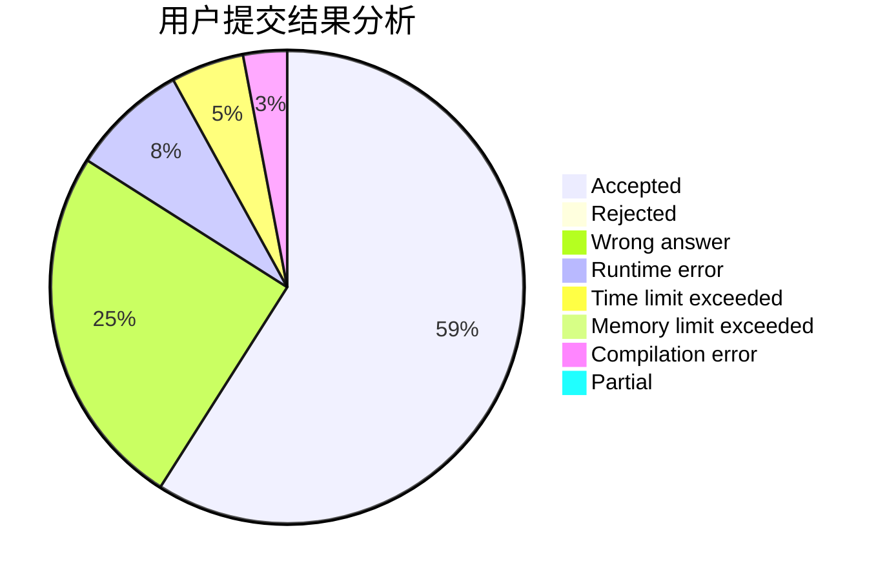
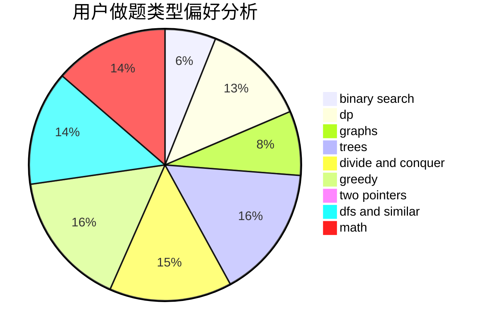

# Contna

<!-- tabs:start -->

#### **用户提交结果分析**

#### **用户做题类型偏好分析**

<!-- tabs:end -->
# 推荐题目
[1337D](https://codeforces.com/contest/1337/problem/D)
[185A](https://codeforces.com/contest/185/problem/A)
[359B](https://codeforces.com/contest/359/problem/B)
[721A](https://codeforces.com/contest/721/problem/A)
[1150E](https://codeforces.com/contest/1150/problem/E)
[215A](https://codeforces.com/contest/215/problem/A)
[1132G](https://codeforces.com/contest/1132/problem/G)
[704D](https://codeforces.com/contest/704/problem/D)
[1023C](https://codeforces.com/contest/1023/problem/C)
[10B](https://codeforces.com/contest/10/problem/B)
