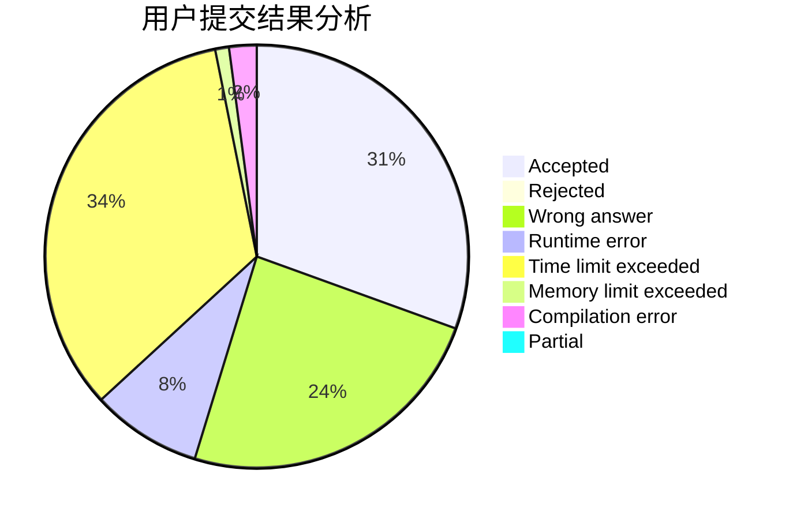
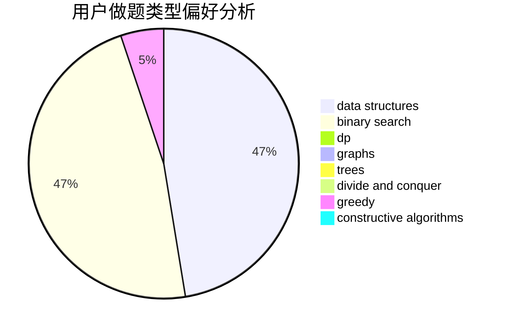
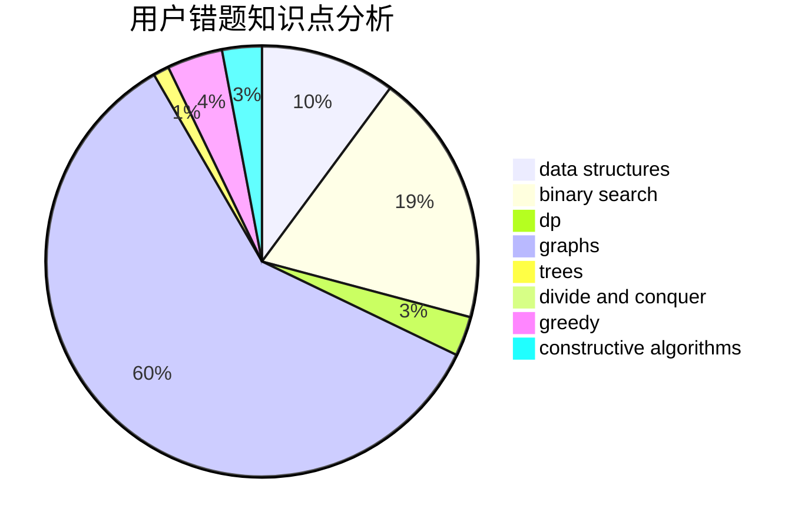

# Cornflakes

<!-- tabs:start -->

#### **用户提交结果分析**

#### **用户做题类型偏好分析**

#### **用户错题知识点分析**

<!-- tabs:end -->
# 推荐题目
[414D](https://codeforces.com/contest/414/problem/D)		binary search,
                        data structures,
                        greedy,
                        trees,
                        two pointers		  
[545C](https://codeforces.com/contest/545/problem/C)		dp,
                        greedy		  
[1047B](https://codeforces.com/contest/1047/problem/B)		geometry,
                        math		  
[1369A](https://codeforces.com/contest/1369/problem/A)		geometry,
                        math		  
[452E](https://codeforces.com/contest/452/problem/E)		data structures,
                        dsu,
                        string suffix structures,
                        strings		  
[1475D](https://codeforces.com/contest/1475/problem/D)		binary search,
                        dp,
                        sortings,
                        two pointers		  
[1482E](https://codeforces.com/contest/1482/problem/E)		data structures,
                        divide and conquer,
                        dp		  
[1489D](https://codeforces.com/contest/1489/problem/D)		dsu,graphs,sortings,trees		  
[1483E](https://codeforces.com/contest/1483/problem/E)		dsu,graphs,sortings,trees		  
[1475F](https://codeforces.com/contest/1475/problem/F)		2-sat,
                        brute force,
                        constructive algorithms		  
