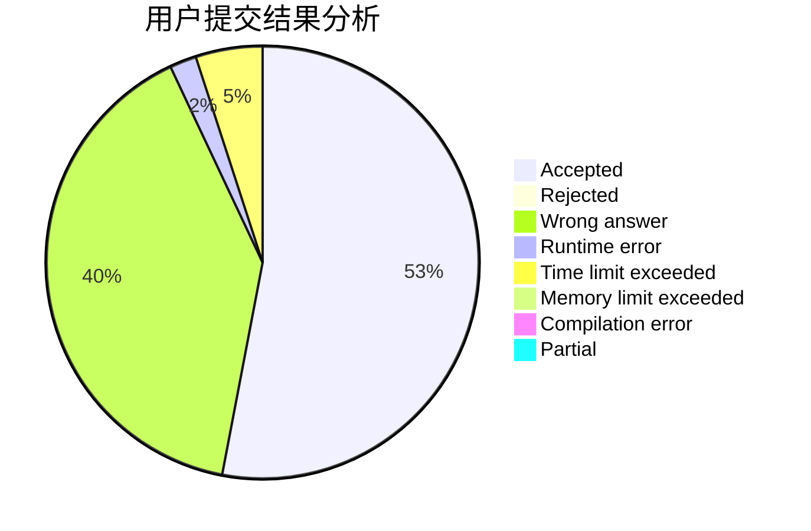
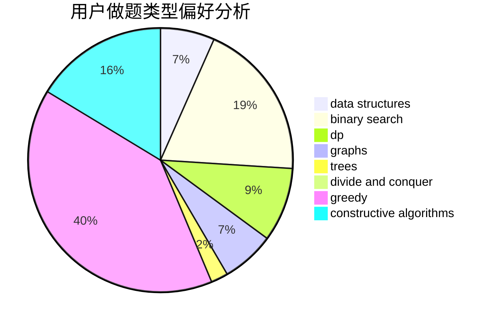
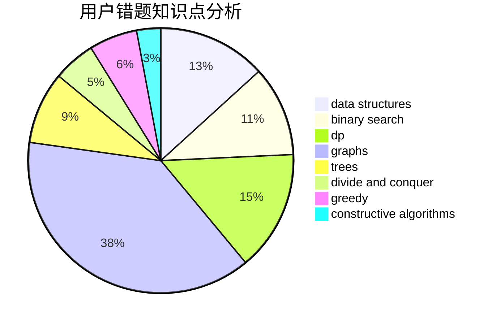

# Corycle

<!-- tabs:start -->

#### **用户提交结果分析**

#### **用户做题类型偏好分析**

#### **用户错题知识点分析**

<!-- tabs:end -->
# 推荐题目
[1398A](https://codeforces.com/contest/1398/problem/A)		geometry,
                        math		  
[1070E](https://codeforces.com/contest/1070/problem/E)		binary search,
                        data structures		  
[1029E](https://codeforces.com/contest/1029/problem/E)		dp,
                        graphs,
                        greedy		  
[39J](https://codeforces.com/contest/39/problem/J)		hashing,
                        implementation,
                        strings		  
[366C](https://codeforces.com/contest/366/problem/C)		dp		  
[1240A](https://codeforces.com/contest/1240/problem/A)		dsu,graphs,sortings,trees		  
[414B](https://codeforces.com/contest/414/problem/B)		combinatorics,
                        dp,
                        number theory		  
[730H](https://codeforces.com/contest/730/problem/H)		constructive algorithms,
                        implementation		  
[1045I](https://codeforces.com/contest/1045/problem/I)		hashing,
                        strings		  
[201E](https://codeforces.com/contest/201/problem/E)		binary search,
                        combinatorics		  
