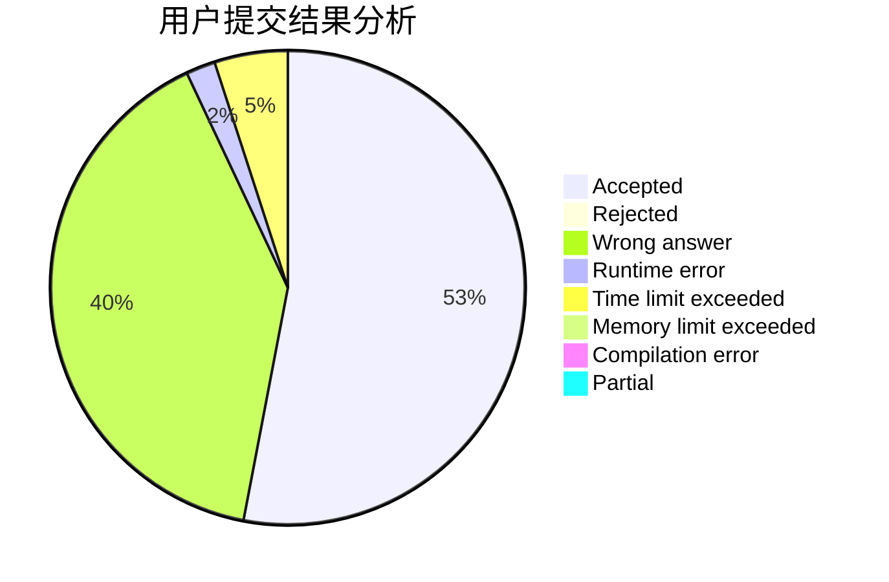
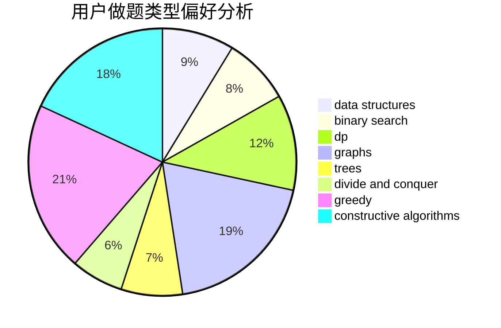

# Corycle

<!-- tabs:start -->

#### **用户提交结果分析**

#### **用户做题类型偏好分析**

#### **用户错题知识点分析**

<!-- tabs:end -->
# 推荐题目
[1406E](https://codeforces.com/contest/1406/problem/E)		interactive,
                        math,
                        number theory		  
[1070H](https://codeforces.com/contest/1070/problem/H)		brute force,
                        implementation		  
[102B](https://codeforces.com/contest/102/problem/B)		implementation		  
[429A](https://codeforces.com/contest/429/problem/A)		dfs and similar,
                        trees		  
[394C](https://codeforces.com/contest/394/problem/C)		constructive algorithms,
                        greedy		  
[1245D](https://codeforces.com/contest/1245/problem/D)		dsu,
                        graphs,
                        greedy,
                        shortest paths,
                        trees		  
[439D](https://codeforces.com/contest/439/problem/D)		binary search,
                        sortings,
                        ternary search,
                        two pointers		  
[748C](https://codeforces.com/contest/748/problem/C)		constructive algorithms,
                        math		  
[1046H](https://codeforces.com/contest/1046/problem/H)		dsu,graphs,sortings,trees		  
[226E](https://codeforces.com/contest/226/problem/E)		data structures,
                        trees		  
