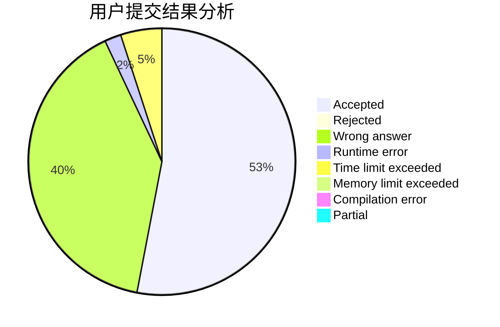
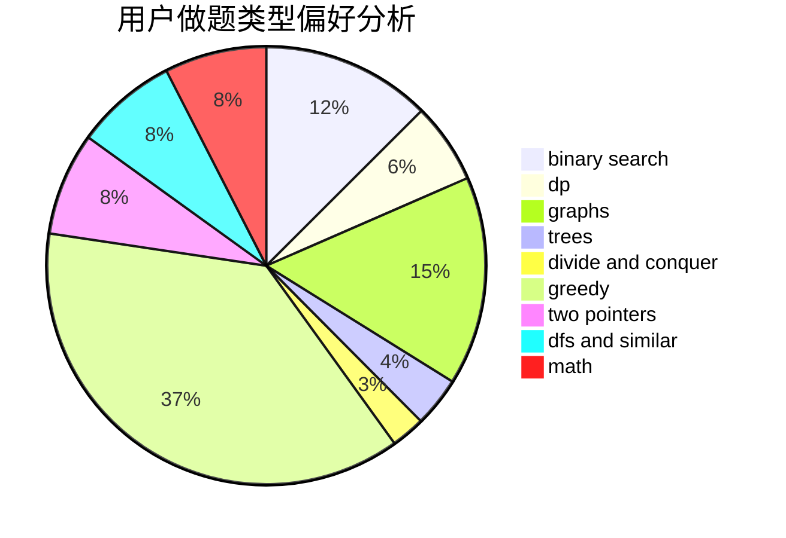

# Corycle

<!-- tabs:start -->

#### **用户提交结果分析**

#### **用户做题类型偏好分析**

<!-- tabs:end -->
# 推荐题目
[1406E](https://codeforces.com/contest/1406/problem/E)
[1070H](https://codeforces.com/contest/1070/problem/H)
[102B](https://codeforces.com/contest/102/problem/B)
[429A](https://codeforces.com/contest/429/problem/A)
[394C](https://codeforces.com/contest/394/problem/C)
[1245D](https://codeforces.com/contest/1245/problem/D)
[439D](https://codeforces.com/contest/439/problem/D)
[748C](https://codeforces.com/contest/748/problem/C)
[1046H](https://codeforces.com/contest/1046/problem/H)
[226E](https://codeforces.com/contest/226/problem/E)
