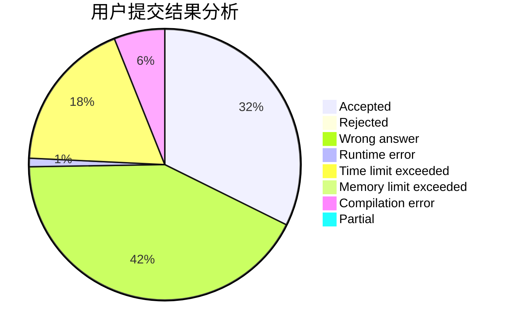
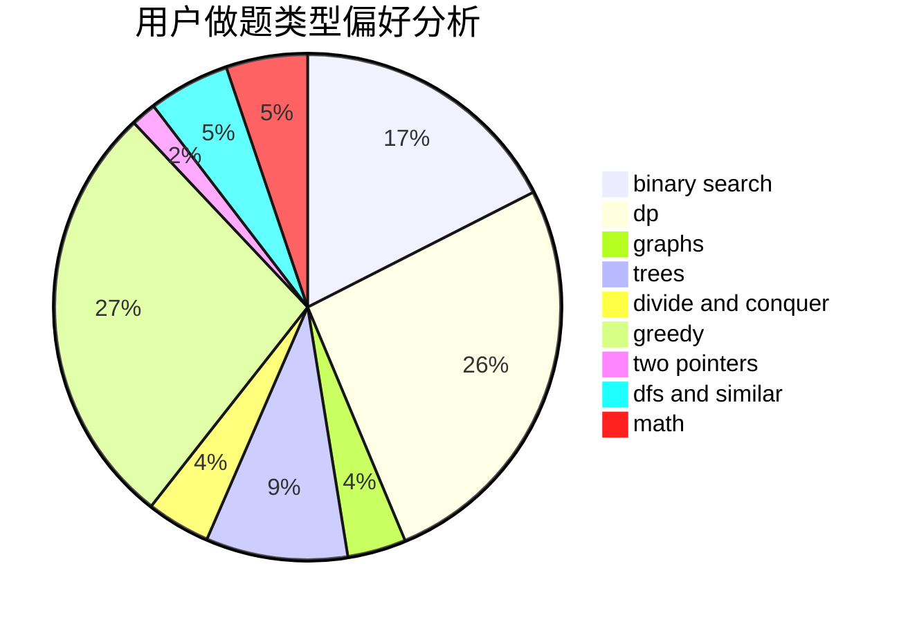

# Cothrax

<!-- tabs:start -->

#### **用户提交结果分析**

#### **用户做题类型偏好分析**

<!-- tabs:end -->
# 推荐题目
[580D](https://codeforces.com/contest/580/problem/D)
[371C](https://codeforces.com/contest/371/problem/C)
[1290A](https://codeforces.com/contest/1290/problem/A)
[681B](https://codeforces.com/contest/681/problem/B)
[1090A](https://codeforces.com/contest/1090/problem/A)
[166A](https://codeforces.com/contest/166/problem/A)
[1252L](https://codeforces.com/contest/1252/problem/L)
[535B](https://codeforces.com/contest/535/problem/B)
[735C](https://codeforces.com/contest/735/problem/C)
[1053B](https://codeforces.com/contest/1053/problem/B)
