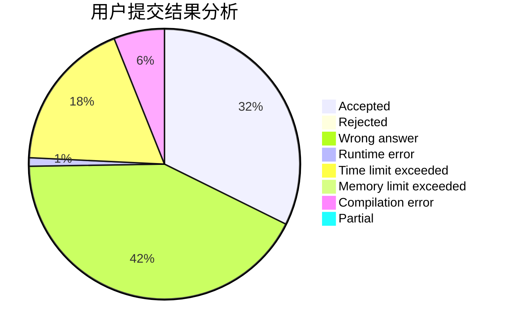
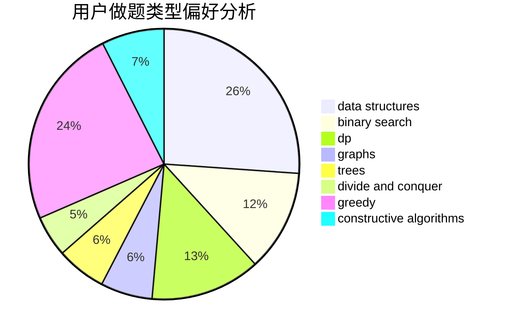
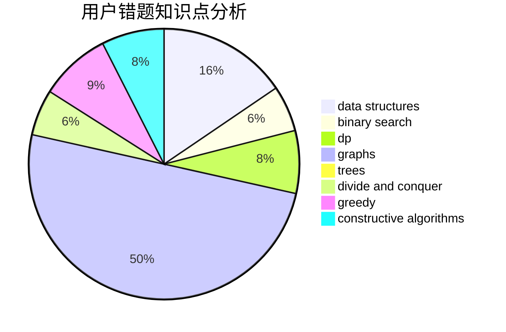

# Cothrax

<!-- tabs:start -->

#### **用户提交结果分析**

#### **用户做题类型偏好分析**

#### **用户错题知识点分析**

<!-- tabs:end -->
# 推荐题目
[557C](https://codeforces.com/contest/557/problem/C)		brute force,
                        data structures,
                        dp,
                        greedy,
                        math,
                        sortings		  
[345A](https://codeforces.com/contest/345/problem/A)		*special problem,
                        probabilities		  
[1283A](https://codeforces.com/contest/1283/problem/A)		math		  
[660D](https://codeforces.com/contest/660/problem/D)		geometry		  
[1089L](https://codeforces.com/contest/1089/problem/L)		nan		  
[1510I](https://codeforces.com/contest/1510/problem/I)		greedy,
                        interactive,
                        math,
                        probabilities		  
[1249C1](https://codeforces.com/contest/1249C/problem/1)		brute force,
                        greedy,
                        implementation		  
[512B](https://codeforces.com/contest/512/problem/B)		dsu,graphs,sortings,trees		  
[717I](https://codeforces.com/contest/717/problem/I)		geometry		  
[1051F](https://codeforces.com/contest/1051/problem/F)		graphs,
                        shortest paths,
                        trees		  
