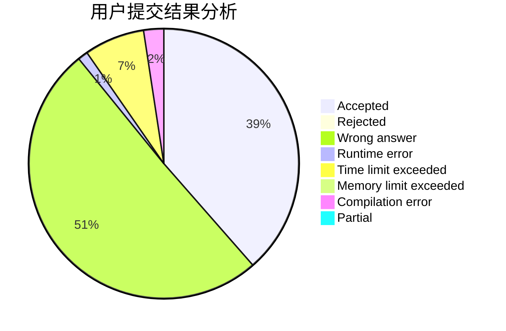
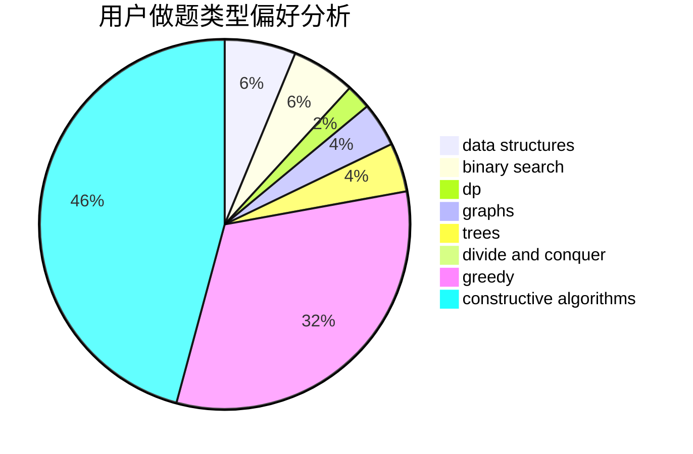
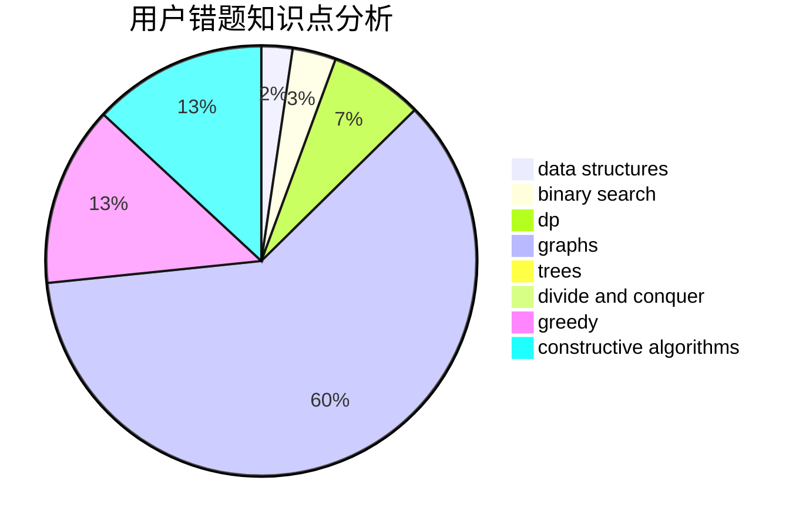

# 19yjy

<!-- tabs:start -->

#### **用户提交结果分析**

#### **用户做题类型偏好分析**

#### **用户错题知识点分析**

<!-- tabs:end -->
# 推荐题目
[1197A](https://codeforces.com/contest/1197/problem/A)		greedy,
                        math,
                        sortings		  
[1196C](https://codeforces.com/contest/1196/problem/C)		implementation		  
[1198E](https://codeforces.com/contest/1198/problem/E)		flows,
                        graph matchings,
                        graphs		  
[11C](https://codeforces.com/contest/11/problem/C)		implementation		  
[1196D2](https://codeforces.com/contest/1196D/problem/2)		data structures,
                        dp,
                        implementation,
                        two pointers		  
[1199E](https://codeforces.com/contest/1199/problem/E)		dsu,graphs,sortings,trees		  
[1199A](https://codeforces.com/contest/1199/problem/A)		implementation		  
[11B](https://codeforces.com/contest/11/problem/B)		math		  
[1149D](https://codeforces.com/contest/1149/problem/D)		brute force,
                        dp,
                        graphs,
                        greedy		  
[1195B](https://codeforces.com/contest/1195/problem/B)		binary search,
                        brute force,
                        math		  
