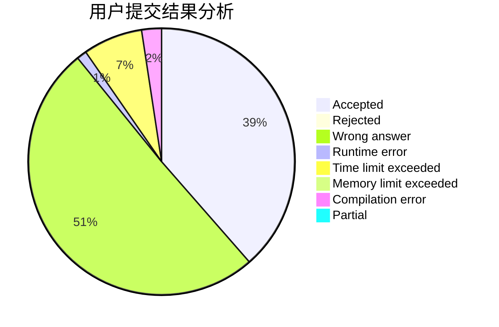
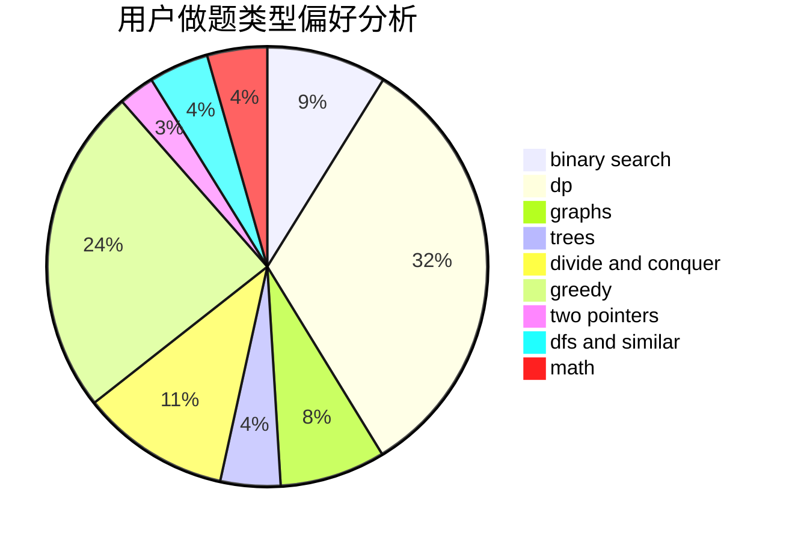

# 19yjy

<!-- tabs:start -->

#### **用户提交结果分析**

#### **用户做题类型偏好分析**

<!-- tabs:end -->
# 推荐题目
[1200C](https://codeforces.com/contest/1200/problem/C)
[11D](https://codeforces.com/contest/11/problem/D)
[1202C](https://codeforces.com/contest/1202/problem/C)
[1204A](https://codeforces.com/contest/1204/problem/A)
[1200A](https://codeforces.com/contest/1200/problem/A)
[1203A](https://codeforces.com/contest/1203/problem/A)
[1202E](https://codeforces.com/contest/1202/problem/E)
[12042](https://codeforces.com/contest/1204/problem/2)
[1151B](https://codeforces.com/contest/1151/problem/B)
[1199D](https://codeforces.com/contest/1199/problem/D)
