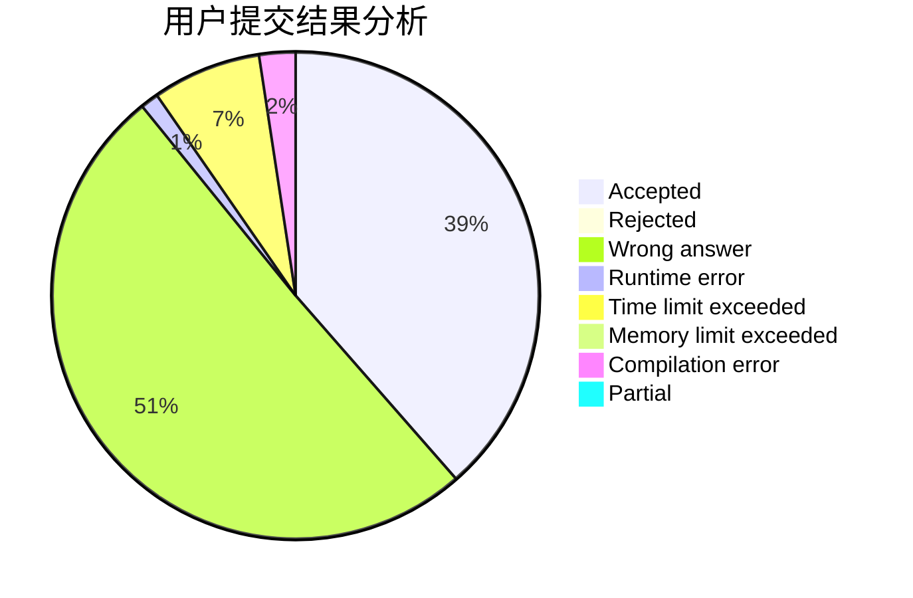
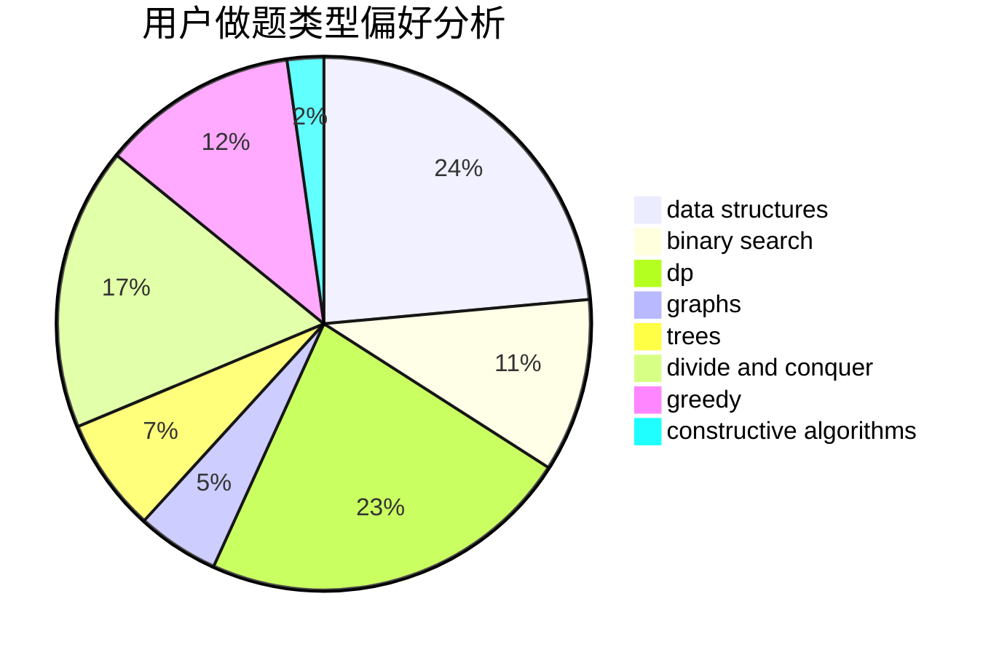
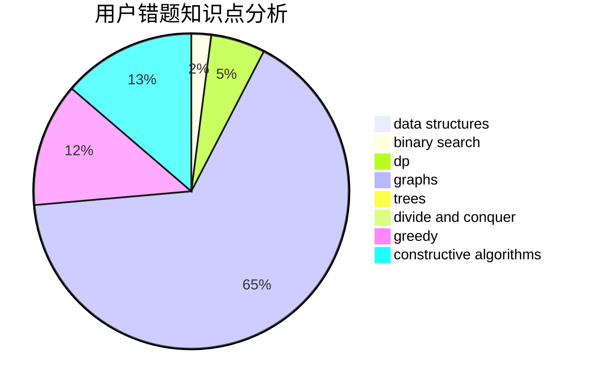

# 19yjy

<!-- tabs:start -->

#### **用户提交结果分析**

#### **用户做题类型偏好分析**

#### **用户错题知识点分析**

<!-- tabs:end -->
# 推荐题目
[1200C](https://codeforces.com/contest/1200/problem/C)		math,
                        number theory		  
[11D](https://codeforces.com/contest/11/problem/D)		bitmasks,
                        dp,
                        graphs		  
[1202C](https://codeforces.com/contest/1202/problem/C)		brute force,
                        data structures,
                        dp,
                        greedy,
                        implementation,
                        math,
                        strings		  
[1204A](https://codeforces.com/contest/1204/problem/A)		math		  
[1200A](https://codeforces.com/contest/1200/problem/A)		brute force,
                        data structures,
                        implementation		  
[1203A](https://codeforces.com/contest/1203/problem/A)		implementation		  
[1202E](https://codeforces.com/contest/1202/problem/E)		brute force,
                        string suffix structures,
                        strings		  
[12042](https://codeforces.com/contest/1204/problem/2)		dsu,graphs,sortings,trees		  
[1151B](https://codeforces.com/contest/1151/problem/B)		bitmasks,
                        brute force,
                        constructive algorithms,
                        dp		  
[1199D](https://codeforces.com/contest/1199/problem/D)		dsu,graphs,sortings,trees		  
