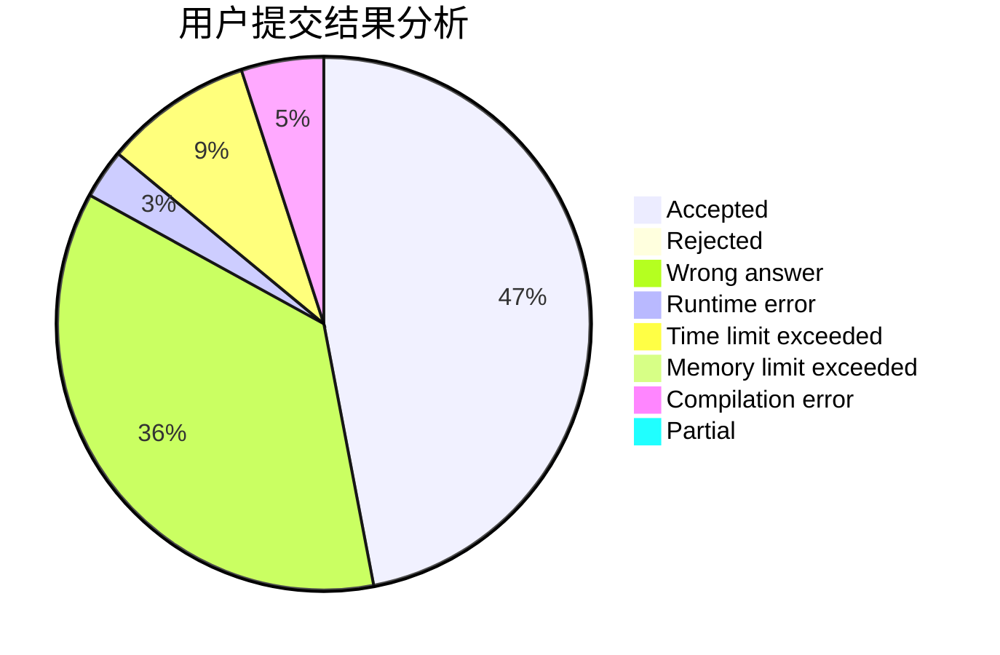
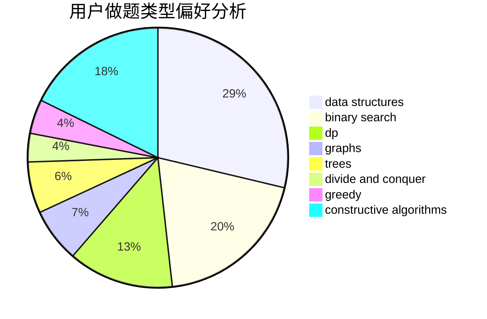
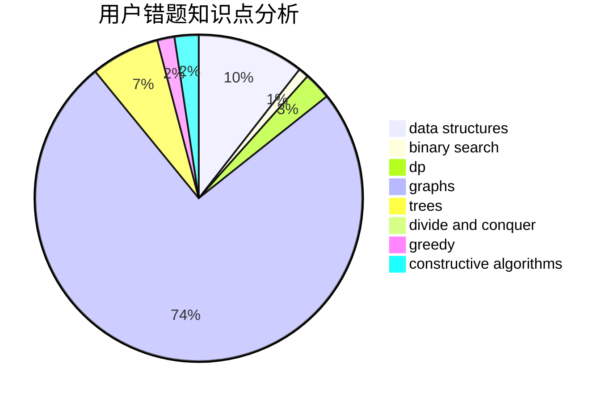

# Cowbby

<!-- tabs:start -->

#### **用户提交结果分析**

#### **用户做题类型偏好分析**

#### **用户错题知识点分析**

<!-- tabs:end -->
# 推荐题目
[616E](https://codeforces.com/contest/616/problem/E)		implementation,
                        math,
                        number theory		  
[27C](https://codeforces.com/contest/27/problem/C)		constructive algorithms,
                        greedy		  
[1106B](https://codeforces.com/contest/1106/problem/B)		data structures,
                        implementation		  
[417E](https://codeforces.com/contest/417/problem/E)		constructive algorithms,
                        math,
                        probabilities		  
[36C](https://codeforces.com/contest/36/problem/C)		geometry,
                        implementation		  
[715C](https://codeforces.com/contest/715/problem/C)		dfs and similar,
                        divide and conquer,
                        dsu,
                        trees		  
[1202B](https://codeforces.com/contest/1202/problem/B)		brute force,
                        dp,
                        shortest paths		  
[371C](https://codeforces.com/contest/371/problem/C)		binary search,
                        brute force		  
[269C](https://codeforces.com/contest/269/problem/C)		constructive algorithms,
                        flows,
                        graphs,
                        greedy		  
[166A](https://codeforces.com/contest/166/problem/A)		binary search,
                        implementation,
                        sortings		  
