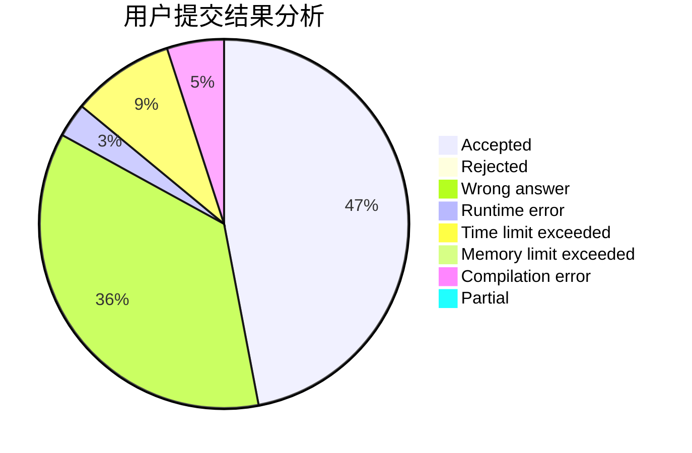
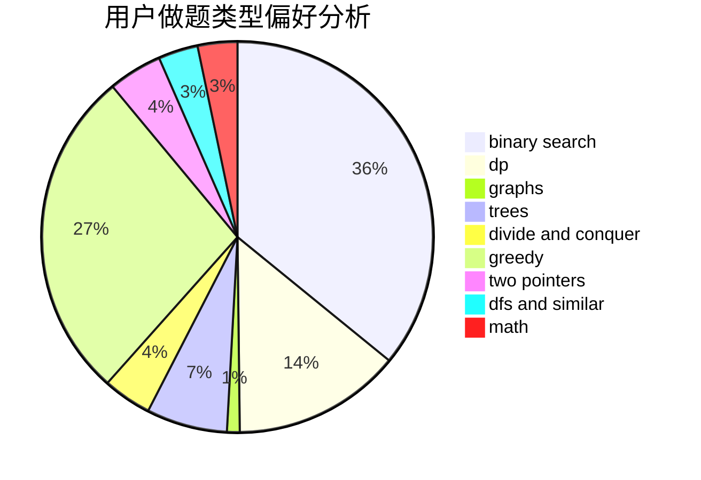

# Cowbby

<!-- tabs:start -->

#### **用户提交结果分析**

#### **用户做题类型偏好分析**

<!-- tabs:end -->
# 推荐题目
[634B](https://codeforces.com/contest/634/problem/B)
[295B](https://codeforces.com/contest/295/problem/B)
[1106E](https://codeforces.com/contest/1106/problem/E)
[442D](https://codeforces.com/contest/442/problem/D)
[39J](https://codeforces.com/contest/39/problem/J)
[733E](https://codeforces.com/contest/733/problem/E)
[1206D](https://codeforces.com/contest/1206/problem/D)
[400E](https://codeforces.com/contest/400/problem/E)
[285A](https://codeforces.com/contest/285/problem/A)
[191C](https://codeforces.com/contest/191/problem/C)
