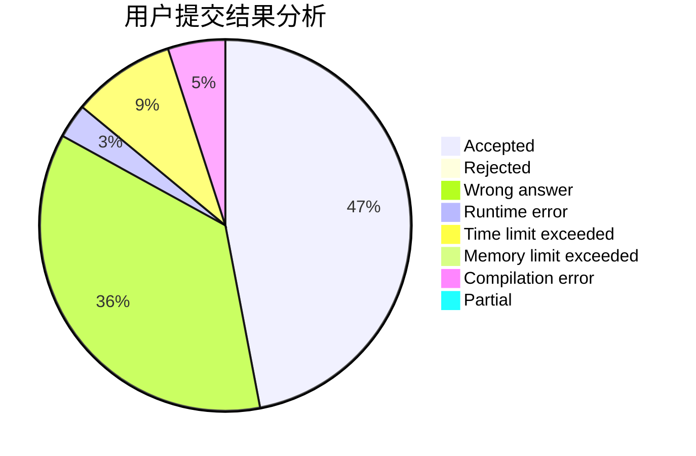
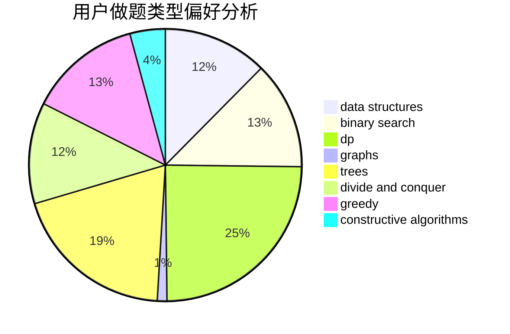
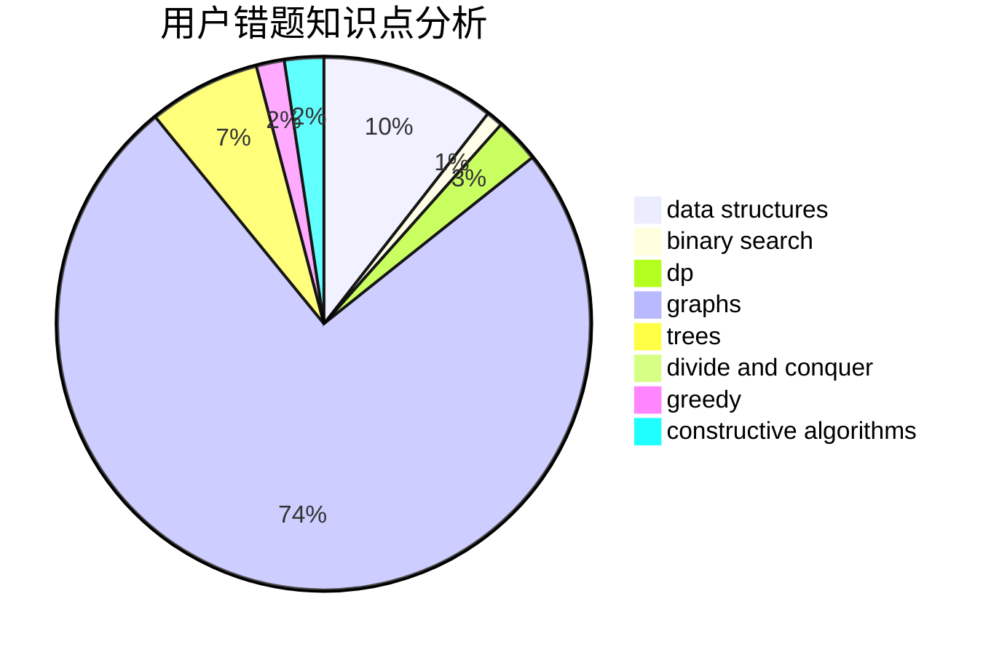

# Cowbby

<!-- tabs:start -->

#### **用户提交结果分析**

#### **用户做题类型偏好分析**

#### **用户错题知识点分析**

<!-- tabs:end -->
# 推荐题目
[634B](https://codeforces.com/contest/634/problem/B)		dsu,graphs,sortings,trees		  
[295B](https://codeforces.com/contest/295/problem/B)		dp,
                        graphs,
                        shortest paths		  
[1106E](https://codeforces.com/contest/1106/problem/E)		data structures,
                        dp		  
[442D](https://codeforces.com/contest/442/problem/D)		data structures,
                        trees		  
[39J](https://codeforces.com/contest/39/problem/J)		hashing,
                        implementation,
                        strings		  
[733E](https://codeforces.com/contest/733/problem/E)		constructive algorithms,
                        data structures,
                        math,
                        two pointers		  
[1206D](https://codeforces.com/contest/1206/problem/D)		dsu,graphs,sortings,trees		  
[400E](https://codeforces.com/contest/400/problem/E)		binary search,
                        bitmasks,
                        data structures		  
[285A](https://codeforces.com/contest/285/problem/A)		greedy,
                        implementation		  
[191C](https://codeforces.com/contest/191/problem/C)		data structures,
                        dfs and similar,
                        trees		  
