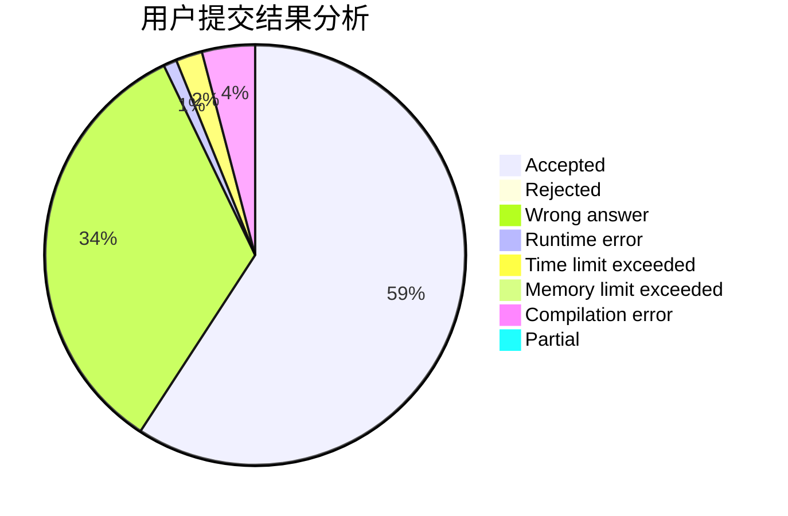
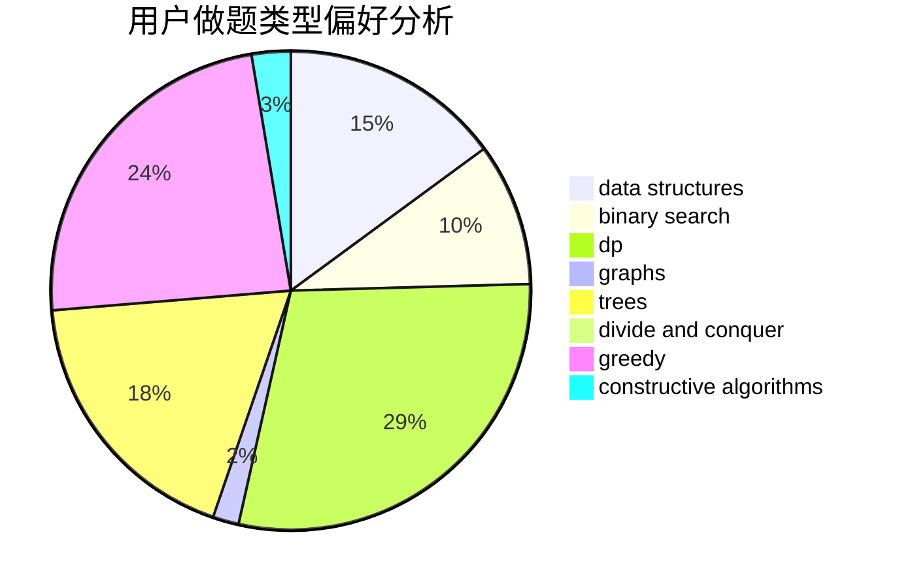
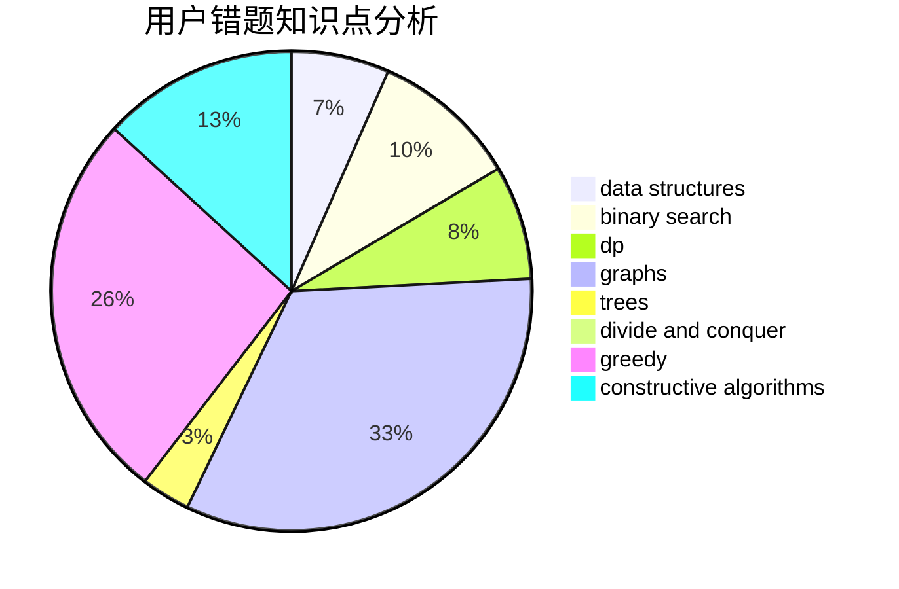

# Cr_Momi91

<!-- tabs:start -->

#### **用户提交结果分析**

#### **用户做题类型偏好分析**

#### **用户错题知识点分析**

<!-- tabs:end -->
# 推荐题目
[1066E](https://codeforces.com/contest/1066/problem/E)		data structures,
                        implementation,
                        math		  
[1067E](https://codeforces.com/contest/1067/problem/E)		dp,
                        graph matchings,
                        math,
                        trees		  
[388E](https://codeforces.com/contest/388/problem/E)		geometry		  
[732F](https://codeforces.com/contest/732/problem/F)		dfs and similar,
                        graphs		  
[1067A](https://codeforces.com/contest/1067/problem/A)		dp		  
[342E](https://codeforces.com/contest/342/problem/E)		data structures,
                        divide and conquer,
                        trees		  
[1073G](https://codeforces.com/contest/1073/problem/G)		data structures,
                        string suffix structures		  
[106A](https://codeforces.com/contest/106/problem/A)		implementation		  
[1453C](https://codeforces.com/contest/1453/problem/C)		greedy,
                        implementation		  
[553A](https://codeforces.com/contest/553/problem/A)		combinatorics,
                        dp,
                        math		  
