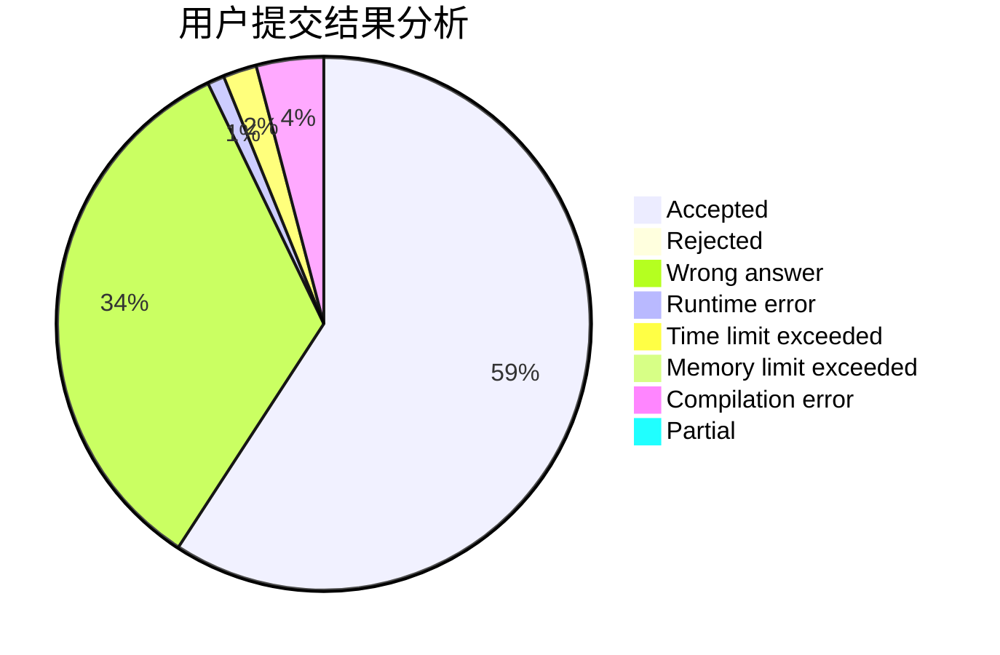
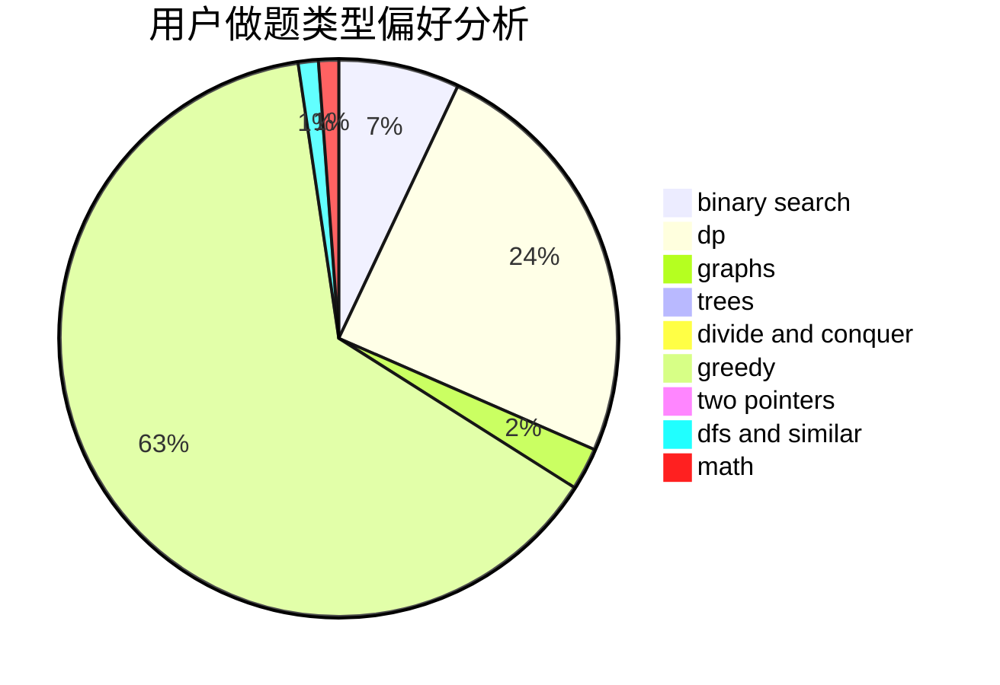

# Cr_Momi91

<!-- tabs:start -->

#### **用户提交结果分析**

#### **用户做题类型偏好分析**

<!-- tabs:end -->
# 推荐题目
[1067B](https://codeforces.com/contest/1067/problem/B)
[1068C](https://codeforces.com/contest/1068/problem/C)
[418B](https://codeforces.com/contest/418/problem/B)
[750E](https://codeforces.com/contest/750/problem/E)
[1067D](https://codeforces.com/contest/1067/problem/D)
[36A](https://codeforces.com/contest/36/problem/A)
[1074C](https://codeforces.com/contest/1074/problem/C)
[1070A](https://codeforces.com/contest/1070/problem/A)
[1462F](https://codeforces.com/contest/1462/problem/F)
[578C](https://codeforces.com/contest/578/problem/C)
