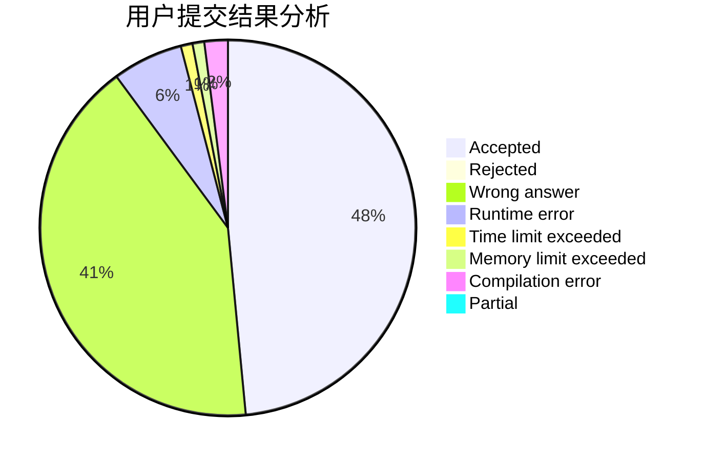
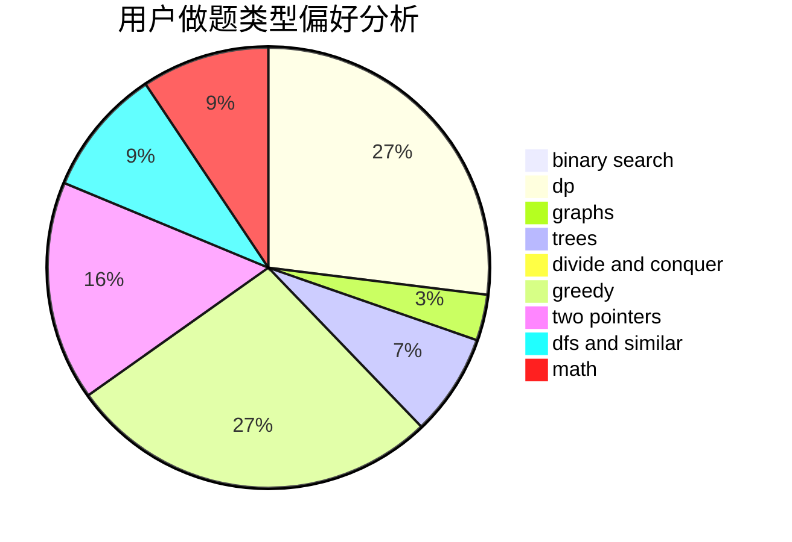

# Crab_Dave

<!-- tabs:start -->

#### **用户提交结果分析**

#### **用户做题类型偏好分析**

<!-- tabs:end -->
# 推荐题目
[1394A](https://codeforces.com/contest/1394/problem/A)
[750F](https://codeforces.com/contest/750/problem/F)
[1070F](https://codeforces.com/contest/1070/problem/F)
[107C](https://codeforces.com/contest/107/problem/C)
[1016F](https://codeforces.com/contest/1016/problem/F)
[380C](https://codeforces.com/contest/380/problem/C)
[1145D](https://codeforces.com/contest/1145/problem/D)
[110A](https://codeforces.com/contest/110/problem/A)
[438D](https://codeforces.com/contest/438/problem/D)
[1367E](https://codeforces.com/contest/1367/problem/E)
