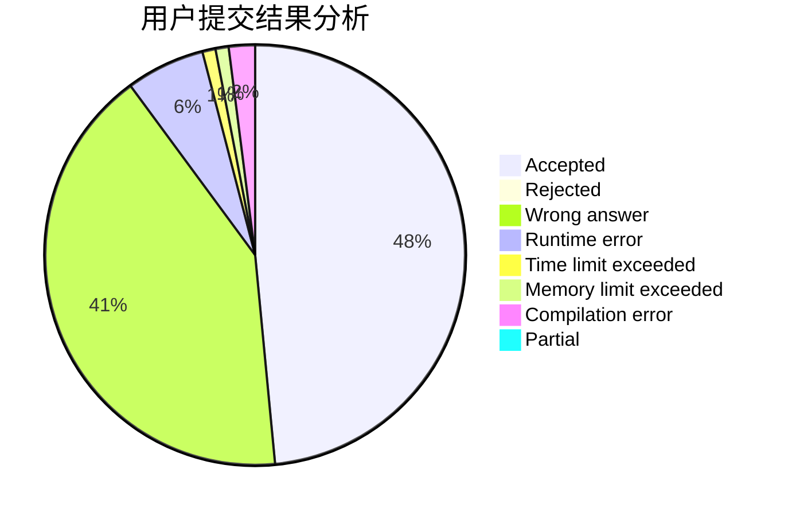
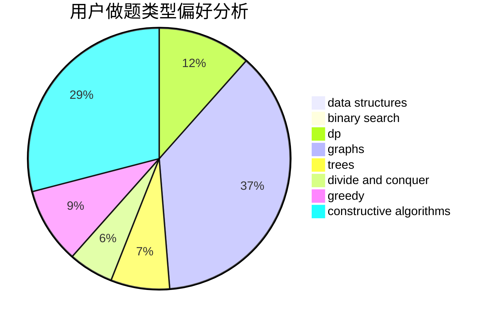
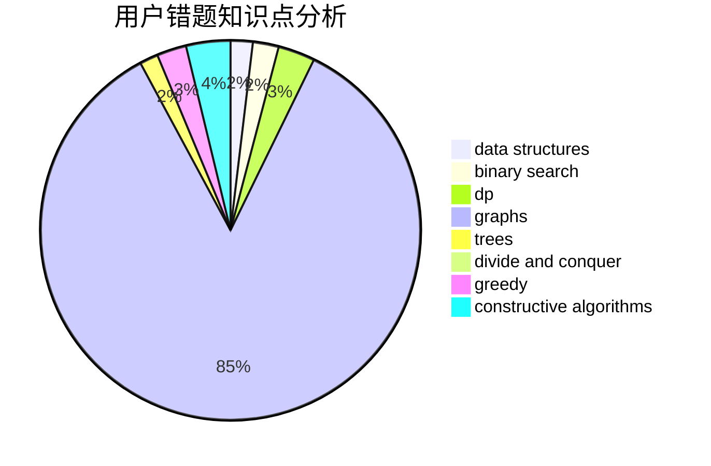

# Crab_Dave

<!-- tabs:start -->

#### **用户提交结果分析**

#### **用户做题类型偏好分析**

#### **用户错题知识点分析**

<!-- tabs:end -->
# 推荐题目
[1384B1](https://codeforces.com/contest/1384B/problem/1)		brute force,
                        dp,
                        greedy		  
[733A](https://codeforces.com/contest/733/problem/A)		implementation		  
[1070C](https://codeforces.com/contest/1070/problem/C)		data structures,
                        greedy		  
[1079D](https://codeforces.com/contest/1079/problem/D)		dsu,graphs,sortings,trees		  
[1016C](https://codeforces.com/contest/1016/problem/C)		dp,
                        implementation		  
[354D](https://codeforces.com/contest/354/problem/D)		dp		  
[1143D](https://codeforces.com/contest/1143/problem/D)		dsu,graphs,sortings,trees		  
[1109D](https://codeforces.com/contest/1109/problem/D)		brute force,
                        combinatorics,
                        dp,
                        math,
                        trees		  
[412E](https://codeforces.com/contest/412/problem/E)		implementation		  
[1359F](https://codeforces.com/contest/1359/problem/F)		binary search,
                        brute force,
                        data structures,
                        geometry,
                        math		  
