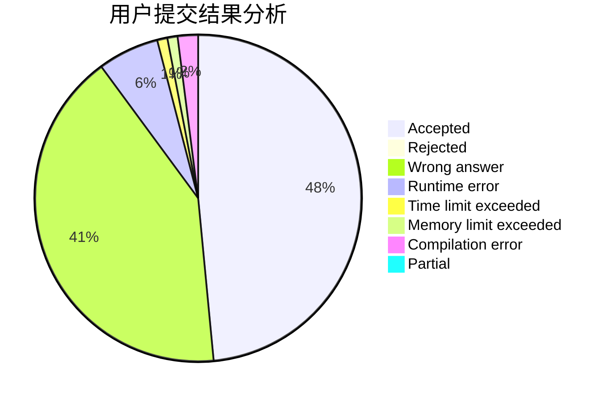
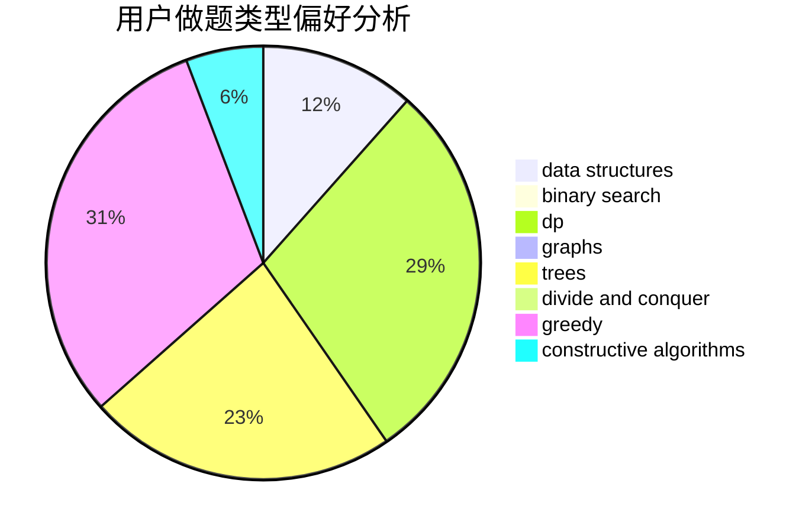
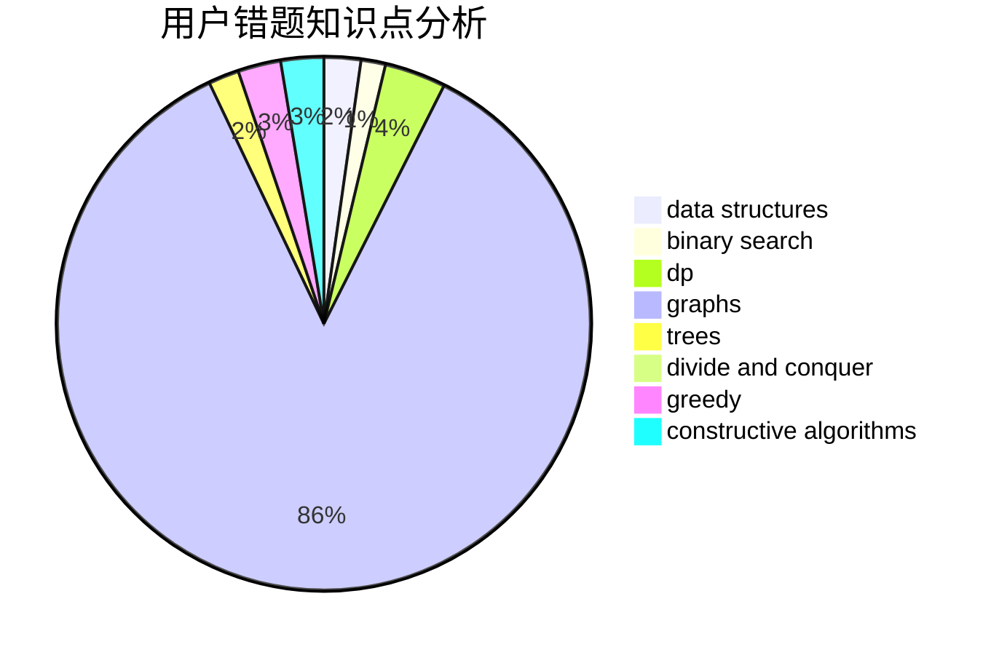

# Crab_Dave

<!-- tabs:start -->

#### **用户提交结果分析**

#### **用户做题类型偏好分析**

#### **用户错题知识点分析**

<!-- tabs:end -->
# 推荐题目
[1394A](https://codeforces.com/contest/1394/problem/A)		dp,
                        greedy,
                        sortings,
                        two pointers		  
[750F](https://codeforces.com/contest/750/problem/F)		constructive algorithms,
                        implementation,
                        interactive,
                        trees		  
[1070F](https://codeforces.com/contest/1070/problem/F)		greedy		  
[107C](https://codeforces.com/contest/107/problem/C)		bitmasks,
                        dp		  
[1016F](https://codeforces.com/contest/1016/problem/F)		dfs and similar,
                        dp,
                        trees		  
[380C](https://codeforces.com/contest/380/problem/C)		data structures,
                        schedules		  
[1145D](https://codeforces.com/contest/1145/problem/D)		implementation		  
[110A](https://codeforces.com/contest/110/problem/A)		implementation		  
[438D](https://codeforces.com/contest/438/problem/D)		data structures,
                        math		  
[1367E](https://codeforces.com/contest/1367/problem/E)		brute force,
                        dfs and similar,
                        dp,
                        graphs,
                        greedy,
                        number theory		  
