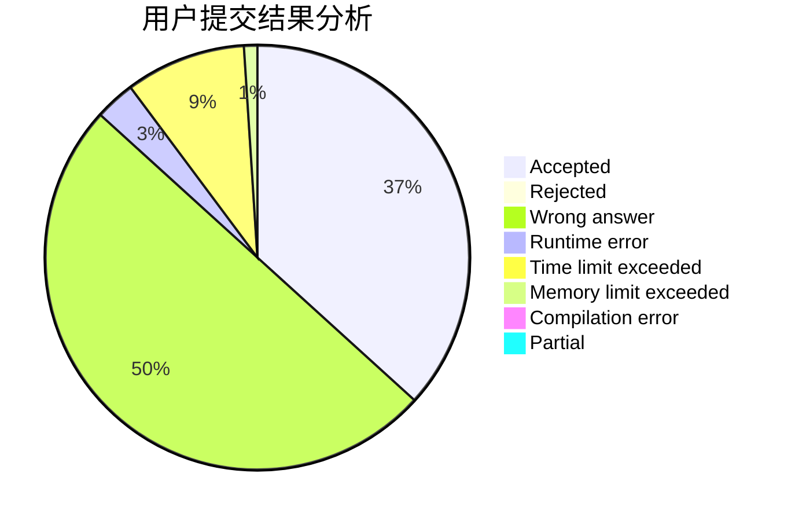
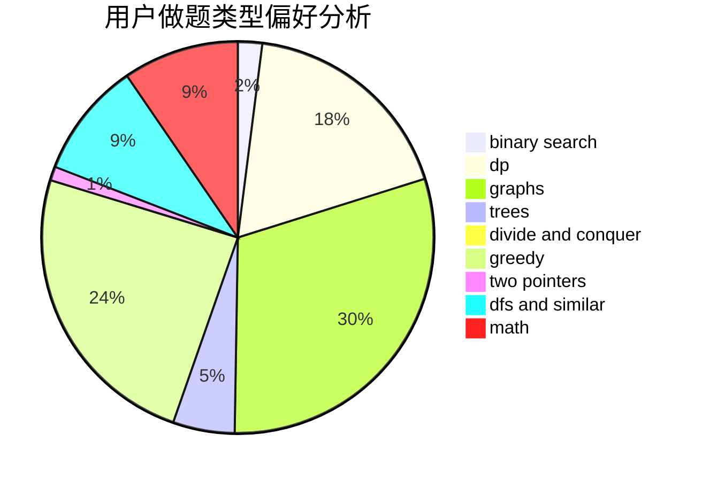

# Crabby_Maskiv

<!-- tabs:start -->

#### **用户提交结果分析**

#### **用户做题类型偏好分析**

<!-- tabs:end -->
# 推荐题目
[371C](https://codeforces.com/contest/371/problem/C)
[1071A](https://codeforces.com/contest/1071/problem/A)
[1113A](https://codeforces.com/contest/1113/problem/A)
[160D](https://codeforces.com/contest/160/problem/D)
[634B](https://codeforces.com/contest/634/problem/B)
[674G](https://codeforces.com/contest/674/problem/G)
[754B](https://codeforces.com/contest/754/problem/B)
[1239B](https://codeforces.com/contest/1239/problem/B)
[701C](https://codeforces.com/contest/701/problem/C)
[29A](https://codeforces.com/contest/29/problem/A)
