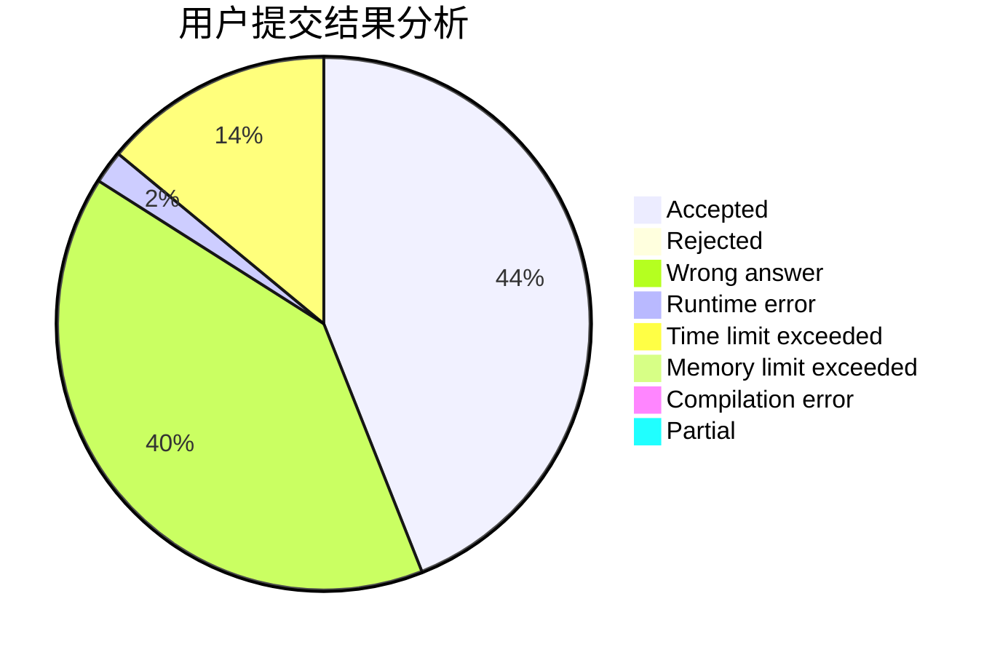
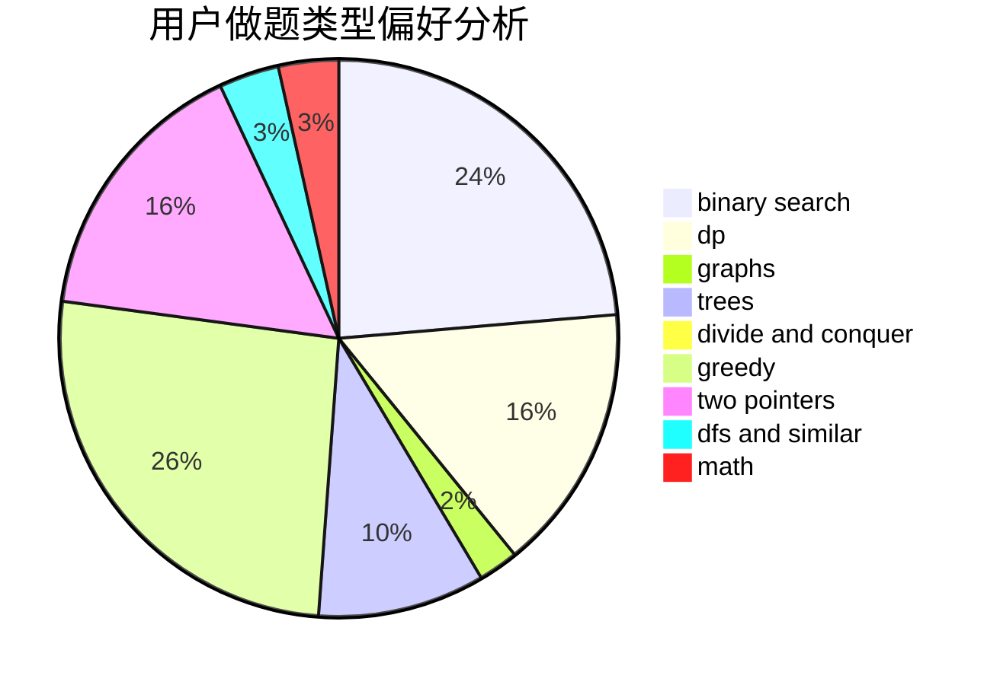

# CrayonKe

<!-- tabs:start -->

#### **用户提交结果分析**

#### **用户做题类型偏好分析**

<!-- tabs:end -->
# 推荐题目
[1500E](https://codeforces.com/contest/1500/problem/E)
[1119C](https://codeforces.com/contest/1119/problem/C)
[1104C](https://codeforces.com/contest/1104/problem/C)
[1183C](https://codeforces.com/contest/1183/problem/C)
[755C](https://codeforces.com/contest/755/problem/C)
[292A](https://codeforces.com/contest/292/problem/A)
[1009C](https://codeforces.com/contest/1009/problem/C)
[1081F](https://codeforces.com/contest/1081/problem/F)
[1187B](https://codeforces.com/contest/1187/problem/B)
[1162A](https://codeforces.com/contest/1162/problem/A)
