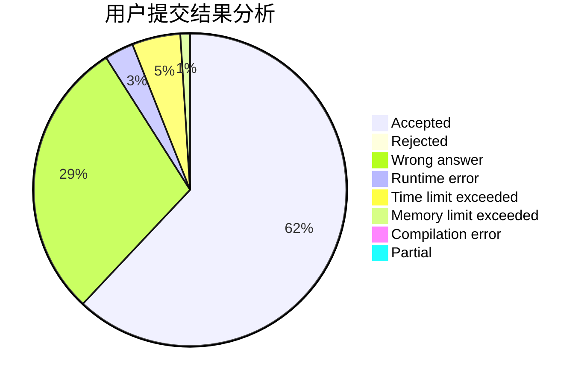
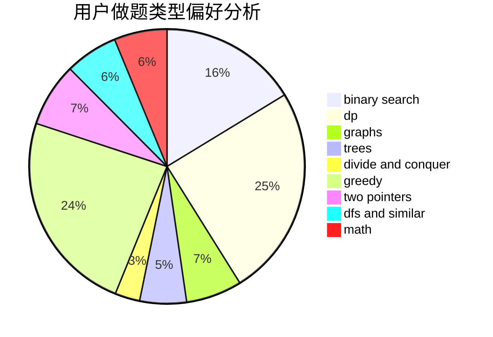

# CrazyTeaMajor

<!-- tabs:start -->

#### **用户提交结果分析**

#### **用户做题类型偏好分析**

<!-- tabs:end -->
# 推荐题目
[1039B](https://codeforces.com/contest/1039/problem/B)
[482A](https://codeforces.com/contest/482/problem/A)
[755G](https://codeforces.com/contest/755/problem/G)
[462A](https://codeforces.com/contest/462/problem/A)
[662D](https://codeforces.com/contest/662/problem/D)
[584C](https://codeforces.com/contest/584/problem/C)
[233A](https://codeforces.com/contest/233/problem/A)
[713E](https://codeforces.com/contest/713/problem/E)
[738D](https://codeforces.com/contest/738/problem/D)
[1087E](https://codeforces.com/contest/1087/problem/E)
