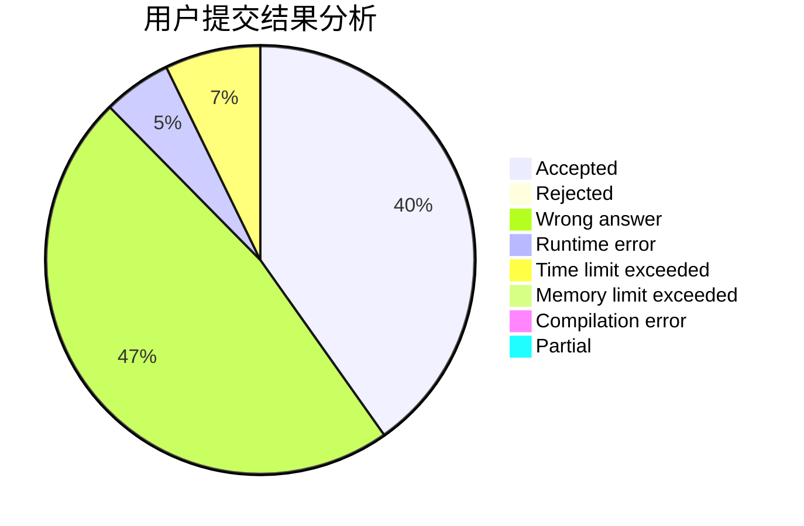
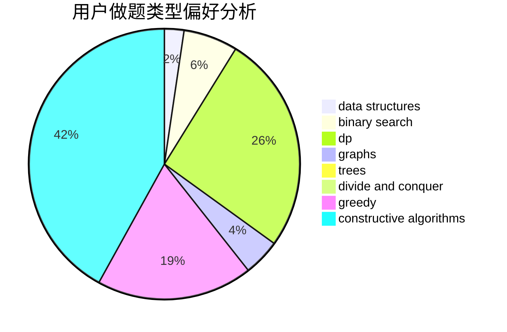
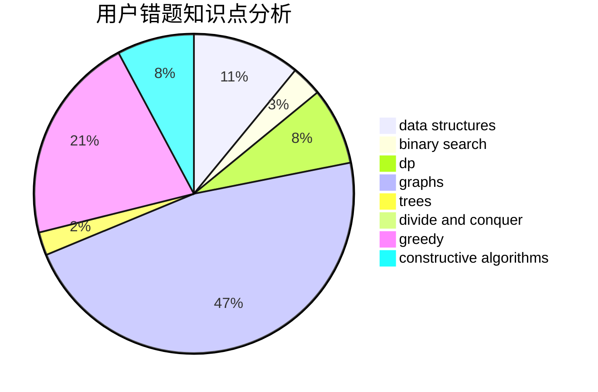

# CreeperK

<!-- tabs:start -->

#### **用户提交结果分析**

#### **用户做题类型偏好分析**

#### **用户错题知识点分析**

<!-- tabs:end -->
# 推荐题目
[329B](https://codeforces.com/contest/329/problem/B)		dfs and similar,
                        shortest paths		  
[1030G](https://codeforces.com/contest/1030/problem/G)		number theory		  
[260D](https://codeforces.com/contest/260/problem/D)		constructive algorithms,
                        dsu,
                        graphs,
                        greedy,
                        trees		  
[1156C](https://codeforces.com/contest/1156/problem/C)		binary search,
                        greedy,
                        sortings,
                        ternary search,
                        two pointers		  
[637B](https://codeforces.com/contest/637/problem/B)		*special problem,
                        binary search,
                        constructive algorithms,
                        data structures,
                        sortings		  
[731B](https://codeforces.com/contest/731/problem/B)		constructive algorithms,
                        greedy		  
[703C](https://codeforces.com/contest/703/problem/C)		geometry,
                        implementation		  
[757B](https://codeforces.com/contest/757/problem/B)		greedy,
                        math,
                        number theory		  
[523A](https://codeforces.com/contest/523/problem/A)		*special problem,
                        implementation		  
[587E](https://codeforces.com/contest/587/problem/E)		data structures		  
