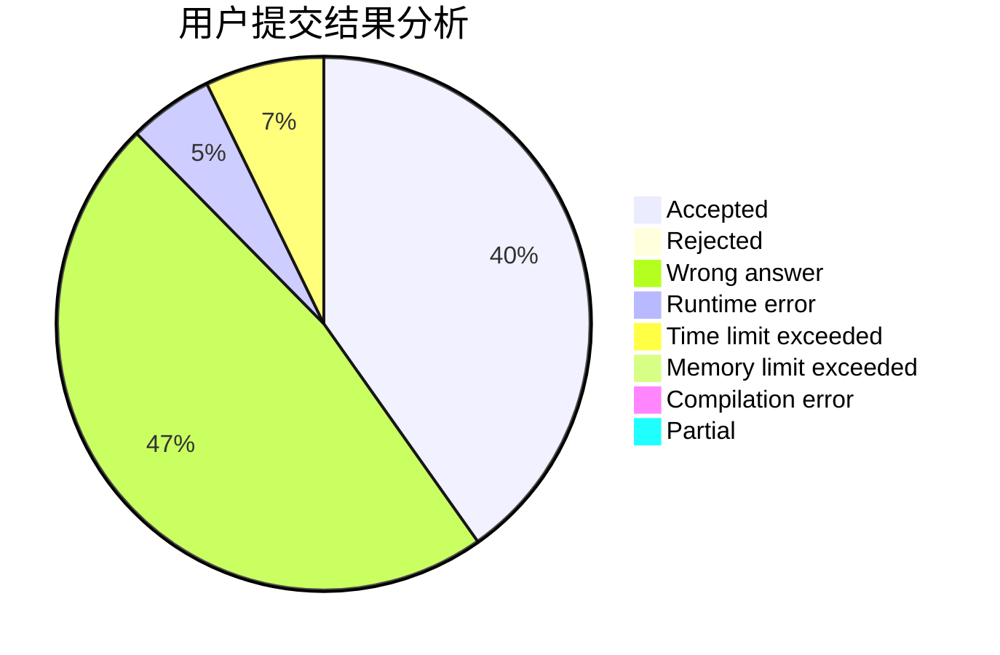
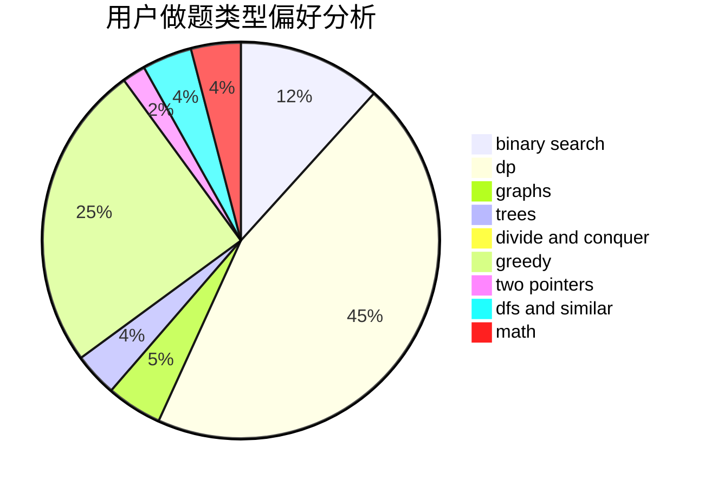

# CreeperK

<!-- tabs:start -->

#### **用户提交结果分析**

#### **用户做题类型偏好分析**

<!-- tabs:end -->
# 推荐题目
[329B](https://codeforces.com/contest/329/problem/B)
[1030G](https://codeforces.com/contest/1030/problem/G)
[260D](https://codeforces.com/contest/260/problem/D)
[1156C](https://codeforces.com/contest/1156/problem/C)
[637B](https://codeforces.com/contest/637/problem/B)
[731B](https://codeforces.com/contest/731/problem/B)
[703C](https://codeforces.com/contest/703/problem/C)
[757B](https://codeforces.com/contest/757/problem/B)
[523A](https://codeforces.com/contest/523/problem/A)
[587E](https://codeforces.com/contest/587/problem/E)
