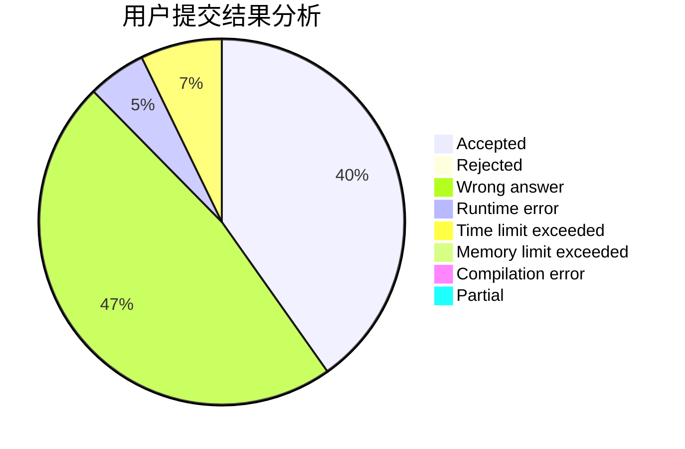
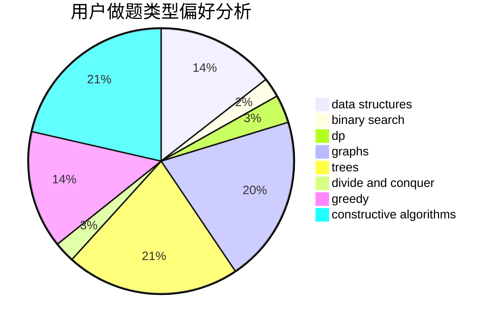
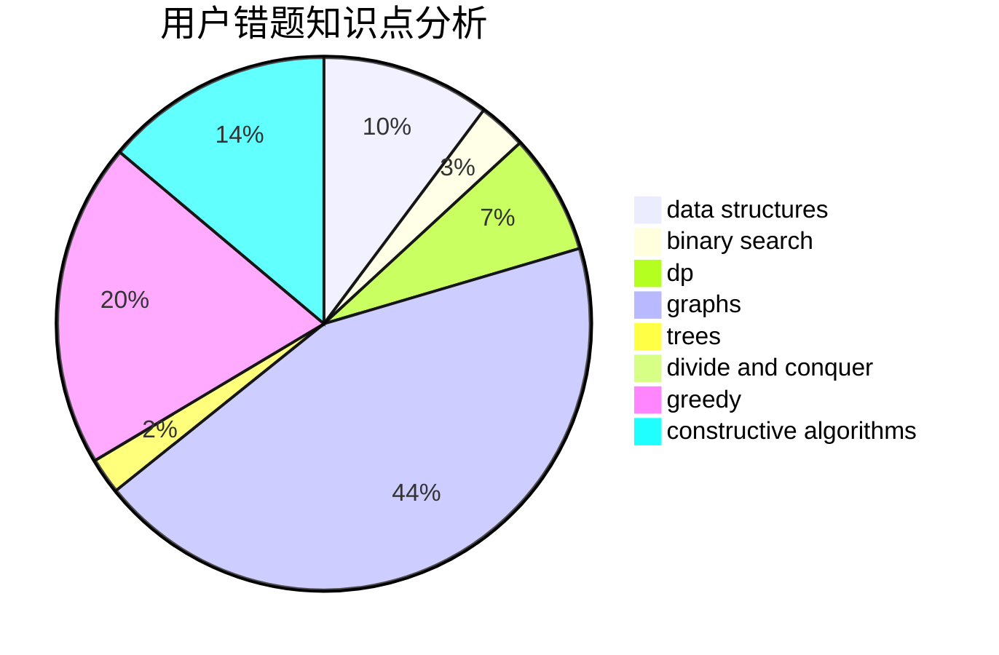

# CreeperK

<!-- tabs:start -->

#### **用户提交结果分析**

#### **用户做题类型偏好分析**

#### **用户错题知识点分析**

<!-- tabs:end -->
# 推荐题目
[306D](https://codeforces.com/contest/306/problem/D)		constructive algorithms,
                        geometry		  
[1030C](https://codeforces.com/contest/1030/problem/C)		implementation		  
[23B](https://codeforces.com/contest/23/problem/B)		constructive algorithms,
                        graphs,
                        math		  
[1154C](https://codeforces.com/contest/1154/problem/C)		implementation,
                        math		  
[618A](https://codeforces.com/contest/618/problem/A)		implementation		  
[711B](https://codeforces.com/contest/711/problem/B)		constructive algorithms,
                        implementation		  
[679E](https://codeforces.com/contest/679/problem/E)		data structures		  
[735D](https://codeforces.com/contest/735/problem/D)		math,
                        number theory		  
[501C](https://codeforces.com/contest/501/problem/C)		constructive algorithms,
                        data structures,
                        greedy,
                        sortings,
                        trees		  
[567F](https://codeforces.com/contest/567/problem/F)		dp		  
