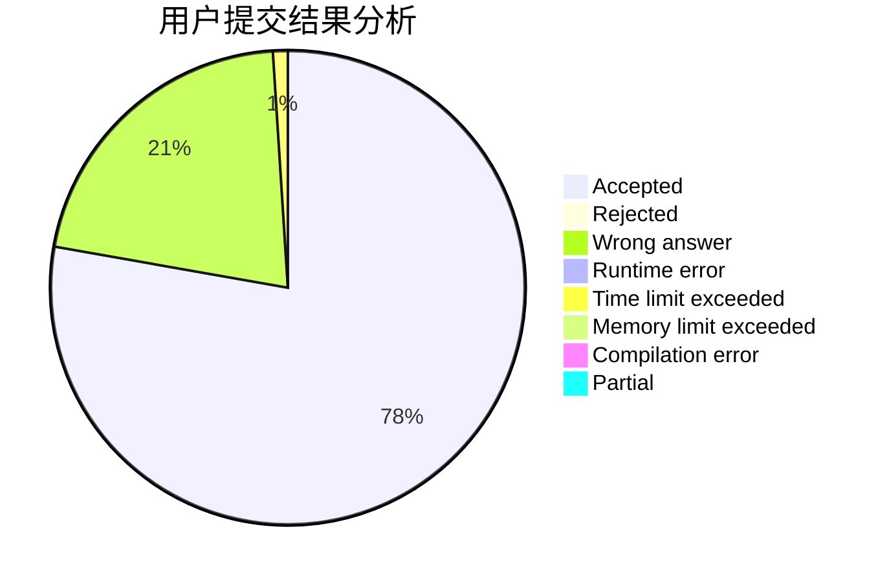
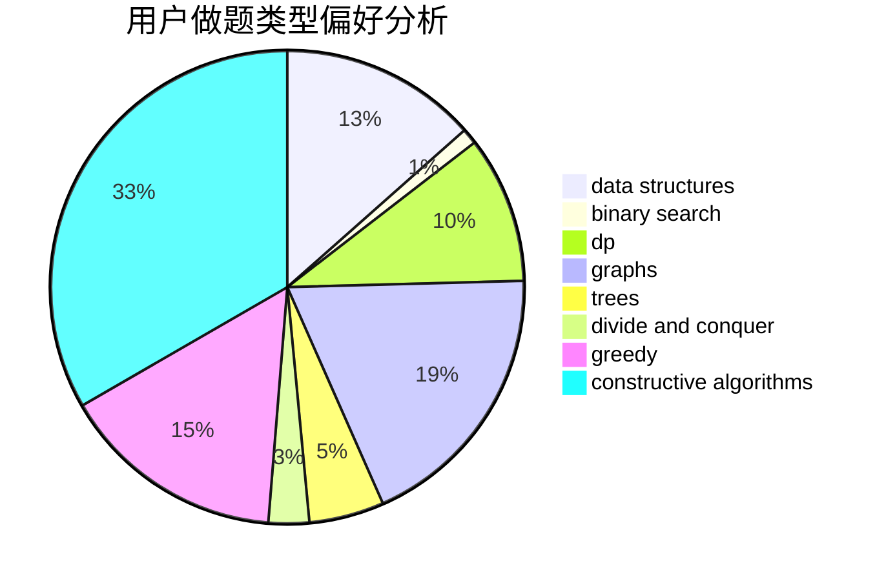
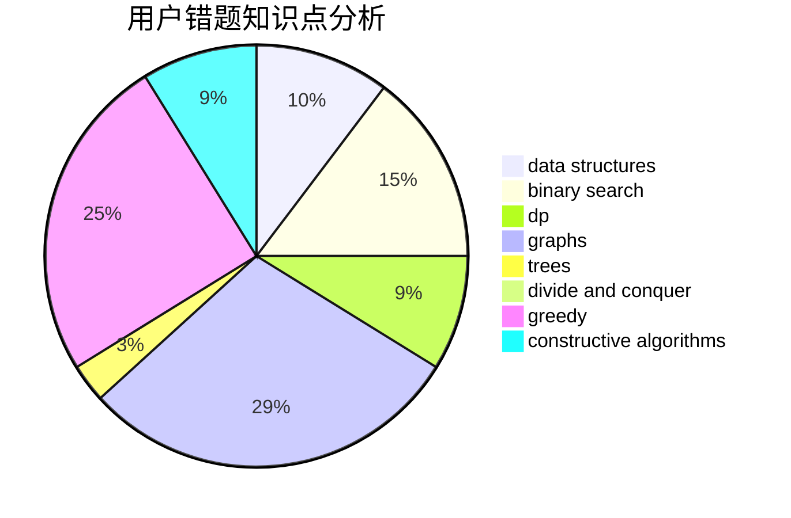

# Cro-Marmot

<!-- tabs:start -->

#### **用户提交结果分析**

#### **用户做题类型偏好分析**

#### **用户错题知识点分析**

<!-- tabs:end -->
# 推荐题目
[736E](https://codeforces.com/contest/736/problem/E)		constructive algorithms,
                        flows,
                        greedy,
                        math		  
[316G3](https://codeforces.com/contest/316G/problem/3)		string suffix structures		  
[1099A](https://codeforces.com/contest/1099/problem/A)		implementation		  
[652A](https://codeforces.com/contest/652/problem/A)		implementation,
                        math		  
[736D](https://codeforces.com/contest/736/problem/D)		math,
                        matrices		  
[1511B](https://codeforces.com/contest/1511/problem/B)		constructive algorithms,
                        math,
                        number theory		  
[1236B](https://codeforces.com/contest/1236/problem/B)		combinatorics,
                        math		  
[1096F](https://codeforces.com/contest/1096/problem/F)		dp,
                        math,
                        probabilities		  
[1098E](https://codeforces.com/contest/1098/problem/E)		binary search,
                        implementation,
                        math,
                        number theory		  
[735E](https://codeforces.com/contest/735/problem/E)		dp,
                        trees		  
