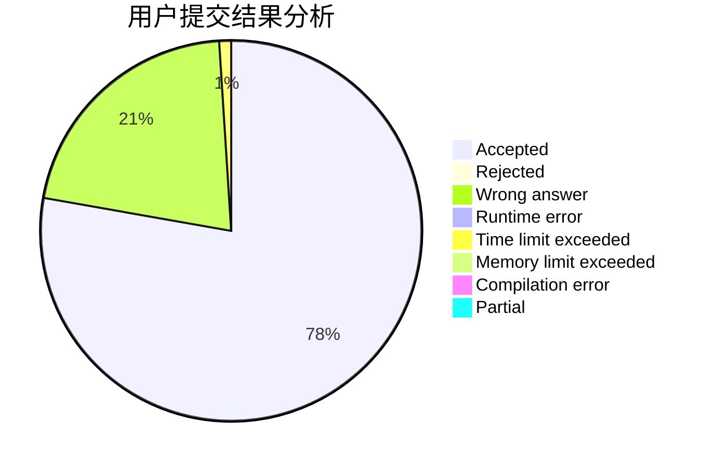
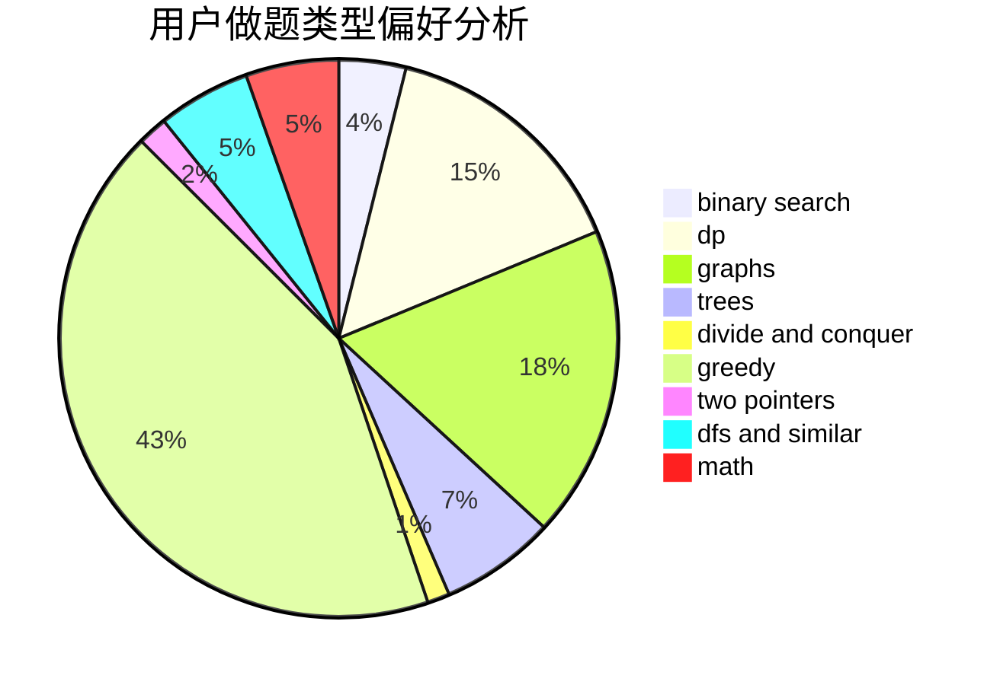

# Cro-Marmot

<!-- tabs:start -->

#### **用户提交结果分析**

#### **用户做题类型偏好分析**

<!-- tabs:end -->
# 推荐题目
[758D](https://codeforces.com/contest/758/problem/D)
[346A](https://codeforces.com/contest/346/problem/A)
[1099D](https://codeforces.com/contest/1099/problem/D)
[675E](https://codeforces.com/contest/675/problem/E)
[758B](https://codeforces.com/contest/758/problem/B)
[167C](https://codeforces.com/contest/167/problem/C)
[1240E](https://codeforces.com/contest/1240/problem/E)
[1097B](https://codeforces.com/contest/1097/problem/B)
[1099B](https://codeforces.com/contest/1099/problem/B)
[757E](https://codeforces.com/contest/757/problem/E)
