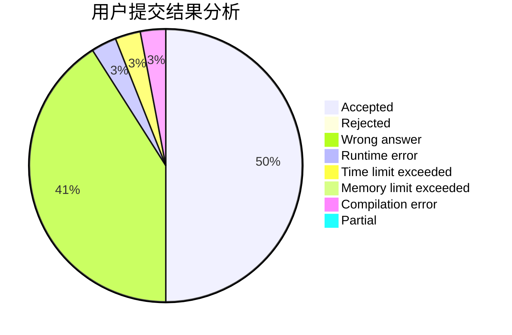
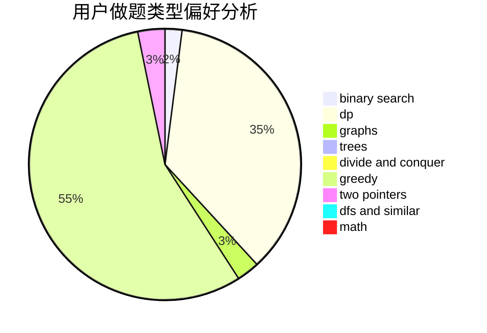

# Crossea

<!-- tabs:start -->

#### **用户提交结果分析**

#### **用户做题类型偏好分析**

<!-- tabs:end -->
# 推荐题目
[1506B](https://codeforces.com/contest/1506/problem/B)
[600D](https://codeforces.com/contest/600/problem/D)
[1119B](https://codeforces.com/contest/1119/problem/B)
[1459E](https://codeforces.com/contest/1459/problem/E)
[759B](https://codeforces.com/contest/759/problem/B)
[758F](https://codeforces.com/contest/758/problem/F)
[1036B](https://codeforces.com/contest/1036/problem/B)
[1210E](https://codeforces.com/contest/1210/problem/E)
[39E](https://codeforces.com/contest/39/problem/E)
[758E](https://codeforces.com/contest/758/problem/E)
