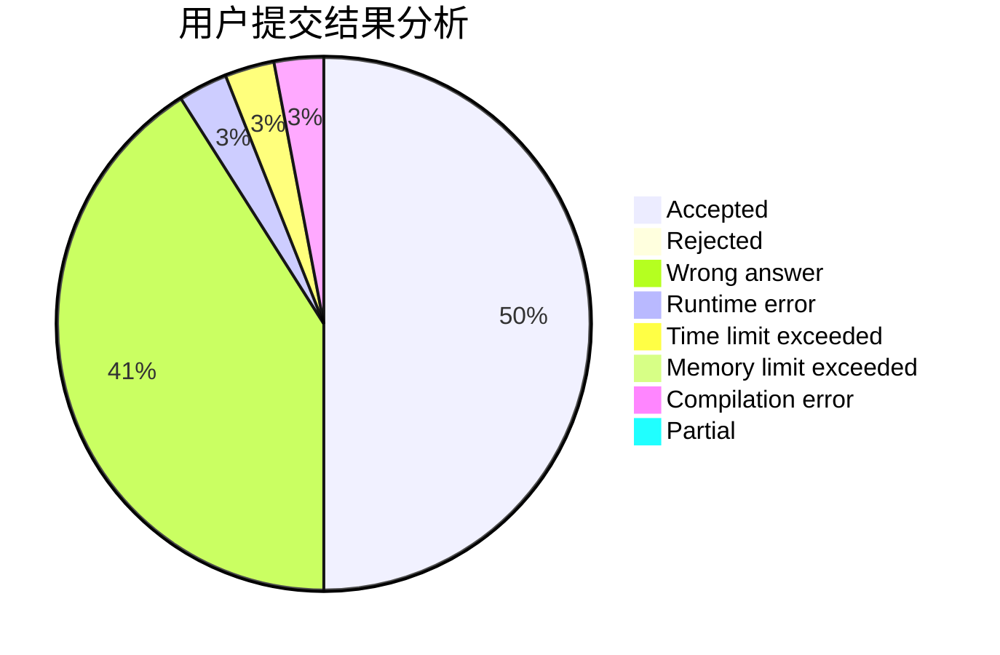
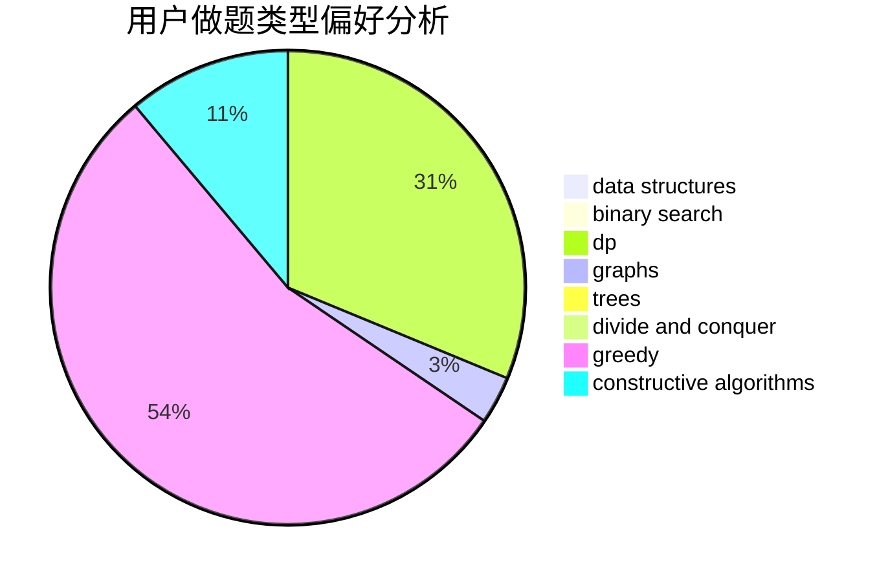
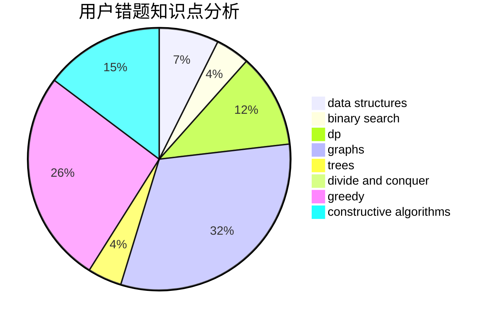

# Crossea

<!-- tabs:start -->

#### **用户提交结果分析**

#### **用户做题类型偏好分析**

#### **用户错题知识点分析**

<!-- tabs:end -->
# 推荐题目
[1506B](https://codeforces.com/contest/1506/problem/B)		greedy,
                        implementation		  
[600D](https://codeforces.com/contest/600/problem/D)		geometry		  
[1119B](https://codeforces.com/contest/1119/problem/B)		binary search,
                        flows,
                        greedy,
                        sortings		  
[1459E](https://codeforces.com/contest/1459/problem/E)		dsu,graphs,sortings,trees		  
[759B](https://codeforces.com/contest/759/problem/B)		dsu,graphs,sortings,trees		  
[758F](https://codeforces.com/contest/758/problem/F)		brute force,
                        math,
                        number theory		  
[1036B](https://codeforces.com/contest/1036/problem/B)		math		  
[1210E](https://codeforces.com/contest/1210/problem/E)		math		  
[39E](https://codeforces.com/contest/39/problem/E)		dp,
                        games		  
[758E](https://codeforces.com/contest/758/problem/E)		dfs and similar,
                        dp,
                        graphs,
                        greedy,
                        trees		  
