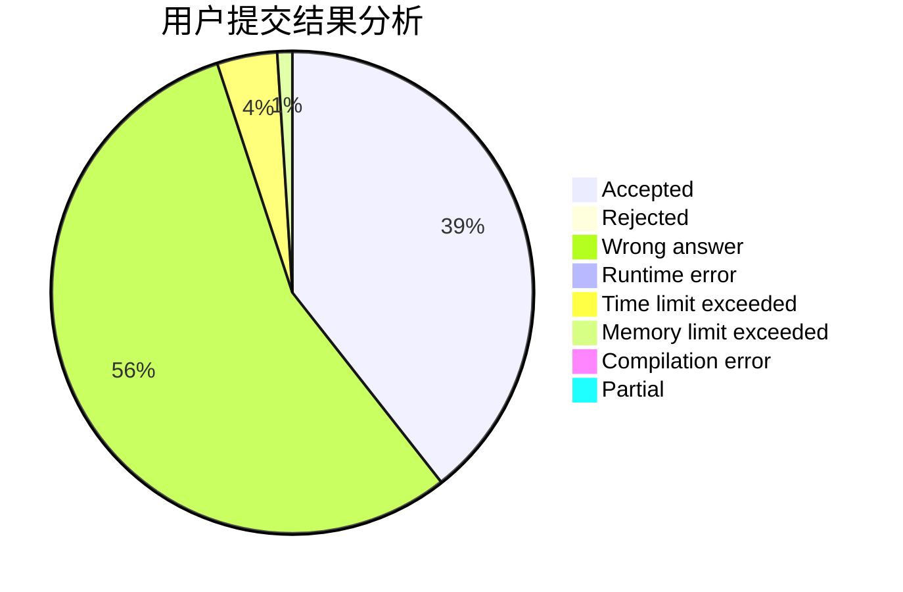
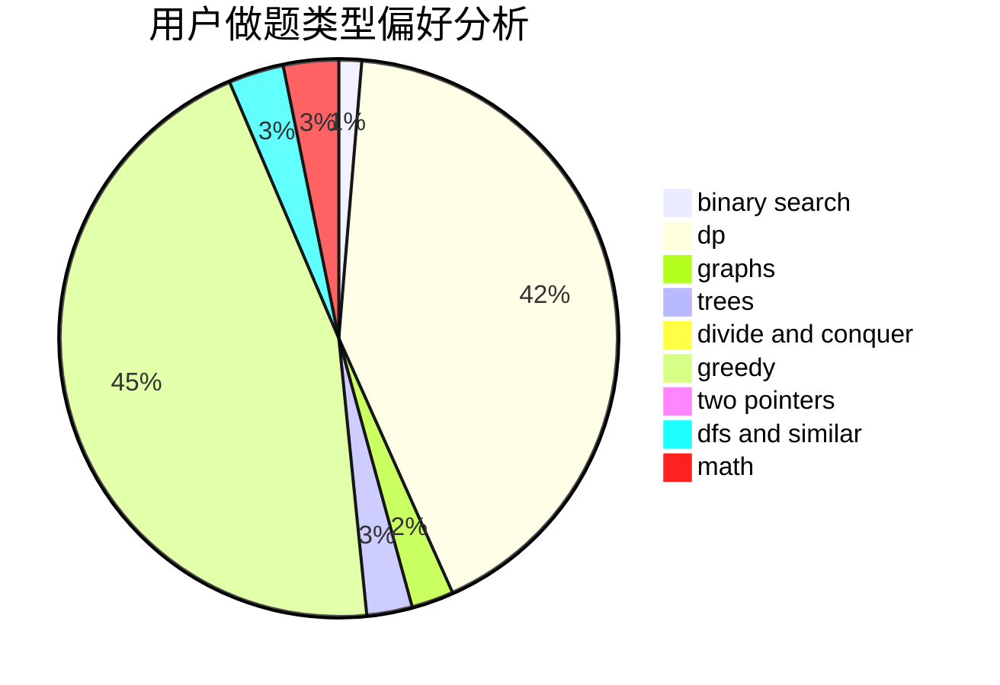

# Cry_For_theMoon

<!-- tabs:start -->

#### **用户提交结果分析**

#### **用户做题类型偏好分析**

<!-- tabs:end -->
# 推荐题目
[75A](https://codeforces.com/contest/75/problem/A)
[425C](https://codeforces.com/contest/425/problem/C)
[759D](https://codeforces.com/contest/759/problem/D)
[759E](https://codeforces.com/contest/759/problem/E)
[1054C](https://codeforces.com/contest/1054/problem/C)
[29A](https://codeforces.com/contest/29/problem/A)
[12622](https://codeforces.com/contest/1262/problem/2)
[34D](https://codeforces.com/contest/34/problem/D)
[1072D](https://codeforces.com/contest/1072/problem/D)
[1210C](https://codeforces.com/contest/1210/problem/C)
