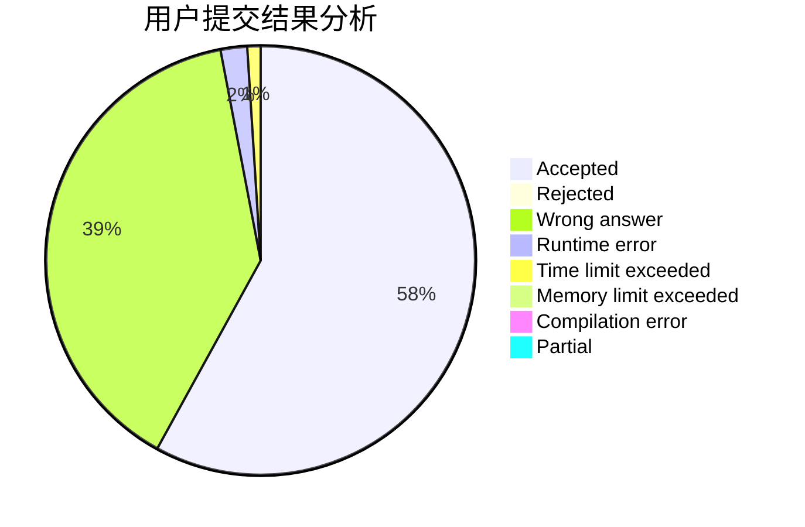
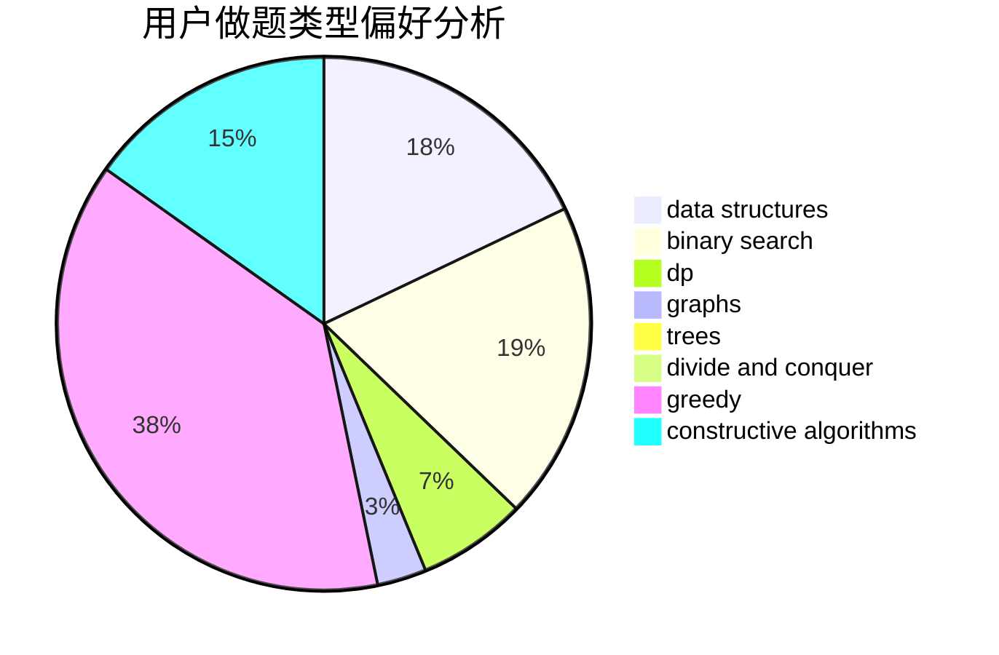
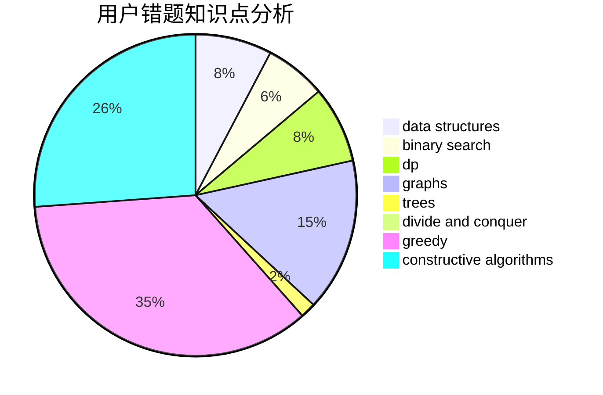

# 1A2012

<!-- tabs:start -->

#### **用户提交结果分析**

#### **用户做题类型偏好分析**

#### **用户错题知识点分析**

<!-- tabs:end -->
# 推荐题目
[1201A](https://codeforces.com/contest/1201/problem/A)		implementation,
                        strings		  
[1202D](https://codeforces.com/contest/1202/problem/D)		combinatorics,
                        constructive algorithms,
                        math,
                        strings		  
[1061A](https://codeforces.com/contest/1061/problem/A)		greedy,
                        implementation,
                        math		  
[1201B](https://codeforces.com/contest/1201/problem/B)		greedy,
                        math		  
[1204D1](https://codeforces.com/contest/1204D/problem/1)		brute force,
                        greedy,
                        strings		  
[1203F1](https://codeforces.com/contest/1203F/problem/1)		greedy		  
[1203B](https://codeforces.com/contest/1203/problem/B)		greedy,
                        math		  
[1204B](https://codeforces.com/contest/1204/problem/B)		greedy,
                        math		  
[1200B](https://codeforces.com/contest/1200/problem/B)		dp,
                        greedy		  
[1200D](https://codeforces.com/contest/1200/problem/D)		brute force,
                        data structures,
                        dp,
                        implementation,
                        two pointers		  
