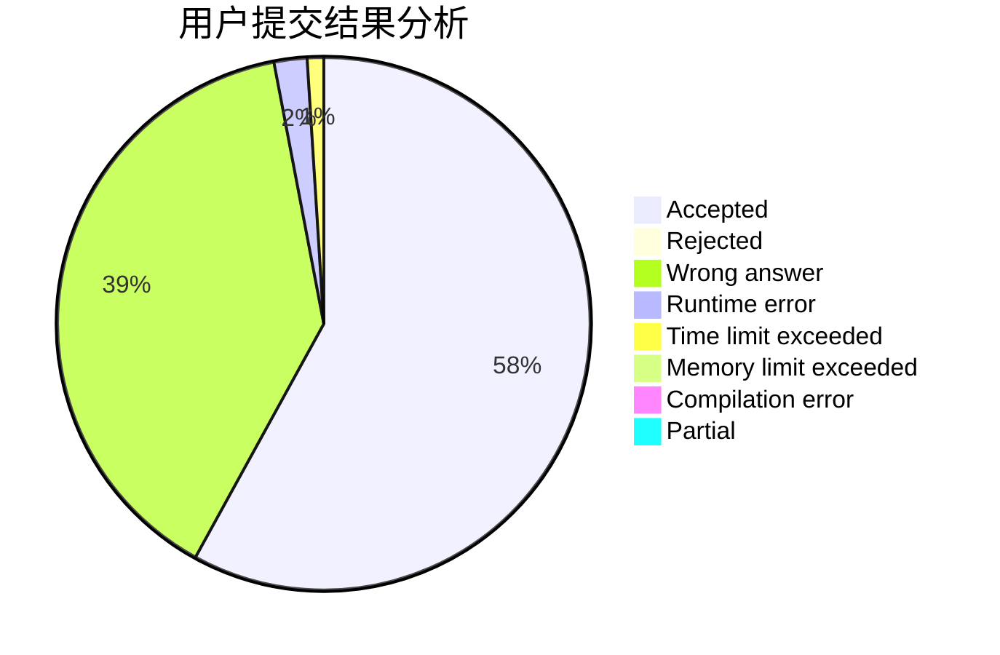
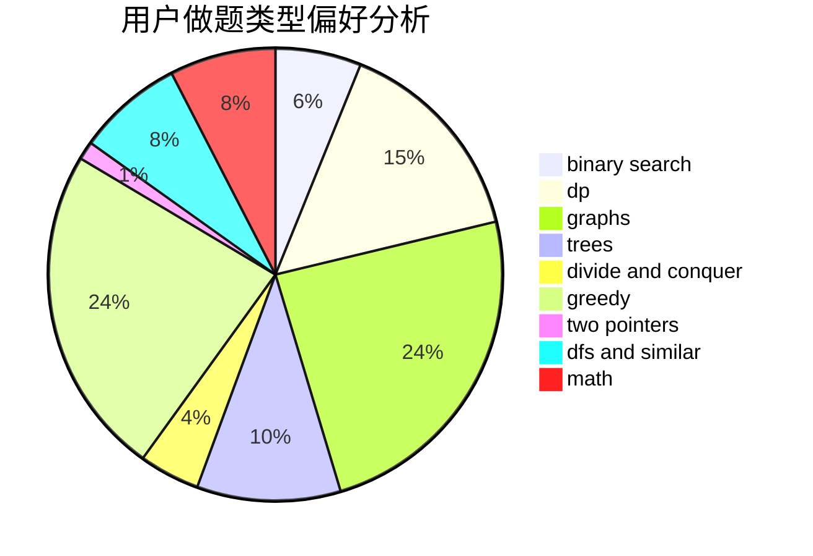

# 1A2012

<!-- tabs:start -->

#### **用户提交结果分析**

#### **用户做题类型偏好分析**

<!-- tabs:end -->
# 推荐题目
[1205E](https://codeforces.com/contest/1205/problem/E)
[1207B](https://codeforces.com/contest/1207/problem/B)
[1061E](https://codeforces.com/contest/1061/problem/E)
[1205F](https://codeforces.com/contest/1205/problem/F)
[12092](https://codeforces.com/contest/1209/problem/2)
[1208D](https://codeforces.com/contest/1208/problem/D)
[1207F](https://codeforces.com/contest/1207/problem/F)
[1208G](https://codeforces.com/contest/1208/problem/G)
[1205A](https://codeforces.com/contest/1205/problem/A)
[1205C](https://codeforces.com/contest/1205/problem/C)
