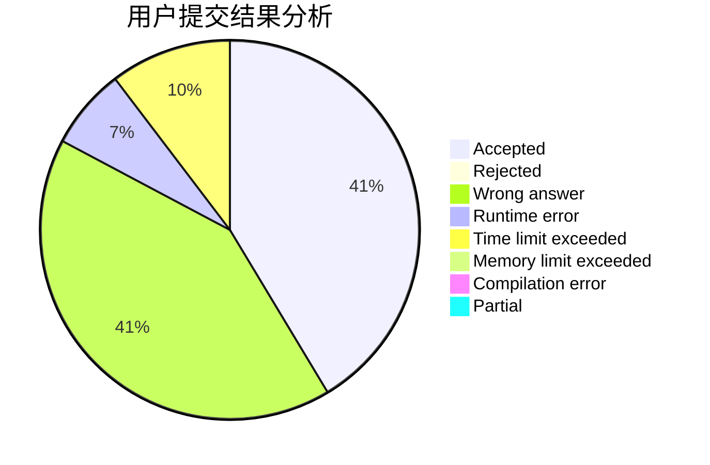
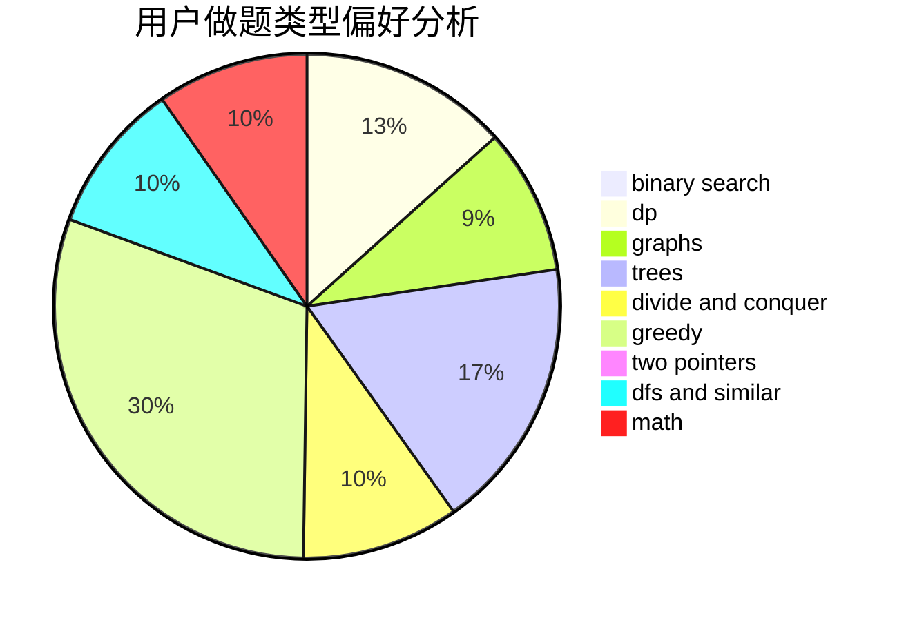

# CrystalNanami

<!-- tabs:start -->

#### **用户提交结果分析**

#### **用户做题类型偏好分析**

<!-- tabs:end -->
# 推荐题目
[13352](https://codeforces.com/contest/1335/problem/2)
[213C](https://codeforces.com/contest/213/problem/C)
[14C](https://codeforces.com/contest/14/problem/C)
[1113D](https://codeforces.com/contest/1113/problem/D)
[261D](https://codeforces.com/contest/261/problem/D)
[689A](https://codeforces.com/contest/689/problem/A)
[11153](https://codeforces.com/contest/1115/problem/3)
[518B](https://codeforces.com/contest/518/problem/B)
[1214G](https://codeforces.com/contest/1214/problem/G)
[335D](https://codeforces.com/contest/335/problem/D)
