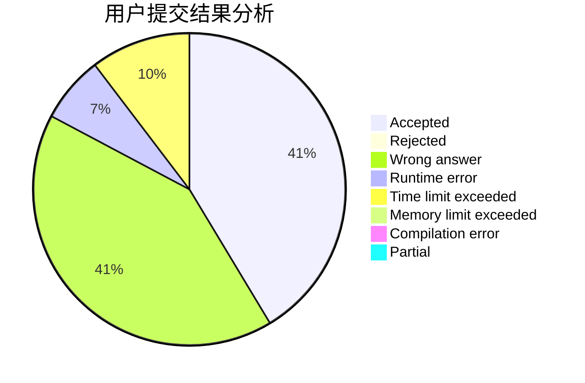
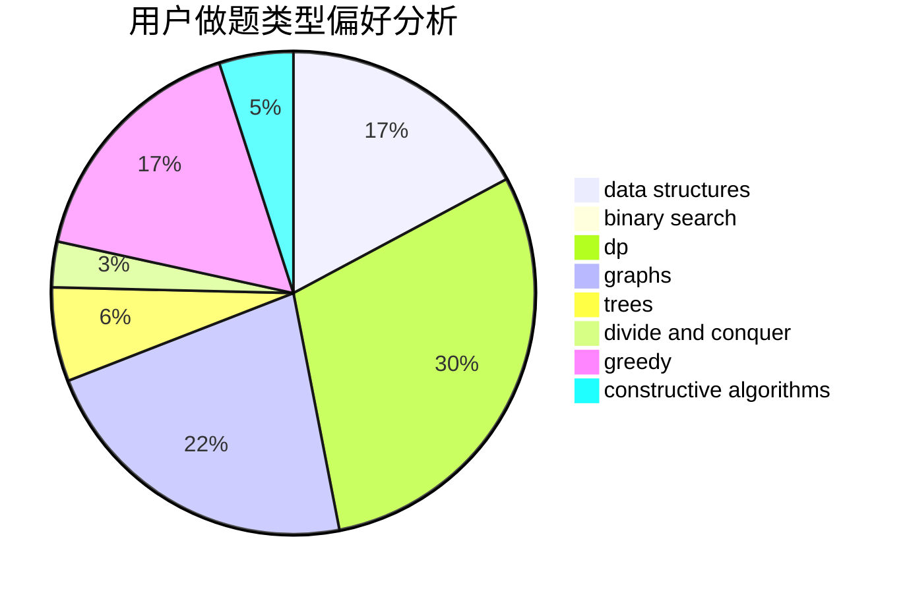

# CrystalNanami

<!-- tabs:start -->

#### **用户提交结果分析**

#### **用户做题类型偏好分析**

#### **用户错题知识点分析**

<!-- tabs:end -->
# 推荐题目
[13352](https://codeforces.com/contest/1335/problem/2)		dsu,graphs,sortings,trees		  
[213C](https://codeforces.com/contest/213/problem/C)		dp		  
[14C](https://codeforces.com/contest/14/problem/C)		brute force,
                        constructive algorithms,
                        geometry,
                        implementation,
                        math		  
[1113D](https://codeforces.com/contest/1113/problem/D)		dsu,graphs,sortings,trees		  
[261D](https://codeforces.com/contest/261/problem/D)		dp		  
[689A](https://codeforces.com/contest/689/problem/A)		brute force,
                        constructive algorithms,
                        implementation		  
[11153](https://codeforces.com/contest/1115/problem/3)		dsu,graphs,sortings,trees		  
[518B](https://codeforces.com/contest/518/problem/B)		greedy,
                        implementation,
                        strings		  
[1214G](https://codeforces.com/contest/1214/problem/G)		bitmasks,
                        data structures		  
[335D](https://codeforces.com/contest/335/problem/D)		brute force,
                        dp		  
