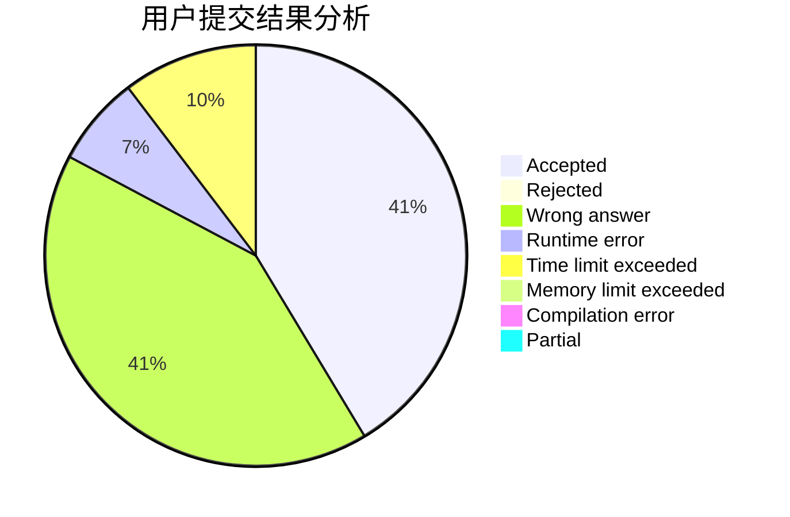
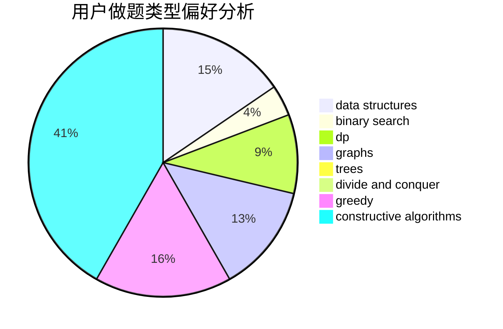

# CrystalNanami

<!-- tabs:start -->

#### **用户提交结果分析**

#### **用户做题类型偏好分析**

#### **用户错题知识点分析**

<!-- tabs:end -->
# 推荐题目
[1328F](https://codeforces.com/contest/1328/problem/F)		greedy		  
[189B](https://codeforces.com/contest/189/problem/B)		brute force,
                        math		  
[1491F](https://codeforces.com/contest/1491/problem/F)		binary search,
                        constructive algorithms,
                        interactive		  
[1113A](https://codeforces.com/contest/1113/problem/A)		dp,
                        greedy,
                        math		  
[240F](https://codeforces.com/contest/240/problem/F)		data structures		  
[667A](https://codeforces.com/contest/667/problem/A)		geometry,
                        math		  
[1114F](https://codeforces.com/contest/1114/problem/F)		bitmasks,
                        data structures,
                        divide and conquer,
                        math,
                        number theory		  
[497E](https://codeforces.com/contest/497/problem/E)		dp,
                        matrices		  
[1209C](https://codeforces.com/contest/1209/problem/C)		constructive algorithms,
                        greedy,
                        implementation		  
[311E](https://codeforces.com/contest/311/problem/E)		flows		  
