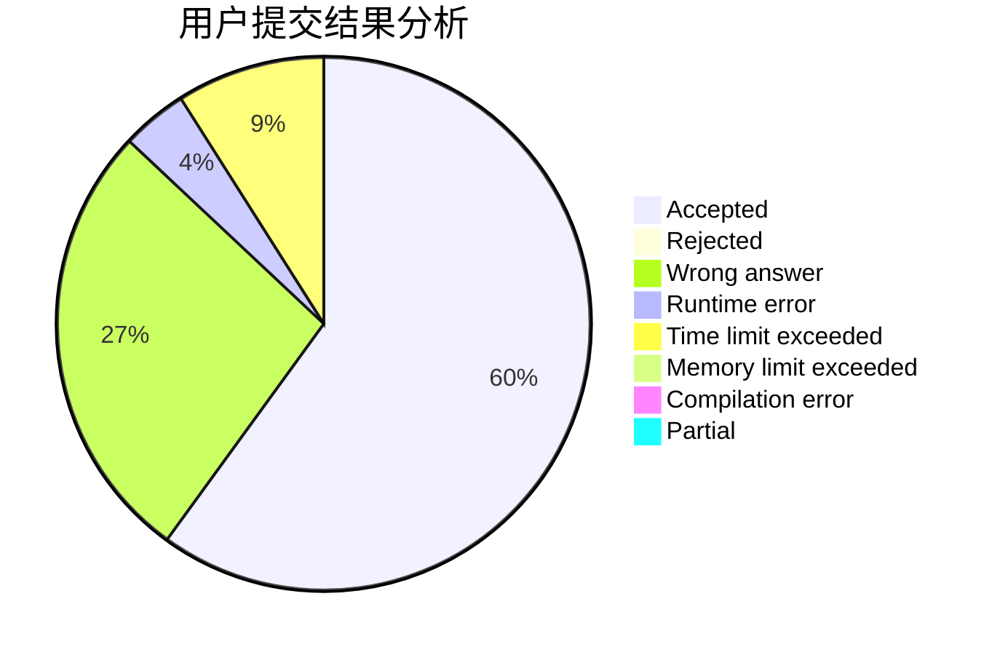
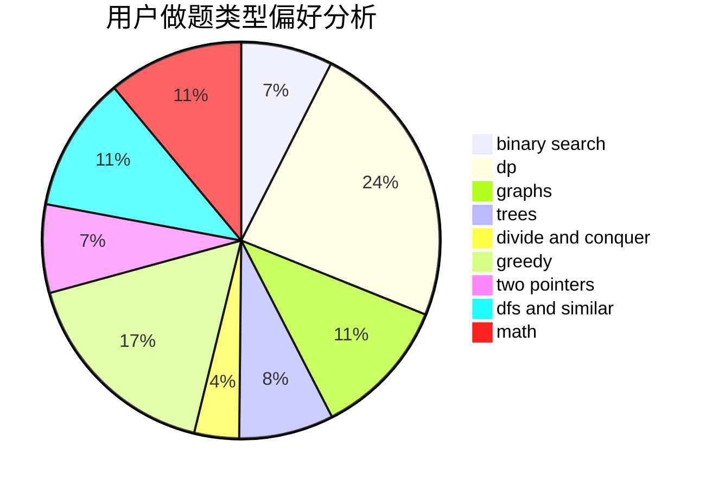

# CuCl2

<!-- tabs:start -->

#### **用户提交结果分析**

#### **用户做题类型偏好分析**

<!-- tabs:end -->
# 推荐题目
[763A](https://codeforces.com/contest/763/problem/A)
[547D](https://codeforces.com/contest/547/problem/D)
[724E](https://codeforces.com/contest/724/problem/E)
[764A](https://codeforces.com/contest/764/problem/A)
[763D](https://codeforces.com/contest/763/problem/D)
[1220C](https://codeforces.com/contest/1220/problem/C)
[551E](https://codeforces.com/contest/551/problem/E)
[1286A](https://codeforces.com/contest/1286/problem/A)
[671A](https://codeforces.com/contest/671/problem/A)
[317A](https://codeforces.com/contest/317/problem/A)
