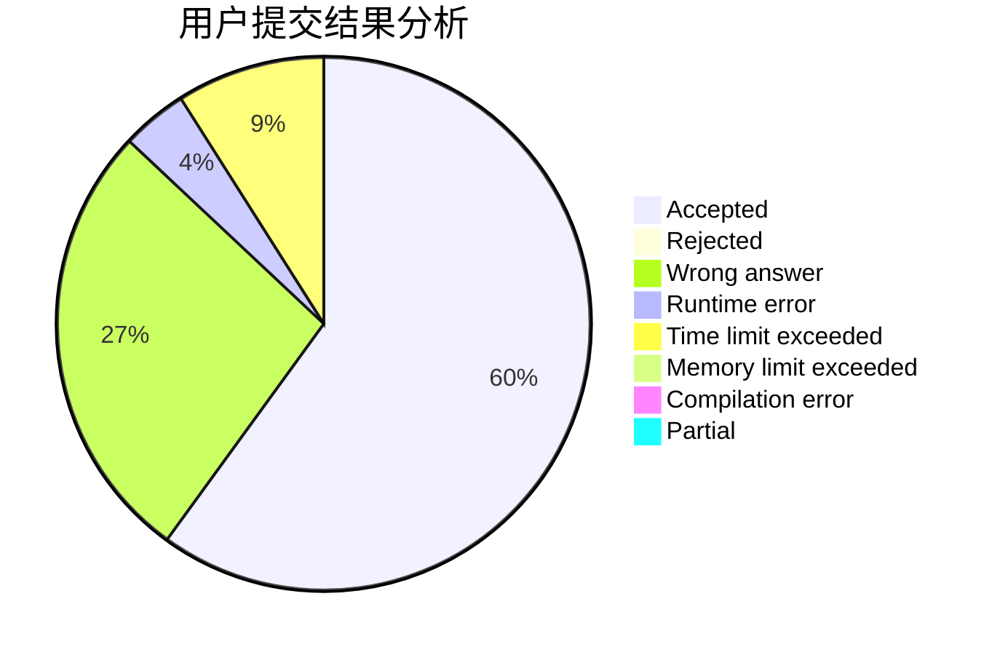
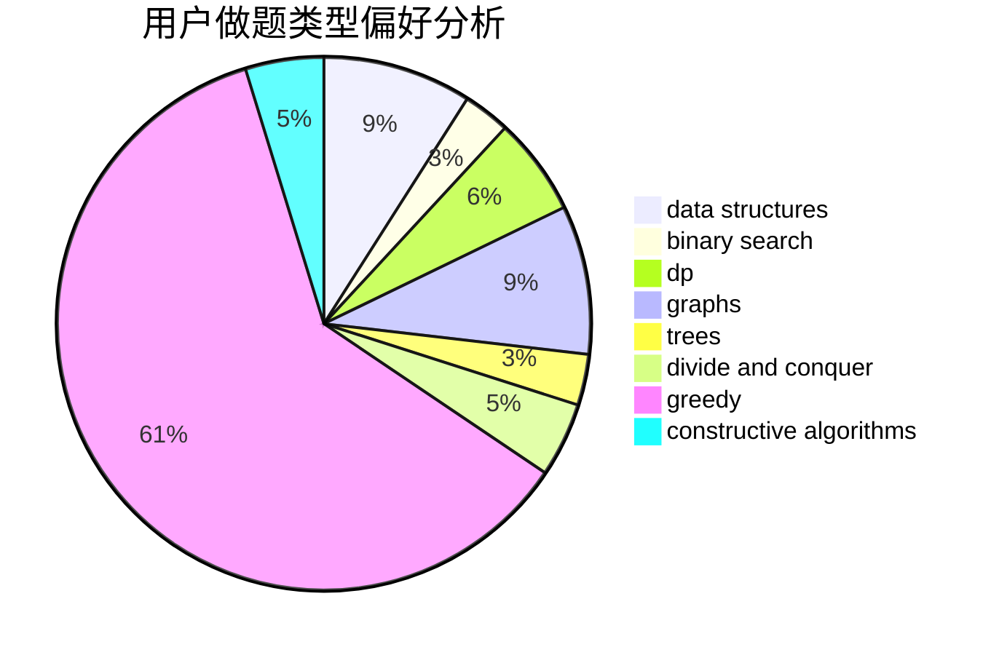
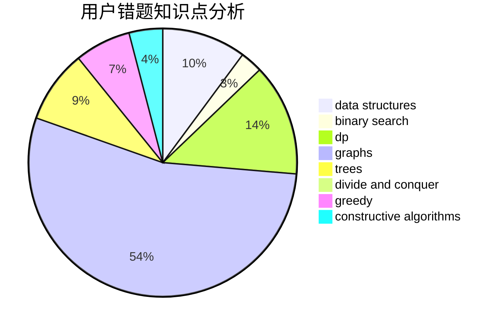

# CuCl2

<!-- tabs:start -->

#### **用户提交结果分析**

#### **用户做题类型偏好分析**

#### **用户错题知识点分析**

<!-- tabs:end -->
# 推荐题目
[742D](https://codeforces.com/contest/742/problem/D)		dsu,graphs,sortings,trees		  
[521E](https://codeforces.com/contest/521/problem/E)		dfs and similar,
                        graphs		  
[705C](https://codeforces.com/contest/705/problem/C)		dsu,graphs,sortings,trees		  
[743E](https://codeforces.com/contest/743/problem/E)		binary search,
                        bitmasks,
                        brute force,
                        dp		  
[743C](https://codeforces.com/contest/743/problem/C)		brute force,
                        constructive algorithms,
                        math,
                        number theory		  
[1214G](https://codeforces.com/contest/1214/problem/G)		bitmasks,
                        data structures		  
[527E](https://codeforces.com/contest/527/problem/E)		dfs and similar,
                        graphs		  
[1280A](https://codeforces.com/contest/1280/problem/A)		implementation,
                        math		  
[643G](https://codeforces.com/contest/643/problem/G)		data structures		  
[29B](https://codeforces.com/contest/29/problem/B)		implementation		  
