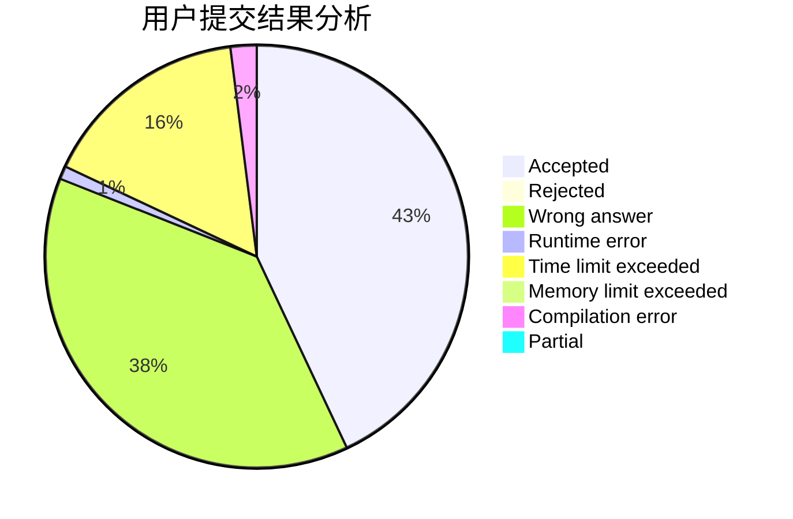
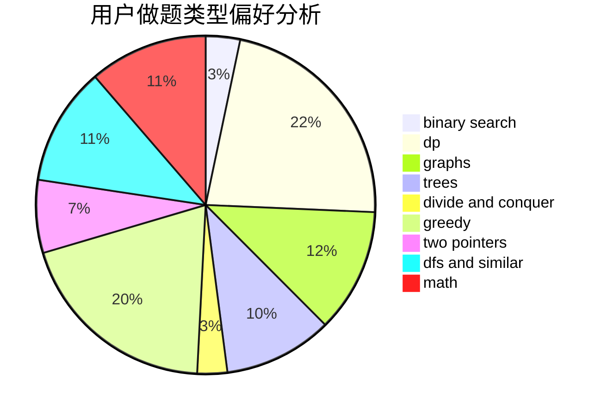

# Cupids_Bow

<!-- tabs:start -->

#### **用户提交结果分析**

#### **用户做题类型偏好分析**

<!-- tabs:end -->
# 推荐题目
[1265D](https://codeforces.com/contest/1265/problem/D)
[506C](https://codeforces.com/contest/506/problem/C)
[1132G](https://codeforces.com/contest/1132/problem/G)
[1142C](https://codeforces.com/contest/1142/problem/C)
[764C](https://codeforces.com/contest/764/problem/C)
[125E](https://codeforces.com/contest/125/problem/E)
[71B](https://codeforces.com/contest/71/problem/B)
[1191A](https://codeforces.com/contest/1191/problem/A)
[216A](https://codeforces.com/contest/216/problem/A)
[764E](https://codeforces.com/contest/764/problem/E)
