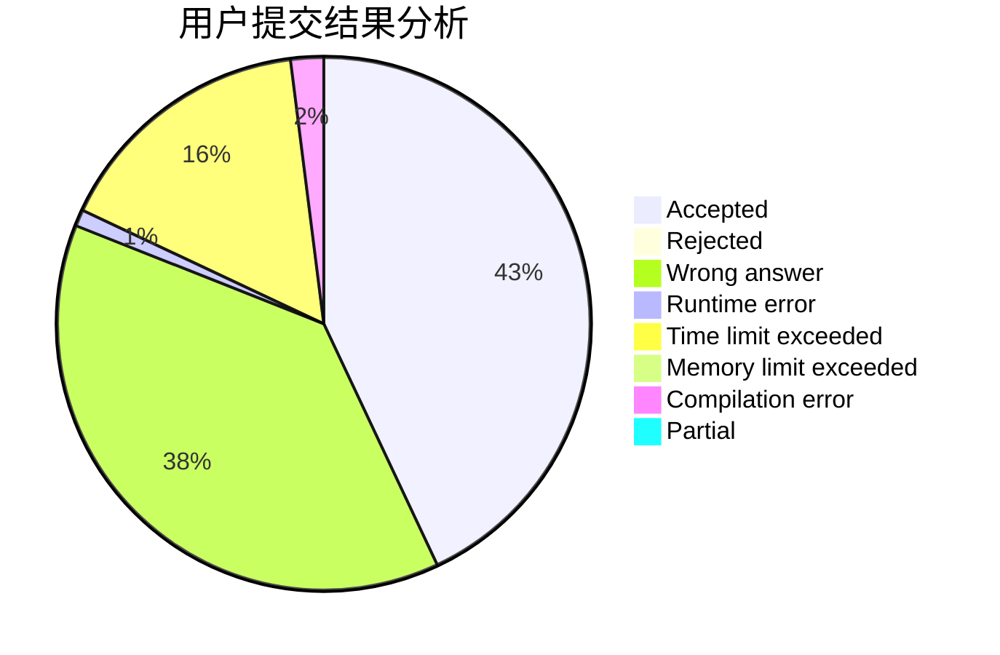
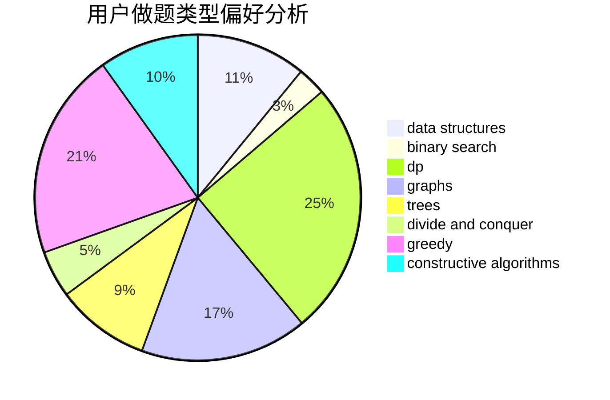
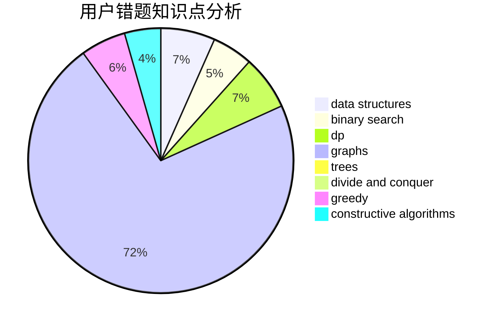

# Cupids_Bow

<!-- tabs:start -->

#### **用户提交结果分析**

#### **用户做题类型偏好分析**

#### **用户错题知识点分析**

<!-- tabs:end -->
# 推荐题目
[1265D](https://codeforces.com/contest/1265/problem/D)		dsu,graphs,sortings,trees		  
[506C](https://codeforces.com/contest/506/problem/C)		dsu,graphs,sortings,trees		  
[1132G](https://codeforces.com/contest/1132/problem/G)		data structures,
                        dp,
                        trees		  
[1142C](https://codeforces.com/contest/1142/problem/C)		geometry		  
[764C](https://codeforces.com/contest/764/problem/C)		dsu,graphs,sortings,trees		  
[125E](https://codeforces.com/contest/125/problem/E)		binary search,
                        graphs		  
[71B](https://codeforces.com/contest/71/problem/B)		implementation,
                        math		  
[1191A](https://codeforces.com/contest/1191/problem/A)		brute force		  
[216A](https://codeforces.com/contest/216/problem/A)		implementation,
                        math		  
[764E](https://codeforces.com/contest/764/problem/E)		dsu,graphs,sortings,trees		  
