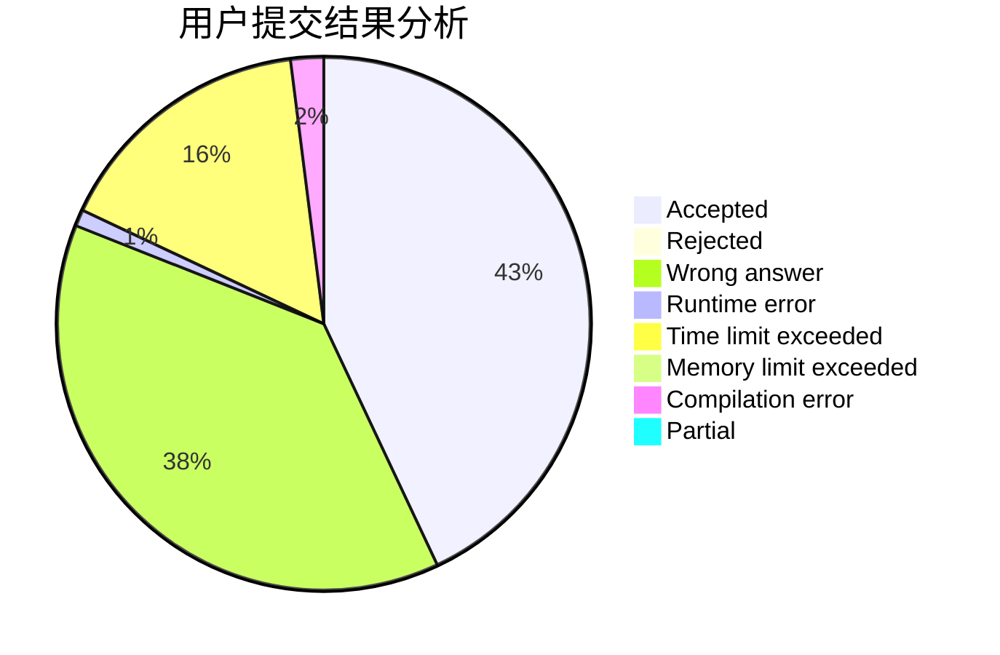
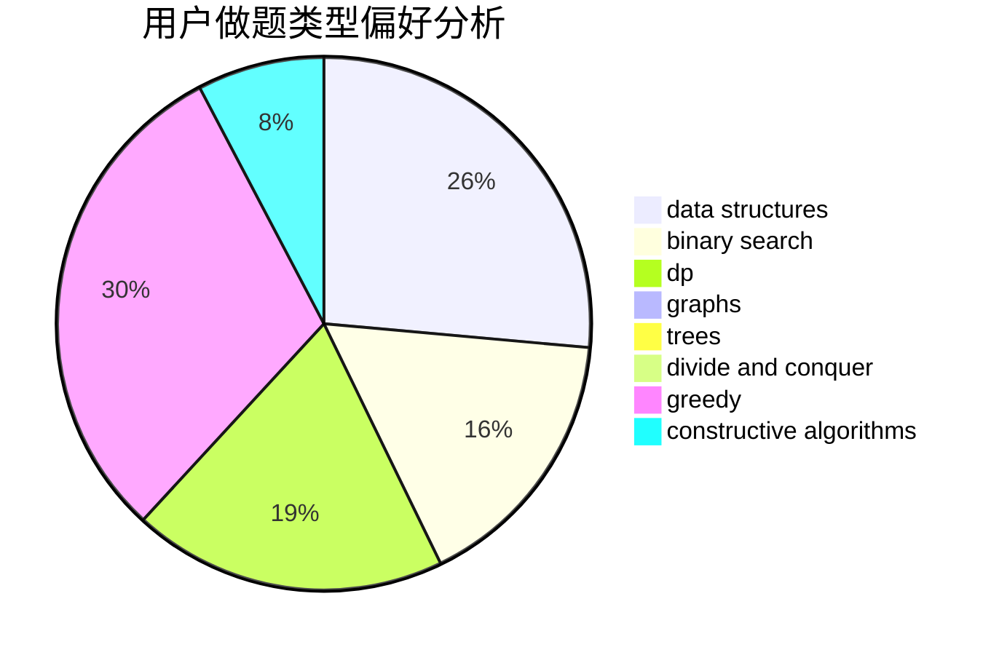
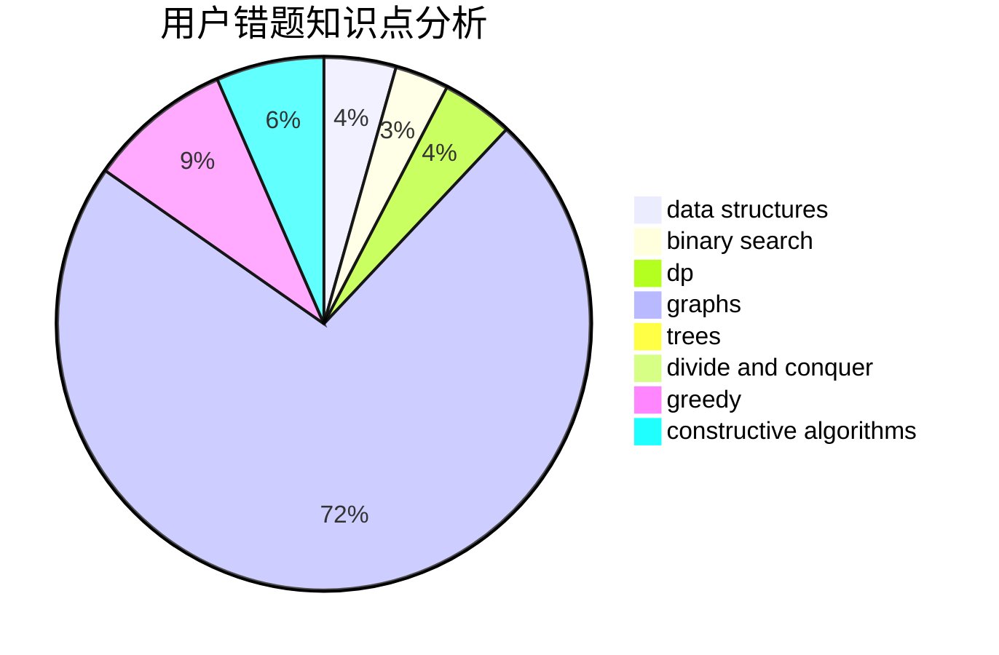

# Cupids_Bow

<!-- tabs:start -->

#### **用户提交结果分析**

#### **用户做题类型偏好分析**

#### **用户错题知识点分析**

<!-- tabs:end -->
# 推荐题目
[125D](https://codeforces.com/contest/125/problem/D)		constructive algorithms,
                        greedy		  
[485D](https://codeforces.com/contest/485/problem/D)		dsu,graphs,sortings,trees		  
[1131A](https://codeforces.com/contest/1131/problem/A)		math		  
[1140E](https://codeforces.com/contest/1140/problem/E)		combinatorics,
                        divide and conquer,
                        dp		  
[744B](https://codeforces.com/contest/744/problem/B)		bitmasks,
                        divide and conquer,
                        interactive		  
[1252J](https://codeforces.com/contest/1252/problem/J)		brute force,
                        dp		  
[701E](https://codeforces.com/contest/701/problem/E)		dsu,graphs,sortings,trees		  
[1187D](https://codeforces.com/contest/1187/problem/D)		data structures,
                        sortings		  
[191C](https://codeforces.com/contest/191/problem/C)		data structures,
                        dfs and similar,
                        trees		  
[744D](https://codeforces.com/contest/744/problem/D)		geometry		  
