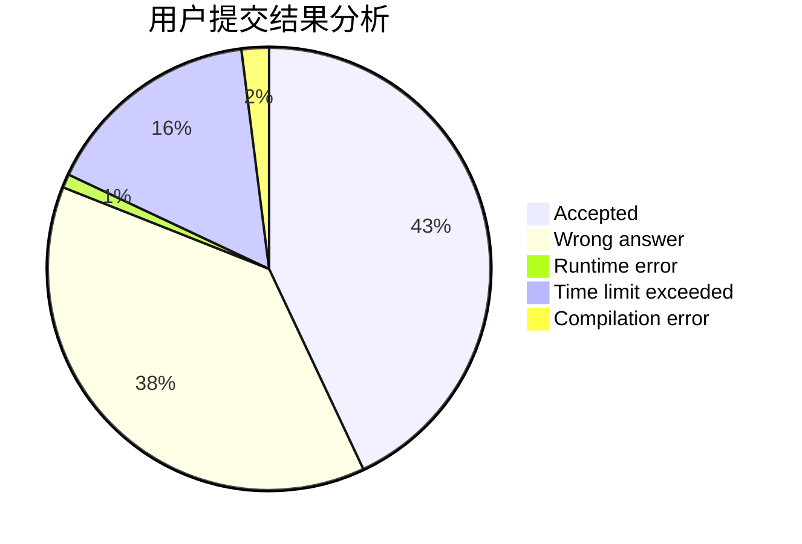
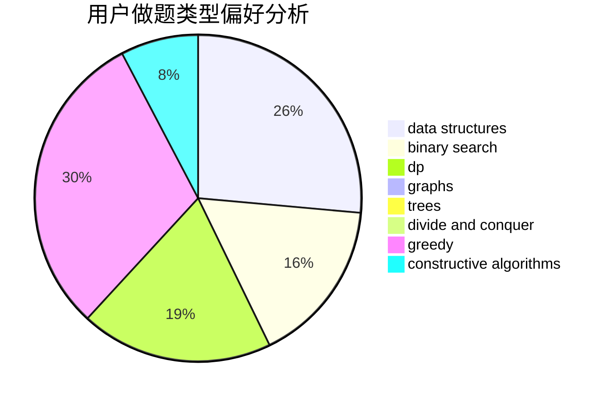
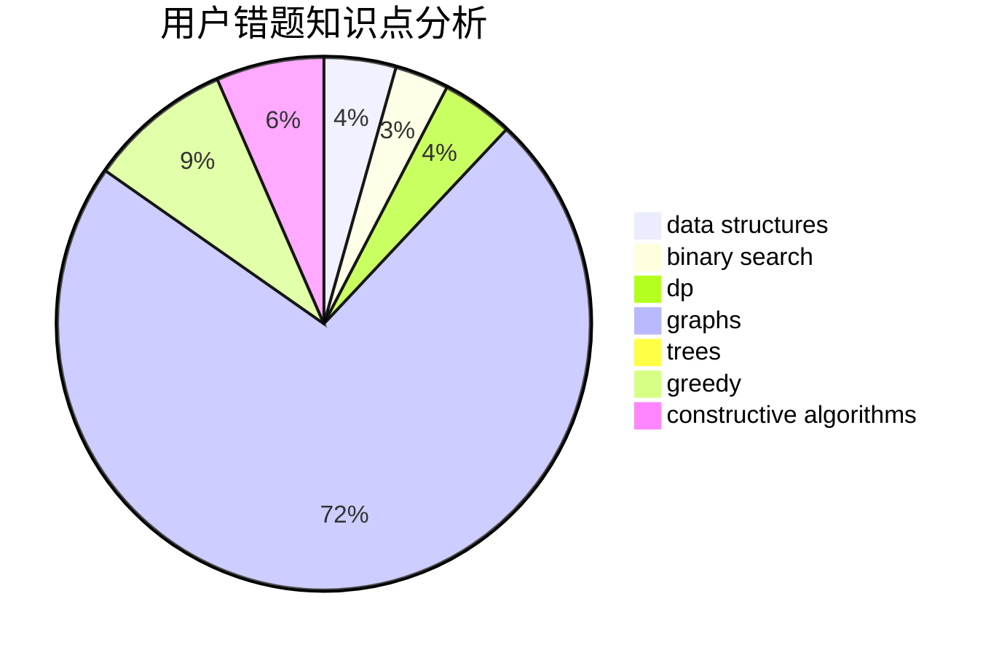

# Cupids_Bow
<!-- tabs:start -->
#### **用户提交结果分析**

#### **用户做题类型偏好分析**

#### **用户错题知识点分析**

<!-- tabs:end -->
# 推荐题目
[Asya And Kittens](http://codeforces.com/problemset/problem/1131/F)		constructive algorithms,
                        dsu		  
[Two progressions](http://codeforces.com/problemset/problem/125/D)		constructive algorithms,
                        greedy		  
[Fools and Roads](http://codeforces.com/problemset/problem/191/C)		data structures,
                        dfs and similar,
                        trees		  
[Generating Sets](http://codeforces.com/problemset/problem/722/D)		binary search,
                        data structures,
                        dfs and similar,
                        greedy,
                        strings,
                        trees		  
[Connecting Universities](https://codeforces.com/contest/701/problem/E)		dfs and similar,
                        dp,
                        graphs,
                        trees		  
[Hongcow Learns the Cyclic Shift](http://codeforces.com/problemset/problem/745/A)		implementation,
                        strings		  
[Huawei Graph Mining Challenge](https://codeforces.com/contest/1378/problem/A3)		nan		  
[Hongcow Buys a Deck of Cards](http://codeforces.com/problemset/problem/744/C)		bitmasks,
                        brute force,
                        dp		  
[Palindrome-less Arrays](http://codeforces.com/problemset/problem/1140/E)		combinatorics,
                        divide and conquer,
                        dp		  
[Tiling Terrace](http://codeforces.com/problemset/problem/1252/J)		brute force,
                        dp		  
<!-- tabs:start -->
#### **data structures**
[Fools and Roads](http://codeforces.com/problemset/problem/191/C)		data structures,
                        dfs and similar,
                        trees		  
[Generating Sets](http://codeforces.com/problemset/problem/722/D)		binary search,
                        data structures,
                        dfs and similar,
                        greedy,
                        strings,
                        trees		  
[Subarray Sorting](http://codeforces.com/problemset/problem/1187/D)		data structures,
                        sortings		  
[New Year Domino](http://codeforces.com/problemset/problem/500/E)		data structures,
                        dp,
                        dsu		  
[Team-Building](http://codeforces.com/problemset/problem/1444/C)		data structures,
                        dfs and similar,
                        dsu,
                        graphs		  
[Maximum width](http://codeforces.com/problemset/problem/1492/C)		binary search,
                        data structures,
                        dp,
                        greedy,
                        two pointers		  
[Old Floppy Drive](http://codeforces.com/problemset/problem/1490/G)		binary search,
                        data structures,
                        math		  
[Odd Mineral Resource](http://codeforces.com/problemset/problem/1479/D)		binary search,
                        bitmasks,
                        brute force,
                        data structures,
                        probabilities,
                        trees		  
[Meximization](http://codeforces.com/problemset/problem/1497/A)		brute force,
                        data structures,
                        greedy,
                        sortings		  
[Pekora and Trampoline](http://codeforces.com/problemset/problem/1491/C)		brute force,
                        data structures,
                        dp,
                        greedy,
                        implementation		  
#### **binary search**
[Generating Sets](http://codeforces.com/problemset/problem/722/D)		binary search,
                        data structures,
                        dfs and similar,
                        greedy,
                        strings,
                        trees		  
[Kuroni the Private Tutor](http://codeforces.com/problemset/problem/1305/H)		binary search,
                        greedy		  
[Maximum Value](https://codeforces.com/contest/485/problem/D)		binary search,
                        math,
                        sortings,
                        two pointers		  
[Maximum width](http://codeforces.com/problemset/problem/1492/C)		binary search,
                        data structures,
                        dp,
                        greedy,
                        two pointers		  
[Pairs](http://codeforces.com/problemset/problem/1463/D)		binary search,
                        constructive algorithms,
                        greedy,
                        two pointers		  
[Old Floppy Drive](http://codeforces.com/problemset/problem/1490/G)		binary search,
                        data structures,
                        math		  
[Odd Mineral Resource](http://codeforces.com/problemset/problem/1479/D)		binary search,
                        bitmasks,
                        brute force,
                        data structures,
                        probabilities,
                        trees		  
[Complicated Computations](http://codeforces.com/problemset/problem/1436/E)		binary search,
                        data structures,
                        two pointers		  
[Divide and Summarize](http://codeforces.com/problemset/problem/1461/D)		binary search,
                        brute force,
                        data structures,
                        divide and conquer,
                        implementation,
                        sortings		  
[K-beautiful Strings](http://codeforces.com/problemset/problem/1493/C)		binary search,
                        brute force,
                        constructive algorithms,
                        greedy,
                        strings		  
#### **dp**
[Connecting Universities](https://codeforces.com/contest/701/problem/E)		dfs and similar,
                        dp,
                        graphs,
                        trees		  
[Hongcow Buys a Deck of Cards](http://codeforces.com/problemset/problem/744/C)		bitmasks,
                        brute force,
                        dp		  
[Palindrome-less Arrays](http://codeforces.com/problemset/problem/1140/E)		combinatorics,
                        divide and conquer,
                        dp		  
[Tiling Terrace](http://codeforces.com/problemset/problem/1252/J)		brute force,
                        dp		  
[New Year Domino](http://codeforces.com/problemset/problem/500/E)		data structures,
                        dp,
                        dsu		  
[Twilight and Ancient Scroll (easier version)](http://codeforces.com/problemset/problem/1393/E1)		dp,
                        hashing,
                        implementation,
                        string suffix structures,
                        strings		  
[Maximum width](http://codeforces.com/problemset/problem/1492/C)		binary search,
                        data structures,
                        dp,
                        greedy,
                        two pointers		  
[Bouncing Ball](https://codeforces.com/contest/1457/problem/C)		brute force,
                        dp,
                        implementation		  
[Pekora and Trampoline](http://codeforces.com/problemset/problem/1491/C)		brute force,
                        data structures,
                        dp,
                        greedy,
                        implementation		  
[Chef Monocarp](http://codeforces.com/problemset/problem/1437/C)		dp,
                        flows,
                        graph matchings,
                        greedy,
                        math,
                        sortings		  
#### **graph**
[Connecting Universities](https://codeforces.com/contest/701/problem/E)		dfs and similar,
                        dp,
                        graphs,
                        trees		  
[Hongcow Builds A Nation](https://codeforces.com/contest/745/problem/C)		dfs and similar,
                        graphs		  
[Team-Building](http://codeforces.com/problemset/problem/1444/C)		data structures,
                        dfs and similar,
                        dsu,
                        graphs		  
[Spanning Tree with Maximum Degree](http://codeforces.com/problemset/problem/1133/F1)		graphs		  
[Spanning Tree with One Fixed Degree](http://codeforces.com/problemset/problem/1133/F2)		constructive algorithms,
                        dfs and similar,
                        dsu,
                        graphs,
                        greedy		  
[Minimum Ties](http://codeforces.com/problemset/problem/1487/C)		brute force,
                        constructive algorithms,
                        dfs and similar,
                        graphs,
                        greedy,
                        implementation,
                        math		  
[Chef Monocarp](http://codeforces.com/problemset/problem/1437/C)		dp,
                        flows,
                        graph matchings,
                        greedy,
                        math,
                        sortings		  
[Strange Housing](http://codeforces.com/problemset/problem/1470/D)		constructive algorithms,
                        dfs and similar,
                        graph matchings,
                        graphs,
                        greedy		  
[Longest Simple Cycle](http://codeforces.com/problemset/problem/1476/C)		dp,
                        graphs,
                        greedy		  
[Shortest and Longest LIS](http://codeforces.com/problemset/problem/1304/D)		constructive algorithms,
                        graphs,
                        greedy,
                        two pointers		  
#### **trees**
[Fools and Roads](http://codeforces.com/problemset/problem/191/C)		data structures,
                        dfs and similar,
                        trees		  
[Generating Sets](http://codeforces.com/problemset/problem/722/D)		binary search,
                        data structures,
                        dfs and similar,
                        greedy,
                        strings,
                        trees		  
[Connecting Universities](https://codeforces.com/contest/701/problem/E)		dfs and similar,
                        dp,
                        graphs,
                        trees		  
[Odd Mineral Resource](http://codeforces.com/problemset/problem/1479/D)		binary search,
                        bitmasks,
                        brute force,
                        data structures,
                        probabilities,
                        trees		  
[Yet Another Card Deck](http://codeforces.com/problemset/problem/1511/C)		brute force,
                        data structures,
                        implementation,
                        trees		  
[Diameter Cuts](http://codeforces.com/problemset/problem/1499/F)		combinatorics,
                        dfs and similar,
                        dp,
                        trees		  
[Fib-tree](http://codeforces.com/problemset/problem/1491/E)		brute force,
                        dfs and similar,
                        divide and conquer,
                        number theory,
                        trees		  
[13th Labour of Heracles](http://codeforces.com/problemset/problem/1466/D)		data structures,
                        greedy,
                        sortings,
                        trees		  
[BFS Trees](http://codeforces.com/problemset/problem/1495/D)		combinatorics,
                        dfs and similar,
                        graphs,
                        math,
                        shortest paths,
                        trees		  
[Sum of Prefix Sums](http://codeforces.com/problemset/problem/1303/G)		data structures,
                        divide and conquer,
                        geometry,
                        trees		  
#### **divide and conquer**
[Palindrome-less Arrays](http://codeforces.com/problemset/problem/1140/E)		combinatorics,
                        divide and conquer,
                        dp		  
[Hongcow's Game](http://codeforces.com/problemset/problem/744/B)		bitmasks,
                        divide and conquer,
                        interactive		  
[Divide and Summarize](http://codeforces.com/problemset/problem/1461/D)		binary search,
                        brute force,
                        data structures,
                        divide and conquer,
                        implementation,
                        sortings		  
[Song of the Sirens](http://codeforces.com/problemset/problem/1466/G)		combinatorics,
                        divide and conquer,
                        hashing,
                        math,
                        string suffix structures,
                        strings		  
[Permutation Transformation](http://codeforces.com/problemset/problem/1490/D)		dfs and similar,
                        divide and conquer,
                        implementation		  
[Skyline Photo](https://codeforces.com/contest/1483/problem/C)		data structures,
                        divide and conquer,
                        dp		  
[Fib-tree](http://codeforces.com/problemset/problem/1491/E)		brute force,
                        dfs and similar,
                        divide and conquer,
                        number theory,
                        trees		  
[Sum of Prefix Sums](http://codeforces.com/problemset/problem/1303/G)		data structures,
                        divide and conquer,
                        geometry,
                        trees		  
[Dogeforces](http://codeforces.com/problemset/problem/1494/D)		constructive algorithms,
                        data structures,
                        dfs and similar,
                        divide and conquer,
                        dsu,
                        greedy,
                        sortings,
                        trees		  
[Logistical Questions](http://codeforces.com/problemset/problem/566/C)		dfs and similar,
                        divide and conquer,
                        trees		  
#### **greedy**
[Two progressions](http://codeforces.com/problemset/problem/125/D)		constructive algorithms,
                        greedy		  
[Generating Sets](http://codeforces.com/problemset/problem/722/D)		binary search,
                        data structures,
                        dfs and similar,
                        greedy,
                        strings,
                        trees		  
[Kuroni the Private Tutor](http://codeforces.com/problemset/problem/1305/H)		binary search,
                        greedy		  
[Tiles](http://codeforces.com/problemset/problem/1178/C)		combinatorics,
                        greedy,
                        math		  
[Social Circles](http://codeforces.com/problemset/problem/1060/D)		greedy,
                        math		  
[Spanning Tree with One Fixed Degree](http://codeforces.com/problemset/problem/1133/F2)		constructive algorithms,
                        dfs and similar,
                        dsu,
                        graphs,
                        greedy		  
[Platforms Jumping](http://codeforces.com/problemset/problem/1256/C)		greedy		  
[Maximum width](http://codeforces.com/problemset/problem/1492/C)		binary search,
                        data structures,
                        dp,
                        greedy,
                        two pointers		  
[Diamond Miner](https://codeforces.com/contest/1496/problem/C)		geometry,
                        greedy,
                        math,
                        sortings		  
[Anti-knapsack](http://codeforces.com/problemset/problem/1493/A)		constructive algorithms,
                        greedy		  
#### **constructive algorithms**
[Asya And Kittens](http://codeforces.com/problemset/problem/1131/F)		constructive algorithms,
                        dsu		  
[Two progressions](http://codeforces.com/problemset/problem/125/D)		constructive algorithms,
                        greedy		  
[Spanning Tree with One Fixed Degree](http://codeforces.com/problemset/problem/1133/F2)		constructive algorithms,
                        dfs and similar,
                        dsu,
                        graphs,
                        greedy		  
[Anti-knapsack](http://codeforces.com/problemset/problem/1493/A)		constructive algorithms,
                        greedy		  
[Pairs](http://codeforces.com/problemset/problem/1463/D)		binary search,
                        constructive algorithms,
                        greedy,
                        two pointers		  
[XOR-gun](https://codeforces.com/contest/1456/problem/B)		bitmasks,
                        brute force,
                        constructive algorithms		  
[Genius's Gambit](http://codeforces.com/problemset/problem/1492/D)		bitmasks,
                        constructive algorithms,
                        greedy,
                        math		  
[3-Coloring](https://codeforces.com/contest/1504/problem/D)		constructive algorithms,
                        games,
                        interactive		  
[Basic Diplomacy](https://codeforces.com/contest/1483/problem/A)		brute force,
                        constructive algorithms,
                        greedy,
                        implementation		  
[Array and Peaks](http://codeforces.com/problemset/problem/1513/A)		constructive algorithms,
                        implementation		  
#### **sortings**
[Subarray Sorting](http://codeforces.com/problemset/problem/1187/D)		data structures,
                        sortings		  
[Maximum Value](https://codeforces.com/contest/485/problem/D)		binary search,
                        math,
                        sortings,
                        two pointers		  
[Doggo Recoloring](http://codeforces.com/problemset/problem/1025/A)		implementation,
                        sortings		  
[Diamond Miner](https://codeforces.com/contest/1496/problem/C)		geometry,
                        greedy,
                        math,
                        sortings		  
[Meximization](http://codeforces.com/problemset/problem/1497/A)		brute force,
                        data structures,
                        greedy,
                        sortings		  
[Avoiding Zero](http://codeforces.com/problemset/problem/1427/A)		math,
                        sortings		  
[Divide and Summarize](http://codeforces.com/problemset/problem/1461/D)		binary search,
                        brute force,
                        data structures,
                        divide and conquer,
                        implementation,
                        sortings		  
[Chef Monocarp](http://codeforces.com/problemset/problem/1437/C)		dp,
                        flows,
                        graph matchings,
                        greedy,
                        math,
                        sortings		  
[Replacing Elements](http://codeforces.com/problemset/problem/1473/A)		greedy,
                        implementation,
                        math,
                        sortings		  
[Eastern Exhibition](http://codeforces.com/problemset/problem/1486/B)		binary search,
                        geometry,
                        shortest paths,
                        sortings		  
<!-- tabs:end -->
