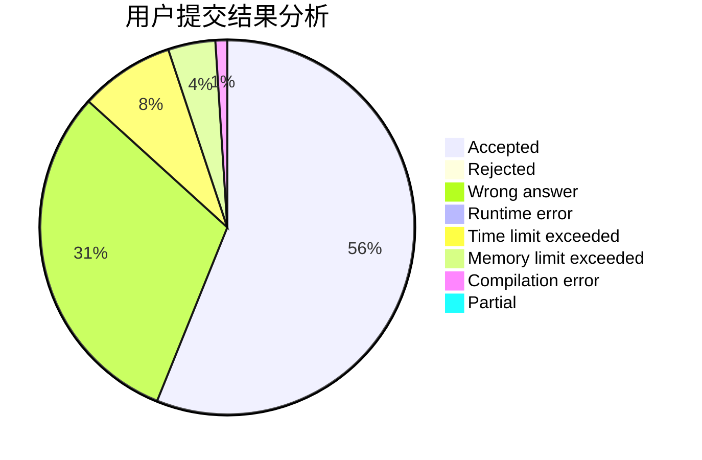
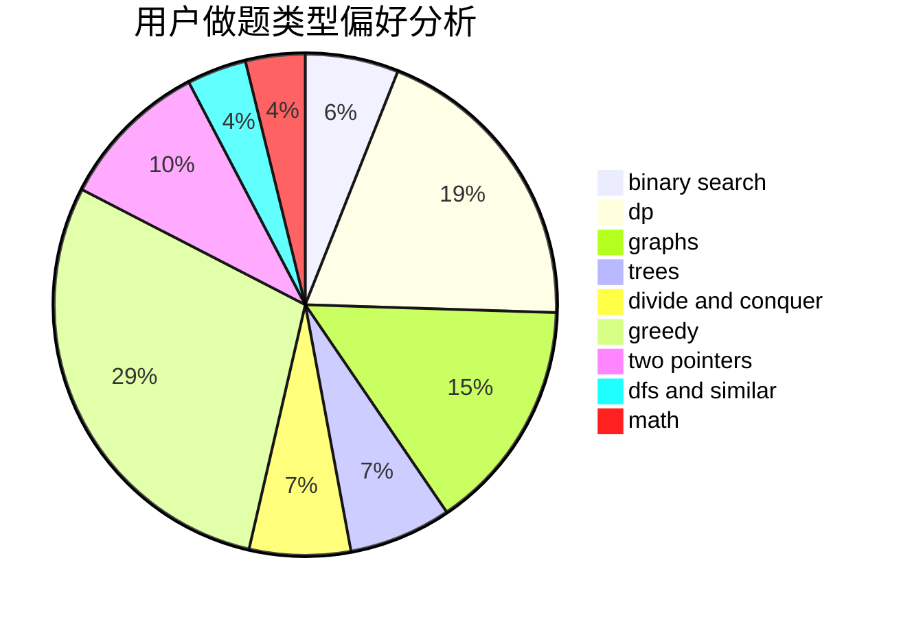

# Cyanic

<!-- tabs:start -->

#### **用户提交结果分析**

#### **用户做题类型偏好分析**

<!-- tabs:end -->
# 推荐题目
[1406B](https://codeforces.com/contest/1406/problem/B)
[1305C](https://codeforces.com/contest/1305/problem/C)
[765E](https://codeforces.com/contest/765/problem/E)
[765F](https://codeforces.com/contest/765/problem/F)
[550E](https://codeforces.com/contest/550/problem/E)
[1039B](https://codeforces.com/contest/1039/problem/B)
[721C](https://codeforces.com/contest/721/problem/C)
[1340B](https://codeforces.com/contest/1340/problem/B)
[765C](https://codeforces.com/contest/765/problem/C)
[600C](https://codeforces.com/contest/600/problem/C)
