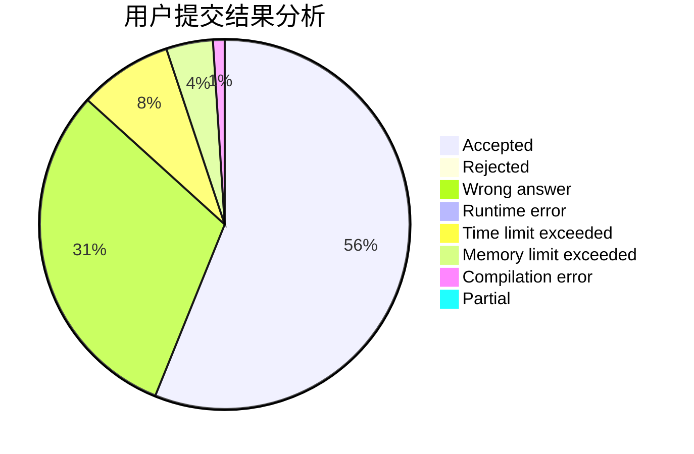
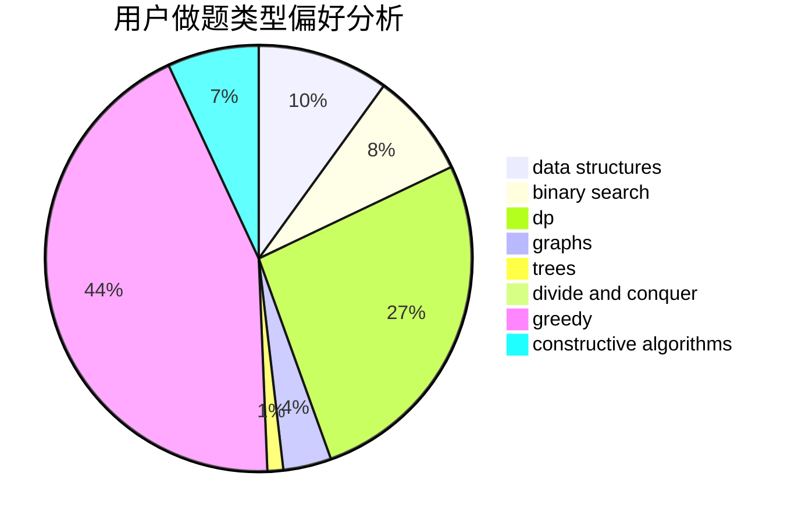
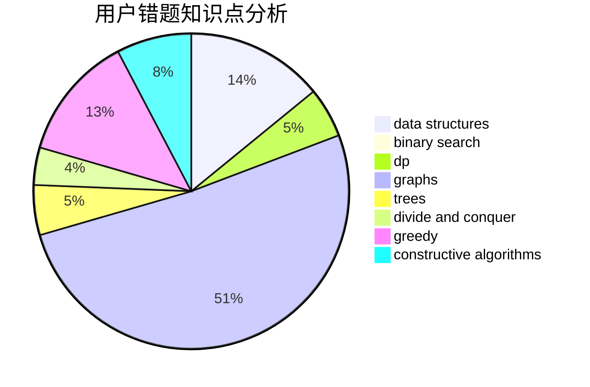

# Cyanic

<!-- tabs:start -->

#### **用户提交结果分析**

#### **用户做题类型偏好分析**

#### **用户错题知识点分析**

<!-- tabs:end -->
# 推荐题目
[1397C](https://codeforces.com/contest/1397/problem/C)		dsu,graphs,sortings,trees		  
[1298D](https://codeforces.com/contest/1298/problem/D)		dsu,graphs,sortings,trees		  
[746C](https://codeforces.com/contest/746/problem/C)		constructive algorithms,
                        implementation,
                        math		  
[746D](https://codeforces.com/contest/746/problem/D)		constructive algorithms,
                        greedy,
                        math		  
[526F](https://codeforces.com/contest/526/problem/F)		data structures,
                        divide and conquer		  
[1038D](https://codeforces.com/contest/1038/problem/D)		dp,
                        greedy,
                        implementation		  
[702E](https://codeforces.com/contest/702/problem/E)		data structures,
                        graphs		  
[1333C](https://codeforces.com/contest/1333/problem/C)		binary search,
                        data structures,
                        implementation,
                        two pointers		  
[746A](https://codeforces.com/contest/746/problem/A)		implementation,
                        math		  
[580A](https://codeforces.com/contest/580/problem/A)		brute force,
                        dp,
                        implementation		  
