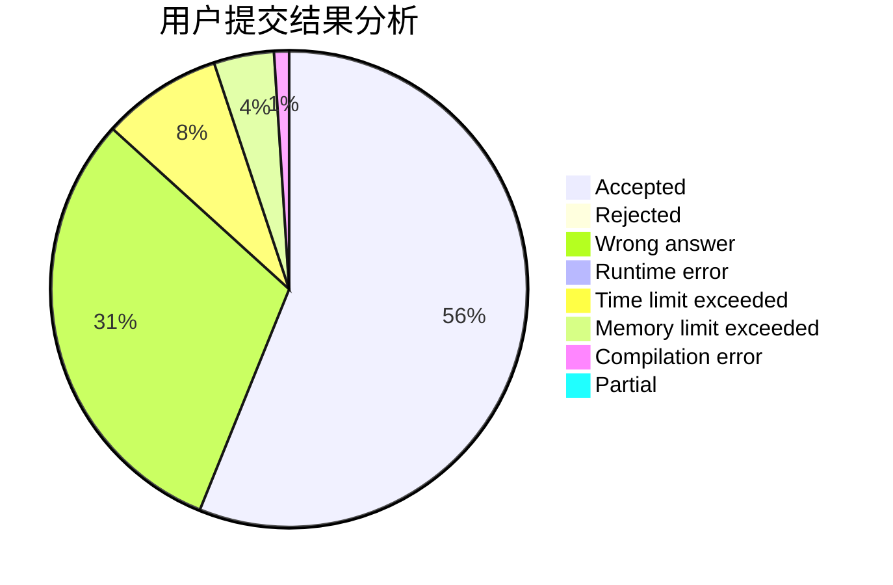
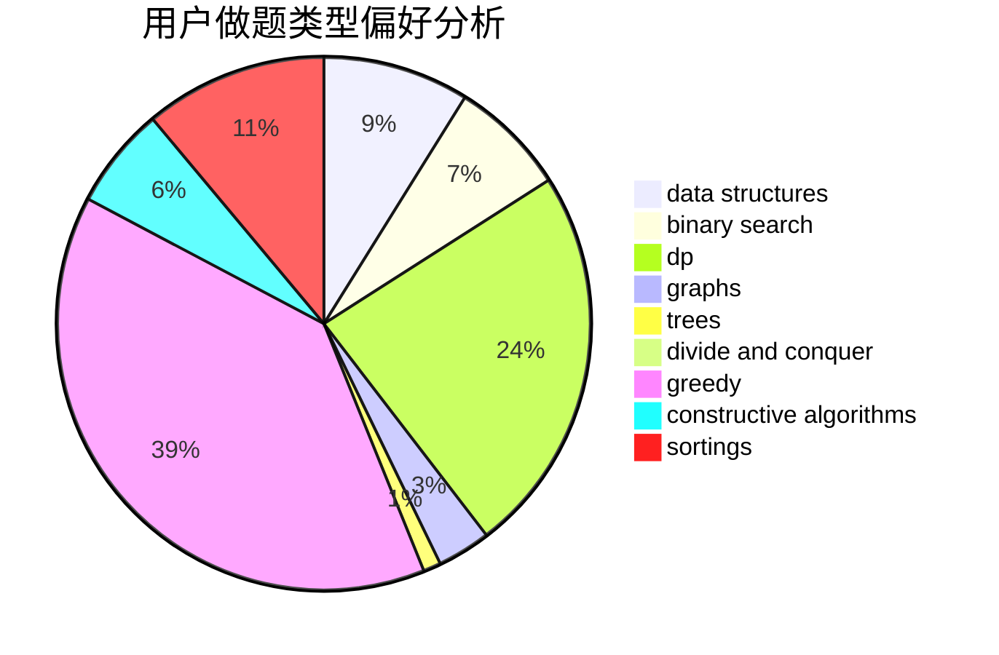
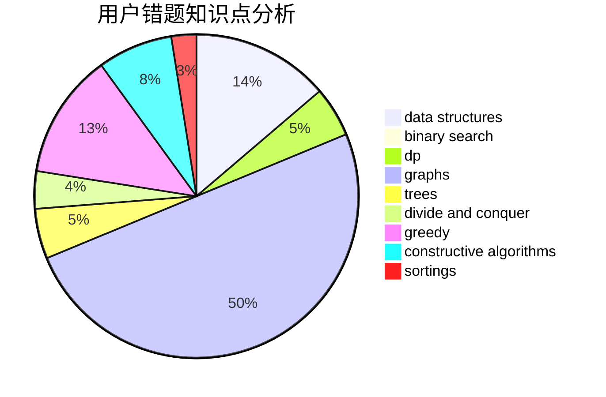

# Cyanic
<!-- tabs:start -->
#### **用户提交结果分析**

#### **用户做题类型偏好分析**

#### **用户错题知识点分析**

<!-- tabs:end -->
# 推荐题目
[1397C](https://codeforces.com/contest/1397/problem/C)		constructive algorithms,
                        greedy,
                        number theory		  
[1459B](http://codeforces.com/problemset/problem/1459/B)		dp,
                        math		  
[1038D](http://codeforces.com/problemset/problem/1038/D)		dp,
                        greedy,
                        implementation		  
[580A](http://codeforces.com/problemset/problem/580/A)		brute force,
                        dp,
                        implementation		  
[732A](http://codeforces.com/problemset/problem/732/A)		brute force,
                        constructive algorithms,
                        implementation,
                        math		  
[746A](http://codeforces.com/problemset/problem/746/A)		implementation,
                        math		  
[1305F](http://codeforces.com/problemset/problem/1305/F)		math,
                        number theory,
                        probabilities		  
[404C](http://codeforces.com/problemset/problem/404/C)		dfs and similar,
                        graphs,
                        sortings		  
[1138F](https://codeforces.com/contest/1138/problem/F)		constructive algorithms,
                        interactive,
                        number theory		  
[702E](http://codeforces.com/problemset/problem/702/E)		data structures,
                        graphs		  
<!-- tabs:start -->
#### **data structures**
[702E](http://codeforces.com/problemset/problem/702/E)		data structures,
                        graphs		  
[1333C](http://codeforces.com/problemset/problem/1333/C)		binary search,
                        data structures,
                        implementation,
                        two pointers		  
[367A](http://codeforces.com/problemset/problem/367/A)		data structures,
                        implementation		  
[746F](http://codeforces.com/problemset/problem/746/F)		data structures,
                        greedy,
                        two pointers		  
[1137E](http://codeforces.com/problemset/problem/1137/E)		data structures,
                        greedy		  
[526F](http://codeforces.com/problemset/problem/526/F)		data structures,
                        divide and conquer		  
[1492C](http://codeforces.com/problemset/problem/1492/C)		binary search,
                        data structures,
                        dp,
                        greedy,
                        two pointers		  
[1492C](http://codeforces.com/problemset/problem/1492/C)		binary search,
                        data structures,
                        dp,
                        greedy,
                        two pointers		  
[1490G](http://codeforces.com/problemset/problem/1490/G)		binary search,
                        data structures,
                        math		  
[1479D](http://codeforces.com/problemset/problem/1479/D)		binary search,
                        bitmasks,
                        brute force,
                        data structures,
                        probabilities,
                        trees		  
#### **binary search**
[309C](http://codeforces.com/problemset/problem/309/C)		binary search,
                        bitmasks,
                        greedy		  
[1333C](http://codeforces.com/problemset/problem/1333/C)		binary search,
                        data structures,
                        implementation,
                        two pointers		  
[1178H](http://codeforces.com/problemset/problem/1178/H)		binary search,
                        flows,
                        graphs		  
[1492C](http://codeforces.com/problemset/problem/1492/C)		binary search,
                        data structures,
                        dp,
                        greedy,
                        two pointers		  
[125E](http://codeforces.com/problemset/problem/125/E)		binary search,
                        graphs		  
[1492C](http://codeforces.com/problemset/problem/1492/C)		binary search,
                        data structures,
                        dp,
                        greedy,
                        two pointers		  
[1463D](http://codeforces.com/problemset/problem/1463/D)		binary search,
                        constructive algorithms,
                        greedy,
                        two pointers		  
[1490G](http://codeforces.com/problemset/problem/1490/G)		binary search,
                        data structures,
                        math		  
[1479D](http://codeforces.com/problemset/problem/1479/D)		binary search,
                        bitmasks,
                        brute force,
                        data structures,
                        probabilities,
                        trees		  
[1436E](http://codeforces.com/problemset/problem/1436/E)		binary search,
                        data structures,
                        two pointers		  
#### **dp**
[1459B](http://codeforces.com/problemset/problem/1459/B)		dp,
                        math		  
[1038D](http://codeforces.com/problemset/problem/1038/D)		dp,
                        greedy,
                        implementation		  
[580A](http://codeforces.com/problemset/problem/580/A)		brute force,
                        dp,
                        implementation		  
[1142D](http://codeforces.com/problemset/problem/1142/D)		dp		  
[279E](http://codeforces.com/problemset/problem/279/E)		dp,
                        games,
                        greedy,
                        number theory		  
[1244D](http://codeforces.com/problemset/problem/1244/D)		brute force,
                        constructive algorithms,
                        dp,
                        graphs,
                        implementation,
                        trees		  
[1492C](http://codeforces.com/problemset/problem/1492/C)		binary search,
                        data structures,
                        dp,
                        greedy,
                        two pointers		  
[1466B](http://codeforces.com/problemset/problem/1466/B)		dp,
                        greedy		  
[1492C](http://codeforces.com/problemset/problem/1492/C)		binary search,
                        data structures,
                        dp,
                        greedy,
                        two pointers		  
[1457C](https://codeforces.com/contest/1457/problem/C)		brute force,
                        dp,
                        implementation		  
#### **graph**
[404C](http://codeforces.com/problemset/problem/404/C)		dfs and similar,
                        graphs,
                        sortings		  
[702E](http://codeforces.com/problemset/problem/702/E)		data structures,
                        graphs		  
[114B](http://codeforces.com/problemset/problem/114/B)		bitmasks,
                        brute force,
                        graphs		  
[218C](https://codeforces.com/contest/218/problem/C)		brute force,
                        dfs and similar,
                        dsu,
                        graphs		  
[1244D](http://codeforces.com/problemset/problem/1244/D)		brute force,
                        constructive algorithms,
                        dp,
                        graphs,
                        implementation,
                        trees		  
[1178H](http://codeforces.com/problemset/problem/1178/H)		binary search,
                        flows,
                        graphs		  
[1245D](http://codeforces.com/problemset/problem/1245/D)		dsu,
                        graphs,
                        greedy,
                        shortest paths,
                        trees		  
[125E](http://codeforces.com/problemset/problem/125/E)		binary search,
                        graphs		  
[520B](http://codeforces.com/problemset/problem/520/B)		dfs and similar,
                        graphs,
                        greedy,
                        implementation,
                        math,
                        shortest paths		  
[1487C](http://codeforces.com/problemset/problem/1487/C)		brute force,
                        constructive algorithms,
                        dfs and similar,
                        graphs,
                        greedy,
                        implementation,
                        math		  
#### **trees**
[1244D](http://codeforces.com/problemset/problem/1244/D)		brute force,
                        constructive algorithms,
                        dp,
                        graphs,
                        implementation,
                        trees		  
[1245D](http://codeforces.com/problemset/problem/1245/D)		dsu,
                        graphs,
                        greedy,
                        shortest paths,
                        trees		  
[1479D](http://codeforces.com/problemset/problem/1479/D)		binary search,
                        bitmasks,
                        brute force,
                        data structures,
                        probabilities,
                        trees		  
[1511C](http://codeforces.com/problemset/problem/1511/C)		brute force,
                        data structures,
                        implementation,
                        trees		  
[1499F](http://codeforces.com/problemset/problem/1499/F)		combinatorics,
                        dfs and similar,
                        dp,
                        trees		  
[1491E](http://codeforces.com/problemset/problem/1491/E)		brute force,
                        dfs and similar,
                        divide and conquer,
                        number theory,
                        trees		  
[1466D](http://codeforces.com/problemset/problem/1466/D)		data structures,
                        greedy,
                        sortings,
                        trees		  
[1495D](http://codeforces.com/problemset/problem/1495/D)		combinatorics,
                        dfs and similar,
                        graphs,
                        math,
                        shortest paths,
                        trees		  
[1303G](http://codeforces.com/problemset/problem/1303/G)		data structures,
                        divide and conquer,
                        geometry,
                        trees		  
[1454E](http://codeforces.com/problemset/problem/1454/E)		combinatorics,
                        dfs and similar,
                        graphs,
                        trees		  
#### **divide and conquer**
[526F](http://codeforces.com/problemset/problem/526/F)		data structures,
                        divide and conquer		  
[1461D](http://codeforces.com/problemset/problem/1461/D)		binary search,
                        brute force,
                        data structures,
                        divide and conquer,
                        implementation,
                        sortings		  
[1466G](http://codeforces.com/problemset/problem/1466/G)		combinatorics,
                        divide and conquer,
                        hashing,
                        math,
                        string suffix structures,
                        strings		  
[1490D](http://codeforces.com/problemset/problem/1490/D)		dfs and similar,
                        divide and conquer,
                        implementation		  
[1483C](https://codeforces.com/contest/1483/problem/C)		data structures,
                        divide and conquer,
                        dp		  
[1491E](http://codeforces.com/problemset/problem/1491/E)		brute force,
                        dfs and similar,
                        divide and conquer,
                        number theory,
                        trees		  
[1303G](http://codeforces.com/problemset/problem/1303/G)		data structures,
                        divide and conquer,
                        geometry,
                        trees		  
[1494D](http://codeforces.com/problemset/problem/1494/D)		constructive algorithms,
                        data structures,
                        dfs and similar,
                        divide and conquer,
                        dsu,
                        greedy,
                        sortings,
                        trees		  
[1482E](http://codeforces.com/problemset/problem/1482/E)		data structures,
                        divide and conquer,
                        dp		  
[566C](http://codeforces.com/problemset/problem/566/C)		dfs and similar,
                        divide and conquer,
                        trees		  
#### **greedy**
[1397C](https://codeforces.com/contest/1397/problem/C)		constructive algorithms,
                        greedy,
                        number theory		  
[1038D](http://codeforces.com/problemset/problem/1038/D)		dp,
                        greedy,
                        implementation		  
[309C](http://codeforces.com/problemset/problem/309/C)		binary search,
                        bitmasks,
                        greedy		  
[279E](http://codeforces.com/problemset/problem/279/E)		dp,
                        games,
                        greedy,
                        number theory		  
[746E](http://codeforces.com/problemset/problem/746/E)		greedy,
                        implementation,
                        math		  
[57A](http://codeforces.com/problemset/problem/57/A)		dfs and similar,
                        greedy,
                        implementation		  
[746F](http://codeforces.com/problemset/problem/746/F)		data structures,
                        greedy,
                        two pointers		  
[1167D](http://codeforces.com/problemset/problem/1167/D)		constructive algorithms,
                        greedy		  
[1086C](https://codeforces.com/contest/1086/problem/C)		greedy,
                        implementation,
                        strings		  
[1245D](http://codeforces.com/problemset/problem/1245/D)		dsu,
                        graphs,
                        greedy,
                        shortest paths,
                        trees		  
#### **constructive algorithms**
[1397C](https://codeforces.com/contest/1397/problem/C)		constructive algorithms,
                        greedy,
                        number theory		  
[732A](http://codeforces.com/problemset/problem/732/A)		brute force,
                        constructive algorithms,
                        implementation,
                        math		  
[1138F](https://codeforces.com/contest/1138/problem/F)		constructive algorithms,
                        interactive,
                        number theory		  
[746C](http://codeforces.com/problemset/problem/746/C)		constructive algorithms,
                        implementation,
                        math		  
[716C](https://codeforces.com/contest/716/problem/C)		constructive algorithms,
                        math		  
[1167D](http://codeforces.com/problemset/problem/1167/D)		constructive algorithms,
                        greedy		  
[1276E](http://codeforces.com/problemset/problem/1276/E)		constructive algorithms		  
[1244D](http://codeforces.com/problemset/problem/1244/D)		brute force,
                        constructive algorithms,
                        dp,
                        graphs,
                        implementation,
                        trees		  
[746D](http://codeforces.com/problemset/problem/746/D)		constructive algorithms,
                        greedy,
                        math		  
[11A](http://codeforces.com/problemset/problem/11/A)		constructive algorithms,
                        implementation,
                        math		  
#### **sortings**
[404C](http://codeforces.com/problemset/problem/404/C)		dfs and similar,
                        graphs,
                        sortings		  
[1427A](http://codeforces.com/problemset/problem/1427/A)		math,
                        sortings		  
[653A](http://codeforces.com/problemset/problem/653/A)		brute force,
                        implementation,
                        sortings		  
[1144B](http://codeforces.com/problemset/problem/1144/B)		greedy,
                        implementation,
                        sortings		  
[1496C](https://codeforces.com/contest/1496/problem/C)		geometry,
                        greedy,
                        math,
                        sortings		  
[1495A](http://codeforces.com/problemset/problem/1495/A)		geometry,
                        greedy,
                        math,
                        sortings		  
[1497A](http://codeforces.com/problemset/problem/1497/A)		brute force,
                        data structures,
                        greedy,
                        sortings		  
[1427A](http://codeforces.com/problemset/problem/1427/A)		math,
                        sortings		  
[1461D](http://codeforces.com/problemset/problem/1461/D)		binary search,
                        brute force,
                        data structures,
                        divide and conquer,
                        implementation,
                        sortings		  
[1437C](http://codeforces.com/problemset/problem/1437/C)		dp,
                        flows,
                        graph matchings,
                        greedy,
                        math,
                        sortings		  
<!-- tabs:end -->
