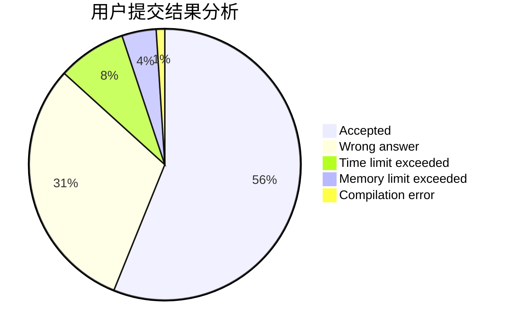
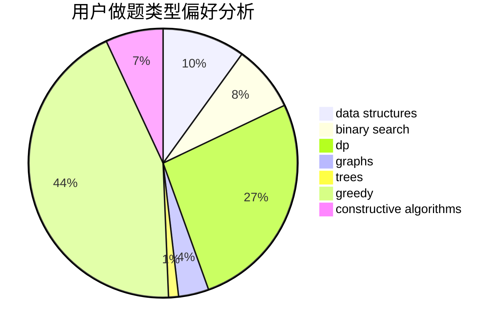
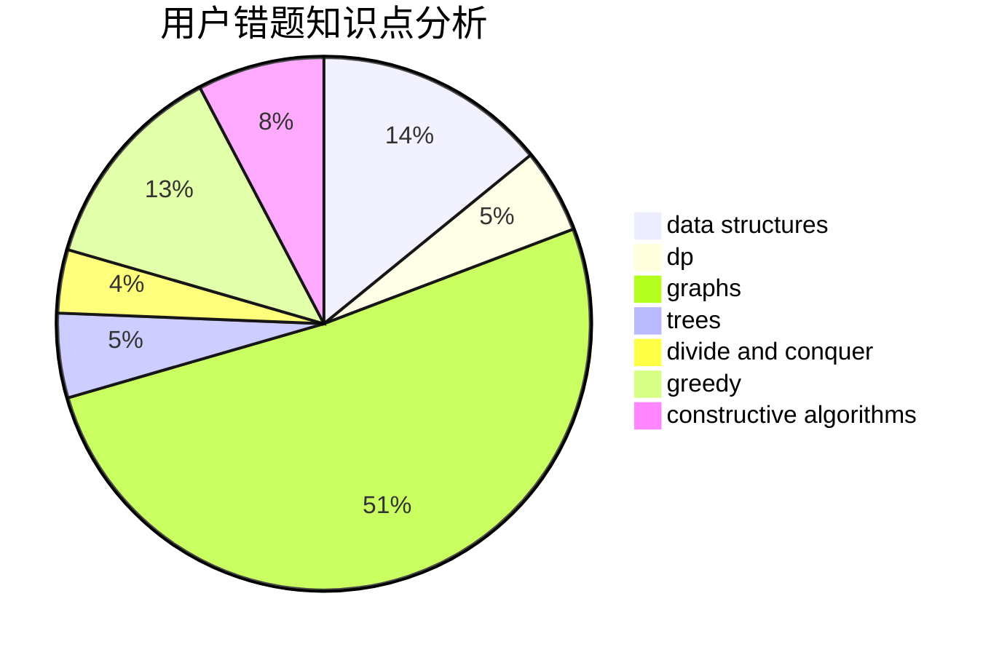

# Cyanic
<!-- tabs:start -->
#### **用户提交结果分析**

#### **用户做题类型偏好分析**

#### **用户错题知识点分析**

<!-- tabs:end -->
# 推荐题目
[Multiples of Length](https://codeforces.com/contest/1397/problem/C)		constructive algorithms,
                        greedy,
                        number theory		  
[Move and Turn](http://codeforces.com/problemset/problem/1459/B)		dp,
                        math		  
[Slime](http://codeforces.com/problemset/problem/1038/D)		dp,
                        greedy,
                        implementation		  
[Kefa and First Steps](http://codeforces.com/problemset/problem/580/A)		brute force,
                        dp,
                        implementation		  
[Buy a Shovel](http://codeforces.com/problemset/problem/732/A)		brute force,
                        constructive algorithms,
                        implementation,
                        math		  
[Compote](http://codeforces.com/problemset/problem/746/A)		implementation,
                        math		  
[Kuroni and the Punishment](http://codeforces.com/problemset/problem/1305/F)		math,
                        number theory,
                        probabilities		  
[Restore Graph](http://codeforces.com/problemset/problem/404/C)		dfs and similar,
                        graphs,
                        sortings		  
[Cooperative Game](https://codeforces.com/contest/1138/problem/F)		constructive algorithms,
                        interactive,
                        number theory		  
[Analysis of Pathes in Functional Graph](http://codeforces.com/problemset/problem/702/E)		data structures,
                        graphs		  
<!-- tabs:start -->
#### **data structures**
[Analysis of Pathes in Functional Graph](http://codeforces.com/problemset/problem/702/E)		data structures,
                        graphs		  
[Eugene and an array](http://codeforces.com/problemset/problem/1333/C)		binary search,
                        data structures,
                        implementation,
                        two pointers		  
[Sereja and Algorithm](http://codeforces.com/problemset/problem/367/A)		data structures,
                        implementation		  
[Music in Car](http://codeforces.com/problemset/problem/746/F)		data structures,
                        greedy,
                        two pointers		  
[Train Car Selection](http://codeforces.com/problemset/problem/1137/E)		data structures,
                        greedy		  
[Pudding Monsters](http://codeforces.com/problemset/problem/526/F)		data structures,
                        divide and conquer		  
[Maximum width](http://codeforces.com/problemset/problem/1492/C)		binary search,
                        data structures,
                        dp,
                        greedy,
                        two pointers		  
[Old Floppy Drive](http://codeforces.com/problemset/problem/1490/G)		binary search,
                        data structures,
                        math		  
[Odd Mineral Resource](http://codeforces.com/problemset/problem/1479/D)		binary search,
                        bitmasks,
                        brute force,
                        data structures,
                        probabilities,
                        trees		  
[Meximization](http://codeforces.com/problemset/problem/1497/A)		brute force,
                        data structures,
                        greedy,
                        sortings		  
#### **binary search**
[Memory for Arrays](http://codeforces.com/problemset/problem/309/C)		binary search,
                        bitmasks,
                        greedy		  
[Eugene and an array](http://codeforces.com/problemset/problem/1333/C)		binary search,
                        data structures,
                        implementation,
                        two pointers		  
[Stock Exchange](http://codeforces.com/problemset/problem/1178/H)		binary search,
                        flows,
                        graphs		  
[Maximum width](http://codeforces.com/problemset/problem/1492/C)		binary search,
                        data structures,
                        dp,
                        greedy,
                        two pointers		  
[MST Company](http://codeforces.com/problemset/problem/125/E)		binary search,
                        graphs		  
[Pairs](http://codeforces.com/problemset/problem/1463/D)		binary search,
                        constructive algorithms,
                        greedy,
                        two pointers		  
[Old Floppy Drive](http://codeforces.com/problemset/problem/1490/G)		binary search,
                        data structures,
                        math		  
[Odd Mineral Resource](http://codeforces.com/problemset/problem/1479/D)		binary search,
                        bitmasks,
                        brute force,
                        data structures,
                        probabilities,
                        trees		  
[Complicated Computations](http://codeforces.com/problemset/problem/1436/E)		binary search,
                        data structures,
                        two pointers		  
[Divide and Summarize](http://codeforces.com/problemset/problem/1461/D)		binary search,
                        brute force,
                        data structures,
                        divide and conquer,
                        implementation,
                        sortings		  
#### **dp**
[Move and Turn](http://codeforces.com/problemset/problem/1459/B)		dp,
                        math		  
[Slime](http://codeforces.com/problemset/problem/1038/D)		dp,
                        greedy,
                        implementation		  
[Kefa and First Steps](http://codeforces.com/problemset/problem/580/A)		brute force,
                        dp,
                        implementation		  
[Foreigner](http://codeforces.com/problemset/problem/1142/D)		dp		  
[Beautiful Decomposition](http://codeforces.com/problemset/problem/279/E)		dp,
                        games,
                        greedy,
                        number theory		  
[Paint the Tree](http://codeforces.com/problemset/problem/1244/D)		brute force,
                        constructive algorithms,
                        dp,
                        graphs,
                        implementation,
                        trees		  
[Maximum width](http://codeforces.com/problemset/problem/1492/C)		binary search,
                        data structures,
                        dp,
                        greedy,
                        two pointers		  
[Last minute enhancements](http://codeforces.com/problemset/problem/1466/B)		dp,
                        greedy		  
[Bouncing Ball](https://codeforces.com/contest/1457/problem/C)		brute force,
                        dp,
                        implementation		  
[Pekora and Trampoline](http://codeforces.com/problemset/problem/1491/C)		brute force,
                        data structures,
                        dp,
                        greedy,
                        implementation		  
#### **graph**
[Restore Graph](http://codeforces.com/problemset/problem/404/C)		dfs and similar,
                        graphs,
                        sortings		  
[Analysis of Pathes in Functional Graph](http://codeforces.com/problemset/problem/702/E)		data structures,
                        graphs		  
[PFAST Inc.](http://codeforces.com/problemset/problem/114/B)		bitmasks,
                        brute force,
                        graphs		  
[Ice Skating](https://codeforces.com/contest/218/problem/C)		brute force,
                        dfs and similar,
                        dsu,
                        graphs		  
[Paint the Tree](http://codeforces.com/problemset/problem/1244/D)		brute force,
                        constructive algorithms,
                        dp,
                        graphs,
                        implementation,
                        trees		  
[Stock Exchange](http://codeforces.com/problemset/problem/1178/H)		binary search,
                        flows,
                        graphs		  
[Shichikuji and Power Grid](http://codeforces.com/problemset/problem/1245/D)		dsu,
                        graphs,
                        greedy,
                        shortest paths,
                        trees		  
[MST Company](http://codeforces.com/problemset/problem/125/E)		binary search,
                        graphs		  
[Two Buttons](http://codeforces.com/problemset/problem/520/B)		dfs and similar,
                        graphs,
                        greedy,
                        implementation,
                        math,
                        shortest paths		  
[Minimum Ties](http://codeforces.com/problemset/problem/1487/C)		brute force,
                        constructive algorithms,
                        dfs and similar,
                        graphs,
                        greedy,
                        implementation,
                        math		  
#### **trees**
[Paint the Tree](http://codeforces.com/problemset/problem/1244/D)		brute force,
                        constructive algorithms,
                        dp,
                        graphs,
                        implementation,
                        trees		  
[Shichikuji and Power Grid](http://codeforces.com/problemset/problem/1245/D)		dsu,
                        graphs,
                        greedy,
                        shortest paths,
                        trees		  
[Odd Mineral Resource](http://codeforces.com/problemset/problem/1479/D)		binary search,
                        bitmasks,
                        brute force,
                        data structures,
                        probabilities,
                        trees		  
[Yet Another Card Deck](http://codeforces.com/problemset/problem/1511/C)		brute force,
                        data structures,
                        implementation,
                        trees		  
[Diameter Cuts](http://codeforces.com/problemset/problem/1499/F)		combinatorics,
                        dfs and similar,
                        dp,
                        trees		  
[Fib-tree](http://codeforces.com/problemset/problem/1491/E)		brute force,
                        dfs and similar,
                        divide and conquer,
                        number theory,
                        trees		  
[13th Labour of Heracles](http://codeforces.com/problemset/problem/1466/D)		data structures,
                        greedy,
                        sortings,
                        trees		  
[BFS Trees](http://codeforces.com/problemset/problem/1495/D)		combinatorics,
                        dfs and similar,
                        graphs,
                        math,
                        shortest paths,
                        trees		  
[Sum of Prefix Sums](http://codeforces.com/problemset/problem/1303/G)		data structures,
                        divide and conquer,
                        geometry,
                        trees		  
[Number of Simple Paths](http://codeforces.com/problemset/problem/1454/E)		combinatorics,
                        dfs and similar,
                        graphs,
                        trees		  
#### **divide and conquer**
[Pudding Monsters](http://codeforces.com/problemset/problem/526/F)		data structures,
                        divide and conquer		  
[Divide and Summarize](http://codeforces.com/problemset/problem/1461/D)		binary search,
                        brute force,
                        data structures,
                        divide and conquer,
                        implementation,
                        sortings		  
[Song of the Sirens](http://codeforces.com/problemset/problem/1466/G)		combinatorics,
                        divide and conquer,
                        hashing,
                        math,
                        string suffix structures,
                        strings		  
[Permutation Transformation](http://codeforces.com/problemset/problem/1490/D)		dfs and similar,
                        divide and conquer,
                        implementation		  
[Skyline Photo](https://codeforces.com/contest/1483/problem/C)		data structures,
                        divide and conquer,
                        dp		  
[Fib-tree](http://codeforces.com/problemset/problem/1491/E)		brute force,
                        dfs and similar,
                        divide and conquer,
                        number theory,
                        trees		  
[Sum of Prefix Sums](http://codeforces.com/problemset/problem/1303/G)		data structures,
                        divide and conquer,
                        geometry,
                        trees		  
[Dogeforces](http://codeforces.com/problemset/problem/1494/D)		constructive algorithms,
                        data structures,
                        dfs and similar,
                        divide and conquer,
                        dsu,
                        greedy,
                        sortings,
                        trees		  
[Logistical Questions](http://codeforces.com/problemset/problem/566/C)		dfs and similar,
                        divide and conquer,
                        trees		  
[Fruit Sequences](http://codeforces.com/problemset/problem/1428/F)		binary search,
                        data structures,
                        divide and conquer,
                        dp,
                        two pointers		  
#### **greedy**
[Multiples of Length](https://codeforces.com/contest/1397/problem/C)		constructive algorithms,
                        greedy,
                        number theory		  
[Slime](http://codeforces.com/problemset/problem/1038/D)		dp,
                        greedy,
                        implementation		  
[Memory for Arrays](http://codeforces.com/problemset/problem/309/C)		binary search,
                        bitmasks,
                        greedy		  
[Beautiful Decomposition](http://codeforces.com/problemset/problem/279/E)		dp,
                        games,
                        greedy,
                        number theory		  
[Numbers Exchange](http://codeforces.com/problemset/problem/746/E)		greedy,
                        implementation,
                        math		  
[Square Earth?](http://codeforces.com/problemset/problem/57/A)		dfs and similar,
                        greedy,
                        implementation		  
[Music in Car](http://codeforces.com/problemset/problem/746/F)		data structures,
                        greedy,
                        two pointers		  
[Bicolored RBS](http://codeforces.com/problemset/problem/1167/D)		constructive algorithms,
                        greedy		  
[Vasya and Templates](https://codeforces.com/contest/1086/problem/C)		greedy,
                        implementation,
                        strings		  
[Shichikuji and Power Grid](http://codeforces.com/problemset/problem/1245/D)		dsu,
                        graphs,
                        greedy,
                        shortest paths,
                        trees		  
#### **constructive algorithms**
[Multiples of Length](https://codeforces.com/contest/1397/problem/C)		constructive algorithms,
                        greedy,
                        number theory		  
[Buy a Shovel](http://codeforces.com/problemset/problem/732/A)		brute force,
                        constructive algorithms,
                        implementation,
                        math		  
[Cooperative Game](https://codeforces.com/contest/1138/problem/F)		constructive algorithms,
                        interactive,
                        number theory		  
[Tram](http://codeforces.com/problemset/problem/746/C)		constructive algorithms,
                        implementation,
                        math		  
[Plus and Square Root](https://codeforces.com/contest/716/problem/C)		constructive algorithms,
                        math		  
[Bicolored RBS](http://codeforces.com/problemset/problem/1167/D)		constructive algorithms,
                        greedy		  
[Four Stones](http://codeforces.com/problemset/problem/1276/E)		constructive algorithms		  
[Paint the Tree](http://codeforces.com/problemset/problem/1244/D)		brute force,
                        constructive algorithms,
                        dp,
                        graphs,
                        implementation,
                        trees		  
[Green and Black Tea](http://codeforces.com/problemset/problem/746/D)		constructive algorithms,
                        greedy,
                        math		  
[Increasing Sequence](http://codeforces.com/problemset/problem/11/A)		constructive algorithms,
                        implementation,
                        math		  
#### **sortings**
[Restore Graph](http://codeforces.com/problemset/problem/404/C)		dfs and similar,
                        graphs,
                        sortings		  
[Avoiding Zero](http://codeforces.com/problemset/problem/1427/A)		math,
                        sortings		  
[Bear and Three Balls](http://codeforces.com/problemset/problem/653/A)		brute force,
                        implementation,
                        sortings		  
[Parity Alternated Deletions](http://codeforces.com/problemset/problem/1144/B)		greedy,
                        implementation,
                        sortings		  
[Diamond Miner](https://codeforces.com/contest/1496/problem/C)		geometry,
                        greedy,
                        math,
                        sortings		  
[Meximization](http://codeforces.com/problemset/problem/1497/A)		brute force,
                        data structures,
                        greedy,
                        sortings		  
[Divide and Summarize](http://codeforces.com/problemset/problem/1461/D)		binary search,
                        brute force,
                        data structures,
                        divide and conquer,
                        implementation,
                        sortings		  
[Chef Monocarp](http://codeforces.com/problemset/problem/1437/C)		dp,
                        flows,
                        graph matchings,
                        greedy,
                        math,
                        sortings		  
[Replacing Elements](http://codeforces.com/problemset/problem/1473/A)		greedy,
                        implementation,
                        math,
                        sortings		  
[Eastern Exhibition](http://codeforces.com/problemset/problem/1486/B)		binary search,
                        geometry,
                        shortest paths,
                        sortings		  
<!-- tabs:end -->
