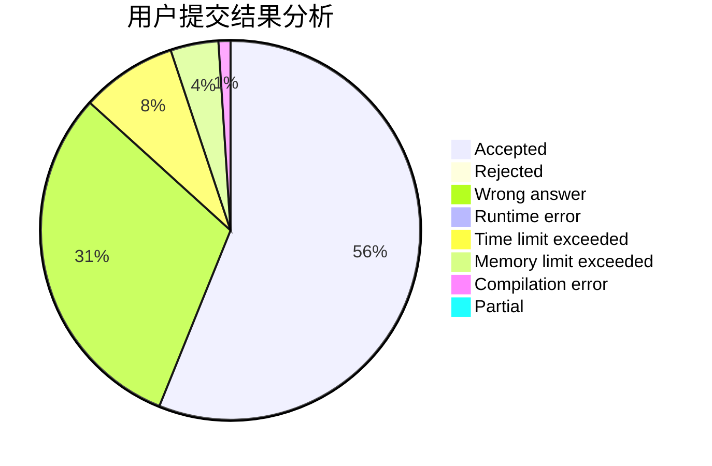
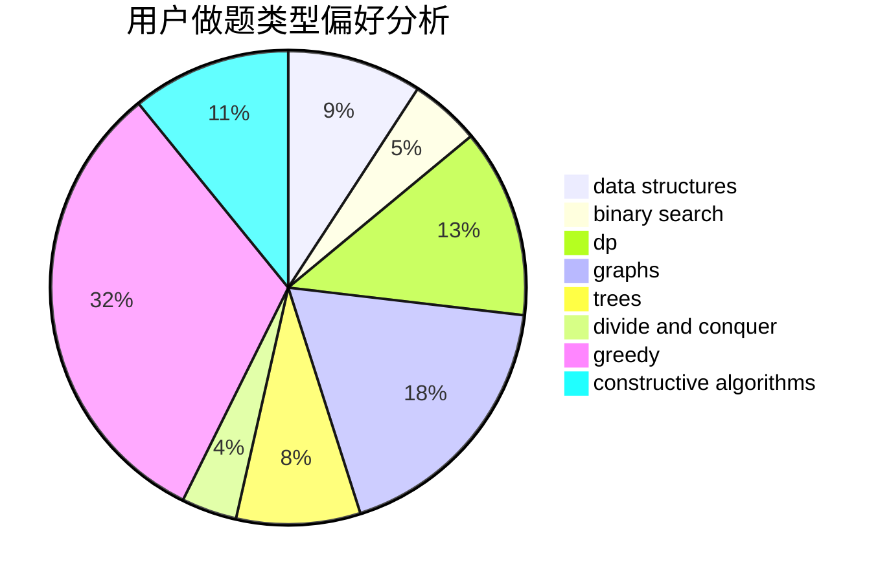
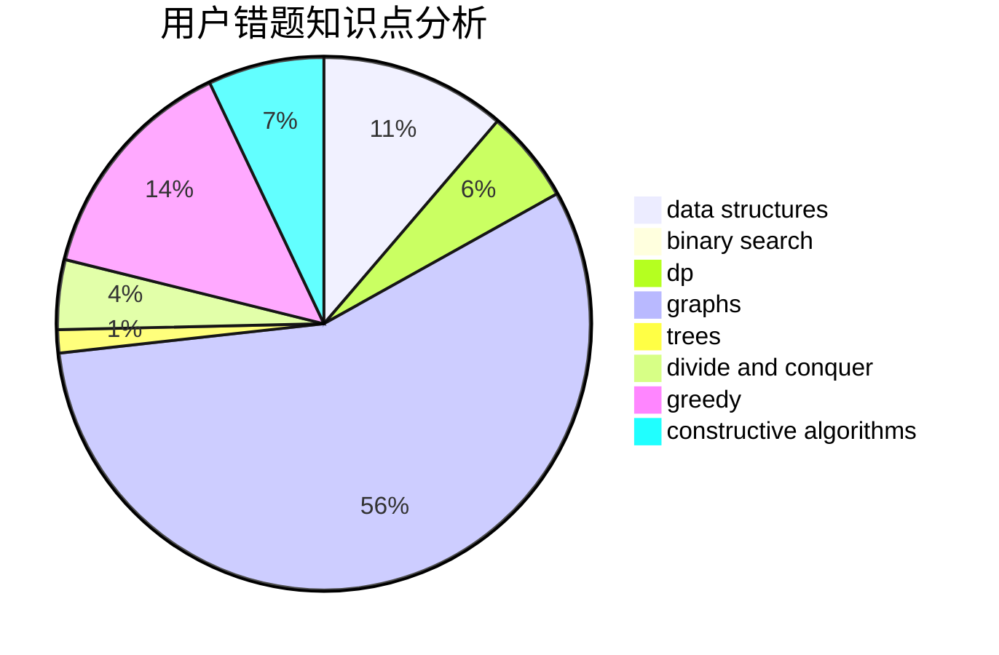

# Cyanic

<!-- tabs:start -->

#### **用户提交结果分析**

#### **用户做题类型偏好分析**

#### **用户错题知识点分析**

<!-- tabs:end -->
# 推荐题目
[1406B](https://codeforces.com/contest/1406/problem/B)		brute force,
                        dp,
                        greedy,
                        implementation,
                        sortings		  
[1305C](https://codeforces.com/contest/1305/problem/C)		brute force,
                        combinatorics,
                        math,
                        number theory		  
[765E](https://codeforces.com/contest/765/problem/E)		dfs and similar,
                        dp,
                        greedy,
                        implementation,
                        trees		  
[765F](https://codeforces.com/contest/765/problem/F)		data structures		  
[550E](https://codeforces.com/contest/550/problem/E)		constructive algorithms,
                        greedy,
                        implementation,
                        math		  
[1039B](https://codeforces.com/contest/1039/problem/B)		binary search,
                        interactive,
                        probabilities		  
[721C](https://codeforces.com/contest/721/problem/C)		dp,
                        graphs		  
[1340B](https://codeforces.com/contest/1340/problem/B)		bitmasks,
                        dp,
                        graphs,
                        greedy		  
[765C](https://codeforces.com/contest/765/problem/C)		math		  
[600C](https://codeforces.com/contest/600/problem/C)		constructive algorithms,
                        greedy,
                        strings		  
