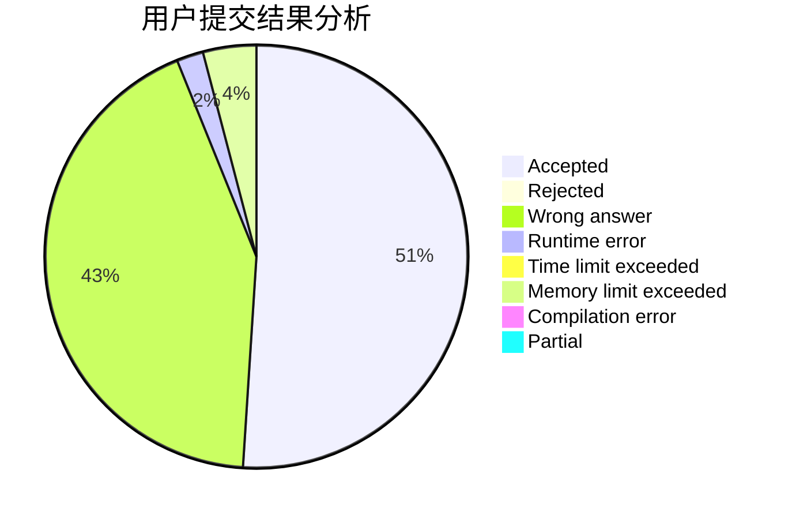
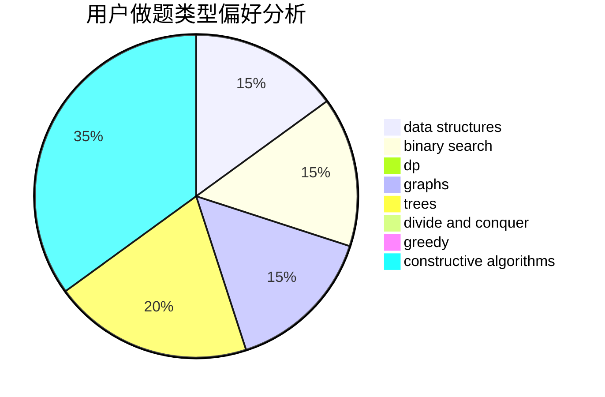
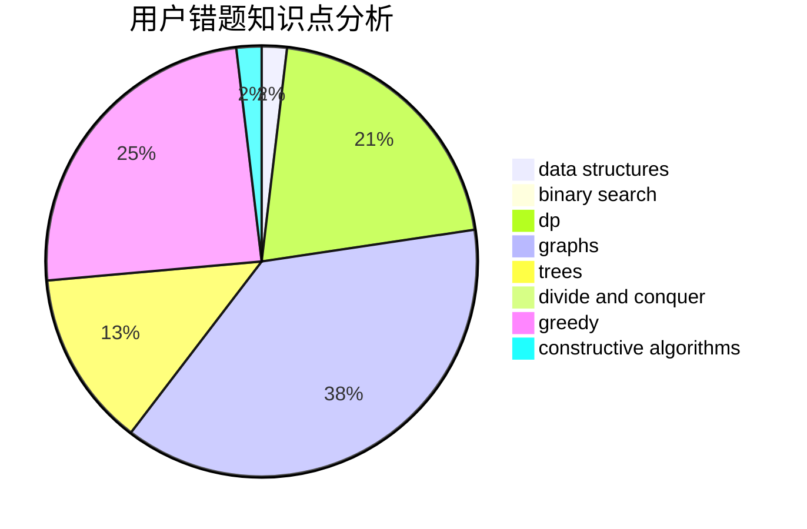

# Cychester

<!-- tabs:start -->

#### **用户提交结果分析**

#### **用户做题类型偏好分析**

#### **用户错题知识点分析**

<!-- tabs:end -->
# 推荐题目
[766D](https://codeforces.com/contest/766/problem/D)		data structures,
                        dfs and similar,
                        dp,
                        dsu,
                        graphs		  
[766C](https://codeforces.com/contest/766/problem/C)		brute force,
                        dp,
                        greedy,
                        strings		  
[1020E](https://codeforces.com/contest/1020/problem/E)		dsu,graphs,sortings,trees		  
[1083D](https://codeforces.com/contest/1083/problem/D)		data structures,
                        implementation		  
[1379E](https://codeforces.com/contest/1379/problem/E)		constructive algorithms,
                        divide and conquer,
                        dp,
                        math,
                        trees		  
[1510H](https://codeforces.com/contest/1510/problem/H)		dp		  
[547A](https://codeforces.com/contest/547/problem/A)		brute force,
                        greedy,
                        implementation,
                        math		  
[715B](https://codeforces.com/contest/715/problem/B)		binary search,
                        constructive algorithms,
                        graphs,
                        shortest paths		  
[1490C](https://codeforces.com/contest/1490/problem/C)		binary search,
                        brute force,
                        brute force,
                        math		  
[1497B](https://codeforces.com/contest/1497/problem/B)		constructive algorithms,
                        greedy,
                        math		  
