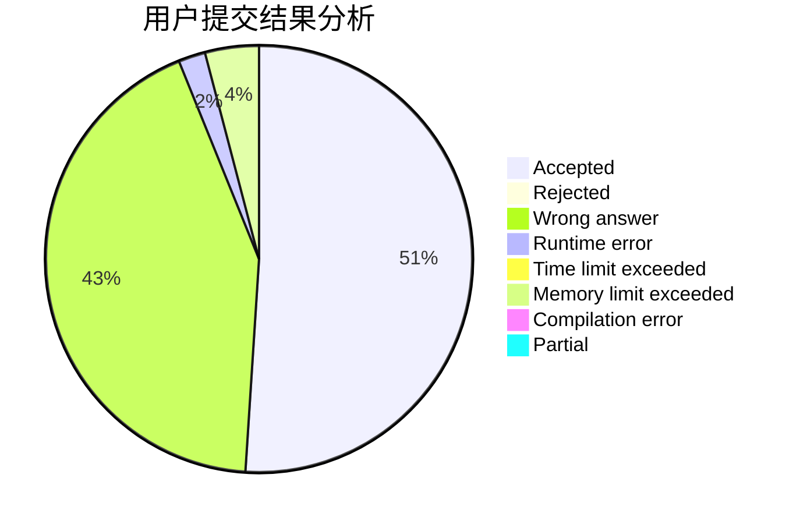
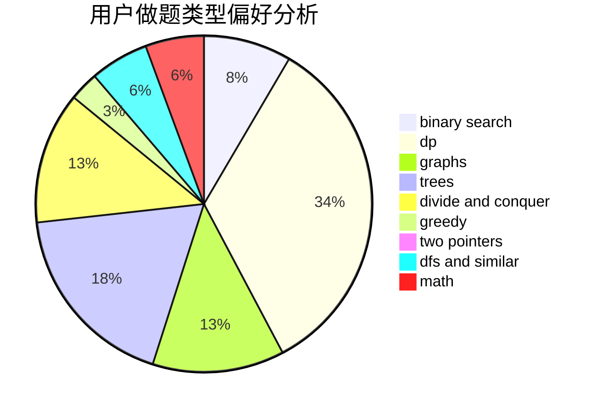

# Cychester

<!-- tabs:start -->

#### **用户提交结果分析**

#### **用户做题类型偏好分析**

<!-- tabs:end -->
# 推荐题目
[766D](https://codeforces.com/contest/766/problem/D)
[766C](https://codeforces.com/contest/766/problem/C)
[1020E](https://codeforces.com/contest/1020/problem/E)
[1083D](https://codeforces.com/contest/1083/problem/D)
[1379E](https://codeforces.com/contest/1379/problem/E)
[1510H](https://codeforces.com/contest/1510/problem/H)
[547A](https://codeforces.com/contest/547/problem/A)
[715B](https://codeforces.com/contest/715/problem/B)
[1490C](https://codeforces.com/contest/1490/problem/C)
[1497B](https://codeforces.com/contest/1497/problem/B)
