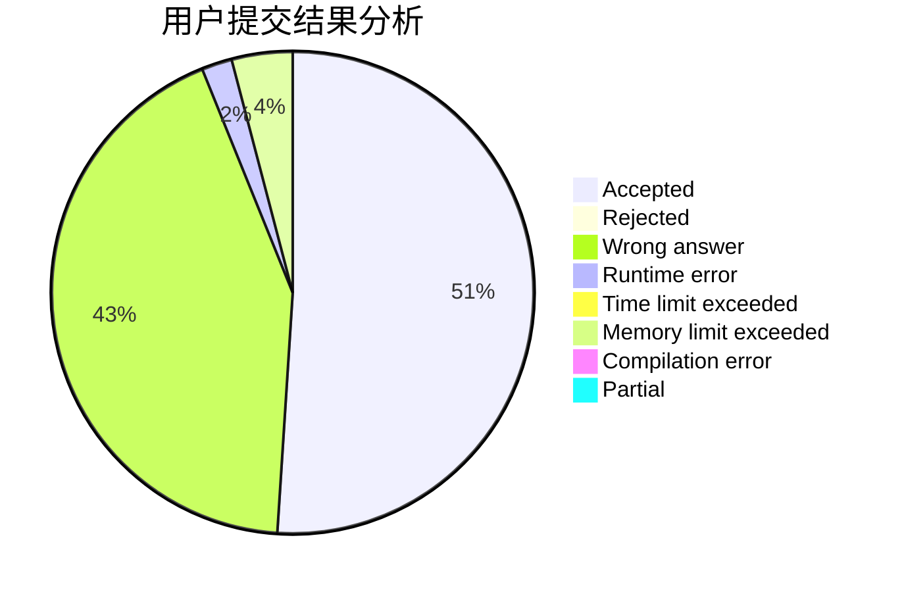
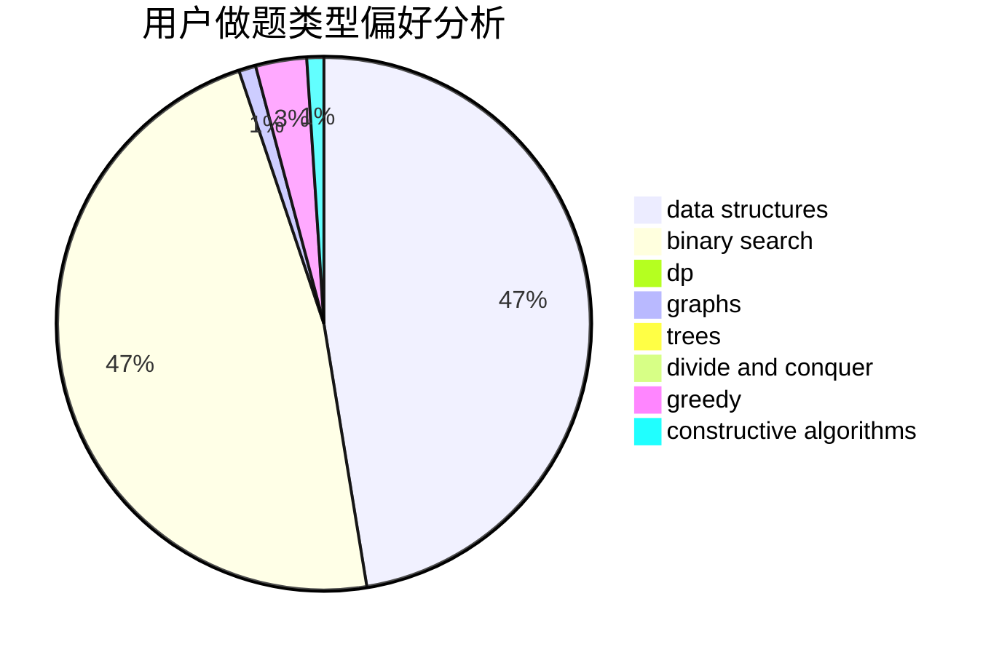
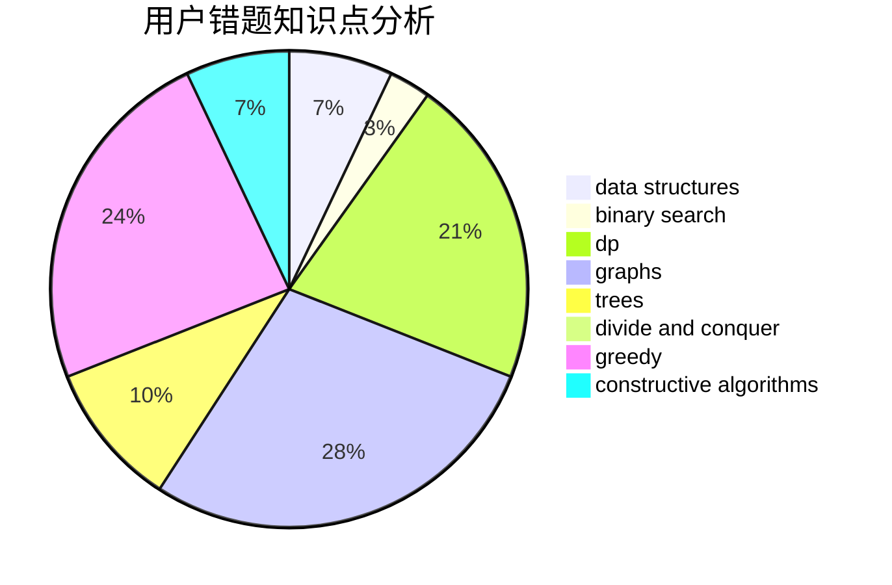

# Cychester

<!-- tabs:start -->

#### **用户提交结果分析**

#### **用户做题类型偏好分析**

#### **用户错题知识点分析**

<!-- tabs:end -->
# 推荐题目
[747A](https://codeforces.com/contest/747/problem/A)		brute force,
                        math		  
[746G](https://codeforces.com/contest/746/problem/G)		constructive algorithms,
                        graphs,
                        trees		  
[1020B](https://codeforces.com/contest/1020/problem/B)		brute force,
                        dfs and similar,
                        graphs		  
[1083A](https://codeforces.com/contest/1083/problem/A)		data structures,
                        dp,
                        trees		  
[1371A](https://codeforces.com/contest/1371/problem/A)		math		  
[1500B](https://codeforces.com/contest/1500/problem/B)		binary search,
                        brute force,
                        chinese remainder theorem,
                        math,
                        number theory		  
[521B](https://codeforces.com/contest/521/problem/B)		dsu,graphs,sortings,trees		  
[698D](https://codeforces.com/contest/698/problem/D)		brute force,
                        geometry,
                        math		  
[1482E](https://codeforces.com/contest/1482/problem/E)		data structures,
                        divide and conquer,
                        dp		  
[1489D](https://codeforces.com/contest/1489/problem/D)		dsu,graphs,sortings,trees		  
